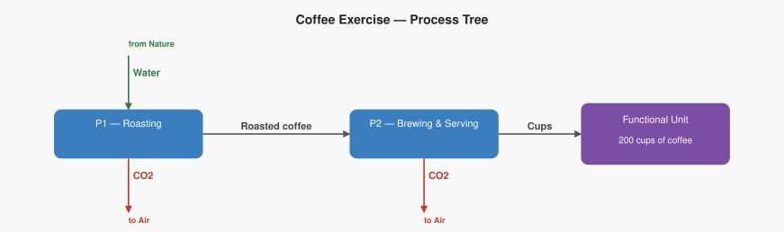
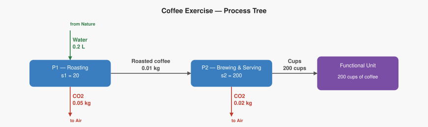

Work through this exercise step by step. The setup is given; the calculations are yours to do. A "Check your answers" section is at the very end — try not to look until you're done.

---

## Functional Unit

> **200 cups of coffee served**

A coffee shop wants to know the total CO₂ released and the total water extracted from the ground to serve 200 cups of coffee, tracing back through the roasting process.

---

## Process Tree

The system has two processes arranged as a simple chain, just like the electricity example:

| Process | Reference output | Technosphere inputs |
|---|---|---|
| **P1 — Coffee roasting** | 0.1 kg roasted coffee | — |
| **P2 — Brewing and serving** | 1 cup of coffee | 0.01 kg roasted coffee (from P1) |

P1 roasts green beans (which come from nature) into roasted coffee. P2 uses that roasted coffee to brew and serve one cup. All roasted coffee stays inside the system — none of it leaves without being brewed.

### Elementary flows

| Process | Flow | Type | Rate |
|---|---|---|---|
| P1 — Coffee roasting | Water | Extraction from ground | 0.20 L per run |
| P1 — Coffee roasting | CO₂ | Emission to air | 0.05 kg per run |
| P2 — Brewing and serving | CO₂ | Emission to air | 0.02 kg per run |

### Process graph (structure)

---

## Characterization factors

To convert inventory flows into impact scores, use these factors:

| Flow | Impact category | Factor |
|---|---|---|
| CO₂ | Climate change | 1.0 kg CO₂-eq per kg CO₂ |
| Water | Water scarcity | 0.5 points per litre water |

---

## Your Task

Work through each step below. Write your answers in the spaces provided.

---

### Step 0a — How many runs does each process need?

We need **200 cups**. Work backwards through the chain.

**P2** makes _____ cup(s) per run. We need 200 cups, so:

$$
s_2 = \frac{200 \ \cancel{\text{cups}}}{\_\_\_ \ \cancel{\text{cups}}/\text{run}} = \_\_\_ \ \text{runs}
$$

**P2 running at that level** consumes _____ kg of roasted coffee in total. P1 makes _____ kg per run, so:

$$
s_1 = \frac{\_\_\_ \ \cancel{\text{kg}}}{\_\_\_ \ \cancel{\text{kg}}/\text{run}} = \_\_\_ \ \text{runs}
$$

**Check — does supply meet demand?**

| Flow | Produced | Consumed | Balance |
|---|---|---|---|
| Cups | ___ × ___ = ___ | delivered to functional unit | ? |
| Roasted coffee | ___ × ___ = ___ | P2 consumes ___ × ___ = ___ | ? |

### Process graph (scaled)

---

### Step 0b — Calculate total emissions and extractions

Multiply each process's rate by the total quantity it handles.

**P1 — Coffee roasting** (runs _____ times):

$$
\text{Water} = 0.20 \ \frac{\text{L}}{\text{run}} \times \_\_\_ \ \text{runs} = \_\_\_ \ \text{L}
$$

$$
\text{CO}_2 = 0.05 \ \frac{\text{kg}}{\text{run}} \times \_\_\_ \ \text{runs} = \_\_\_ \ \text{kg}
$$

**P2 — Brewing and serving** (runs _____ times):

$$
\text{CO}_2 = 0.02 \ \frac{\text{kg}}{\text{run}} \times \_\_\_ \ \text{runs} = \_\_\_ \ \text{kg}
$$

**Add across both processes:**

| Elementary flow | From P1 | From P2 | **Total** |
|---|---|---|---|
| Water (extraction) | ___ L | — | **\_\_\_ L** |
| CO₂ (emission) | ___ kg | ___ kg | **\_\_\_ kg** |

---

### Step 0c — Apply characterization factors

**Climate change** (caused by CO₂):

$$
\text{Climate} = 1.0 \ \frac{\text{CO}_2\text{-eq}}{\text{kg CO}_2} \times \_\_\_ \ \text{kg CO}_2 = \_\_\_ \ \text{kg CO}_2\text{-eq}
$$

**Water scarcity** (caused by water extraction):

$$
\text{Water scarcity} = 0.5 \ \frac{\text{pts}}{\text{L}} \times \_\_\_ \ \text{L} = \_\_\_ \ \text{pts}
$$

---

### Step 1 — Build the technology matrix A

Columns = processes (P1, P2). Rows = products (roasted coffee, cups). Positive = produced, negative = consumed.

$$
A = \begin{pmatrix} \_\_\_ & \_\_\_ \\ \_\_\_ & \_\_\_ \end{pmatrix}
\quad
\begin{array}{l}
\leftarrow \text{Roasted coffee (kg)} \\
\leftarrow \text{Cups}
\end{array}
$$

---

### Step 2 — Set up the demand vector f and solve for s

$$
f = \begin{pmatrix} f_1 \\ f_2 \end{pmatrix}
\quad
\begin{array}{l}
\leftarrow \text{Roasted coffee leaving the system (kg)} \\
\leftarrow \text{Cups leaving the system}
\end{array}
$$

- **f₂ = \_\_\_** — we want 200 cups delivered to customers.
- **f₁ = \_\_\_** — all roasted coffee goes straight into brewing; none leaves the system.

$$
f = \begin{pmatrix} \_\_\_ \\ \_\_\_ \end{pmatrix}
$$

Solve A · s = f by back-substitution:

$$
\text{Row 2 (cups):} \quad \_\_\_ \times s_2 = \_\_\_ \quad\Rightarrow\quad s_2 = \_\_\_
$$

$$
\text{Row 1 (roasted coffee):} \quad \_\_\_ \times s_1 + \_\_\_ \times \_\_\_ = 0 \quad\Rightarrow\quad s_1 = \_\_\_
$$

$$
s = \begin{pmatrix} \_\_\_ \\ \_\_\_ \end{pmatrix}
$$

---

### Step 3 — Build the intervention matrix B

Convert each database rate (per product unit) to a per-run rate, then fill in the matrix.

| Process | Flow | Database rate | Outputs per run | **Per-run rate** |
|---|---|---|---|---|
| P1 | CO₂ | 0.05 kg / run | — | **0.05** |
| P1 | Water | 0.20 L / run | — | **0.20** |
| P2 | CO₂ | 0.02 kg / run | — | **0.02** |

$$
B = \begin{pmatrix} \_\_\_ & \_\_\_ \\ \_\_\_ & \_\_\_ \end{pmatrix}
\quad
\begin{array}{l}
\leftarrow \text{Water (L)} \\
\leftarrow \text{CO}_2 \text{ (kg)}
\end{array}
$$

*(columns left to right: $P_1$, $P_2$)*

---

### Step 4 — Compute the inventory vector R = B · s

$$
R[\text{Water}] = (\_\_\_ \times \_\_\_) + (\_\_\_ \times \_\_\_) = \_\_\_ + \_\_\_ = \_\_\_ \ \text{L}
$$

$$
R[\text{CO}_2] = (\_\_\_ \times \_\_\_) + (\_\_\_ \times \_\_\_) = \_\_\_ + \_\_\_ = \_\_\_ \ \text{kg}
$$

$$
R = \begin{pmatrix} \_\_\_ \\ \_\_\_ \end{pmatrix}
\quad
\begin{array}{l}
\leftarrow \text{Water (L)} \\
\leftarrow \text{CO}_2 \text{ (kg)}
\end{array}
$$

---

### Step 5 — Apply the characterization matrix C, get impact vector h = C · R

$$
C = \begin{pmatrix} 0 & 1.0 \\ 0.5 & 0 \end{pmatrix}
\quad
\begin{array}{l}
\leftarrow \text{Climate change (kg CO}_2\text{-eq)} \\
\leftarrow \text{Water scarcity (pts)}
\end{array}
$$

*(columns left to right: Water, CO$_2$)*

$$
h[\text{Climate}] = (\_\_\_ \times \_\_\_) + (\_\_\_ \times \_\_\_) = \_\_\_ \ \text{kg CO}_2\text{-eq}
$$

$$
h[\text{Water scarcity}] = (\_\_\_ \times \_\_\_) + (\_\_\_ \times \_\_\_) = \_\_\_ \ \text{pts}
$$

$$
h = \begin{pmatrix} \_\_\_ \\ \_\_\_ \end{pmatrix}
\quad
\begin{array}{l}
\leftarrow \text{Climate change (kg CO}_2\text{-eq)} \\
\leftarrow \text{Water scarcity (pts)}
\end{array}
$$

---

## Check Your Answers

**Scaling vector:**
- s_1 = **20 runs**
- s_2 = **200 runs**

**Inventory (R):**
- CO₂: **5.0 kg**
- Water: **4.0 L**

**Impacts (h):**
- Climate change: **5.0 kg CO₂-eq**
- Water scarcity: **2.0 pts**

---

## Full Matrix Solution

### Step 1 — Technology Matrix A

$$
A = \begin{pmatrix} 0.1 & -0.01 \\ 0 & 1 \end{pmatrix}
\quad
\begin{array}{l}
\leftarrow \text{Roasted coffee (kg)} \\
\leftarrow \text{Cups}
\end{array}
$$

*(columns left to right: $P_1$, $P_2$)*

### Step 2 — Demand Vector f and Scaling Vector s

$$
f = \begin{pmatrix} 0 \\ 200 \end{pmatrix}
\quad
\begin{array}{l}
\leftarrow \text{Roasted coffee (kg)} \\
\leftarrow \text{Cups}
\end{array}
$$

Solving $A \cdot s = f$ by back-substitution:

$$
s = \begin{pmatrix} 20 \\ 200 \end{pmatrix}
\quad
\begin{array}{l}
\leftarrow P_1 \\
\leftarrow P_2
\end{array}
$$

### Step 3 — Intervention Matrix B

$$
B = \begin{pmatrix} 0.20 & 0 \\ 0.05 & 0.02 \end{pmatrix}
\quad
\begin{array}{l}
\leftarrow \text{Water (L)} \\
\leftarrow \text{CO}_2 \text{ (kg)}
\end{array}
$$

*(columns left to right: $P_1$, $P_2$)*

### Step 4 — Inventory Vector R = B · s

$$
R = B \cdot s = \begin{pmatrix} 0.20 & 0 \\ 0.05 & 0.02 \end{pmatrix} \begin{pmatrix} 20 \\ 200 \end{pmatrix} = \begin{pmatrix} 4.0 \\ 5.0 \end{pmatrix}
\quad
\begin{array}{l}
\leftarrow \text{Water (L)} \\
\leftarrow \text{CO}_2 \text{ (kg)}
\end{array}
$$

### Step 5 — Characterization Matrix C and Impact Vector h = C · R

$$
C = \begin{pmatrix} 0 & 1.0 \\ 0.5 & 0 \end{pmatrix}
\quad
\begin{array}{l}
\leftarrow \text{Climate change (kg CO}_2\text{-eq)} \\
\leftarrow \text{Water scarcity (pts)}
\end{array}
$$

*(columns left to right: Water, CO$_2$)*

$$
h = C \cdot R = \begin{pmatrix} 0 & 1.0 \\ 0.5 & 0 \end{pmatrix} \begin{pmatrix} 4.0 \\ 5.0 \end{pmatrix} = \begin{pmatrix} 5.0 \\ 2.0 \end{pmatrix}
\quad
\begin{array}{l}
\leftarrow \text{Climate change (kg CO}_2\text{-eq)} \\
\leftarrow \text{Water scarcity (pts)}
\end{array}
$$

### Summary

To produce **200 cups of coffee**:
- Extract **4.0 L of water** from the ground
- Emit **5.0 kg of CO₂** to the atmosphere
- Climate change impact: **5.0 kg CO₂-eq**
- Water scarcity impact: **2.0 points**
