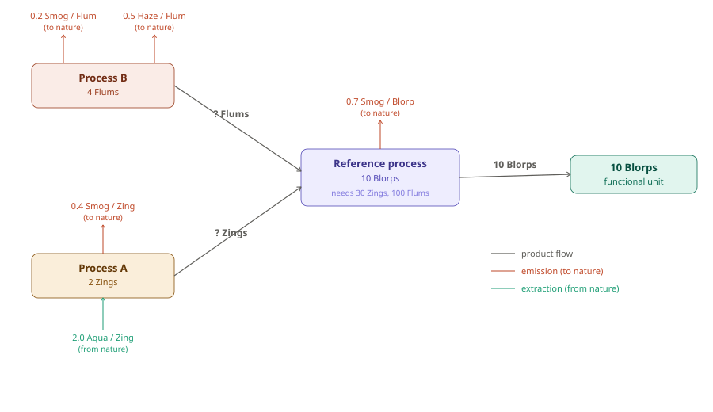

# LCA Example: Producing 10 Blorps

## Overview

Life Cycle Assessment (LCA) has two main computational phases:

1. **Life Cycle Inventory (LCI)** — a bookkeeping and scaling problem. Trace all flows (materials, energy, emissions, extractions) through a process tree and normalize everything to the functional unit.
2. **Life Cycle Impact Assessment (LCIA)** — a modeling problem. Multiply inventory flows by characterization factors to convert them into impact category scores.

The math is linear algebra: solve for how much each process must run, then accumulate elementary flows, then apply impact factors.

---

## Functional Unit

> **10 Blorps** of product

Everything in the inventory is scaled to this reference.

---

## Process Tree

The system has three processes:

| Process | Reference output | Technosphere inputs |
|---|---|---|
| **Reference process** | 10 Blorps | 30 Zings (from A), 100 Flums (from B) |
| **Process A** | 2 Zings | — |
| **Process B** | 4 Flums | — |

### Elementary flows (from database)

Emission and extraction rates are fixed properties of each process, looked up from the database (e.g. ecoinvent). They are always positive — direction is encoded by the flow type (compartment), not by sign.

| Process | Flow | Type | Rate |
|---|---|---|---|
| Reference process | Smog | Emission to air | 0.7 Smog / Blorp |
| Process A | Smog | Emission to air | 0.4 Smog / Zing |
| Process A | Aqua | Extraction from ground | 2.0 Aqua / Zing |
| Process B | Smog | Emission to air | 0.2 Smog / Flum |
| Process B | Haze | Emission to air | 0.5 Haze / Flum |

### Arrow convention

- Product/energy flows go **up** through the tree toward the functional unit
- Emissions point **out** of a process (to nature)
- Extractions point **into** a process (from nature)
- The **? Zings** and **? Flums** on the product flow arrows are unknown until we solve for the scaling vector s

---

## Step 0 — By-Hand Calculation

Before introducing matrices, we can work through the exact same calculation by tracing the supply chain step by step. This produces identical results to the matrix approach and lets you verify every number.

---

### Step 0a — How many times does each process need to run?

We need **10 Blorps**. Work backwards through the tree:

**Reference process** makes 10 Blorps per run. We need 10 Blorps, so:
$$
\text{Ref runs} = \frac{10}{10} = \mathbf{1\ run}
$$

**Process A** supplies Zings to the Reference process. One run of Reference needs 30 Zings. Process A makes 2 Zings per run, so:
$$
\text{A runs} = \frac{30}{2} = \mathbf{15\ runs}
$$

**Process B** supplies Flums to the Reference process. One run of Reference needs 100 Flums. Process B makes 4 Flums per run, so:
$$
\text{B runs} = \frac{100}{4} = \mathbf{25\ runs}
$$

**Check — does every demand get met?**

| Flow | Produced | Consumed | Balance |
|---|---|---|---|
| Blorps | 1 run × 10 = **10** | delivered to functional unit | ✓ |
| Zings  | 15 runs × 2 = **30** | Reference process needs 30 | ✓ |
| Flums  | 25 runs × 4 = **100** | Reference process needs 100 | ✓ |

These run counts are exactly the scaling vector **s = (1.0, 15.0, 25.0)** solved in Step 2.

---

### Step 0b — Calculate total emissions and extractions

Multiply each process's rate by how much product it handles.

**Reference process** — runs 1 time, produces 10 Blorps:

$$
\text{Smog} = 0.7\ \frac{\text{Smog}}{\text{Blorp}} \times 10\ \text{Blorps} = \mathbf{7.0\ Smog}
$$

**Process A** — runs 15 times:

$$
\text{Smog} = 0.4\ \frac{\text{Smog}}{\text{Zing-step}} \times 15\ \text{runs} = \mathbf{6.0\ Smog}
$$

$$
\text{Aqua} = 2.0\ \frac{\text{Aqua}}{\text{Zing-step}} \times 15\ \text{runs} = \mathbf{30.0\ Aqua}
$$

**Process B** — runs 25 times:

$$
\text{Smog} = 0.2\ \frac{\text{Smog}}{\text{Flum-step}} \times 25\ \text{runs} = \mathbf{5.0\ Smog}
$$

$$
\text{Haze} = 0.5\ \frac{\text{Haze}}{\text{Flum-step}} \times 25\ \text{runs} = \mathbf{12.5\ Haze}
$$

**Add across all processes to get the total inventory:**

| Elementary flow | From Ref | From A | From B | **Total** |
|---|---|---|---|---|
| Smog (emission) | 7.0 | 6.0 | 5.0 | **18.0** |
| Haze (emission) | — | — | 12.5 | **12.5** |
| Aqua (extraction) | — | 30.0 | — | **30.0** |

---

### Step 0c — Apply characterization factors to get impact scores

**Murk** is caused by Smog (factor 1.0) and Haze (factor 3.0):

$$
\text{Murk} = (1.0 \times 18.0) + (3.0 \times 12.5) = 18.0 + 37.5 = \mathbf{55.5}
$$

**Depletion** is caused by Aqua (factor 0.8):

$$
\text{Depletion} = 0.8 \times 30.0 = \mathbf{24.0}
$$

---

### Step 0 Summary

| | By-hand result | Matrix result (Steps 1–5) |
|---|---|---|
| Ref runs | 1.0 | s = 1.0 |
| A runs | 15.0 | s = 15.0 |
| B runs | 25.0 | s = 25.0 |
| Inventory: Smog | 18.0 | 18.0 |
| Inventory: Haze | 12.5 | 12.5 |
| Inventory: Aqua | 30.0 | 30.0 |
| **Impact: Murk** | **55.5** | **55.5** |
| **Impact: Depletion** | **24.0** | **24.0** |

Every number matches. The matrix approach in Steps 1–5 simply packages this same arithmetic into a compact, scalable form that works even when there are thousands of processes.

---

## Step 1 — Build the technology matrix A

The technology matrix **A** encodes what each process produces and consumes in the technosphere. Columns are processes, rows are products.

- **Diagonal entries**: reference output of each process (positive)
- **Off-diagonal entries**: technosphere demands — what the Reference process needs from A and B (negative)

$$
A = \begin{pmatrix}
10 & 0 & 0 \\
-30 & 2 & 0 \\
-100 & 0 & 4
\end{pmatrix}
\quad
\begin{array}{l}
\leftarrow \text{Blorp} \\
\leftarrow \text{Zings} \\
\leftarrow \text{Flums}
\end{array}
$$

Columns left to right: Reference process, Process A, Process B.

---

## Step 2 — Solve for the scaling vector s

The demand vector **f** expresses the functional unit — 10 Blorps, nothing else:

$$
f = \begin{pmatrix} 10 \\ 0 \\ 0 \end{pmatrix}
$$

Solve $A \cdot s = f \Rightarrow s = A^{-1} \cdot f$. Since A is lower triangular, back-substitute row by row:

$$
\text{Row 1 (Blorp):} \quad 10 \times s_\text{Ref} = 10 \quad\Rightarrow\quad s_\text{Ref} = 1.0
$$

$$
\text{Row 2 (Zings):} \quad -30 \times 1.0 + 2 \times s_A = 0 \quad\Rightarrow\quad s_A = \frac{30}{2} = 15.0
$$

$$
\text{Row 3 (Flums):} \quad -100 \times 1.0 + 4 \times s_B = 0 \quad\Rightarrow\quad s_B = \frac{100}{4} = 25.0
$$

$$
s = \begin{pmatrix} 1.0 \\ 15.0 \\ 25.0 \end{pmatrix}
$$

The **? Zings** and **? Flums** from the process tree are now resolved: The Reference process runs 1 time (producing 10 Blorps), Process A runs 15 times (delivering 15 × 2 = 30 Zings), Process B runs 25 times (delivering 25 × 4 = 100 Flums).

---

## Step 3 — Build the intervention matrix B

The intervention matrix **B** contains the database rates for each elementary flow per unit of each process's reference product. Entries are always positive — direction (emission vs extraction) is a property of the flow type, not a sign.

$$
B = \begin{pmatrix}
0.7 & 0.4 & 0.2 \\
0   & 0   & 0.5 \\
0   & 2.0 & 0
\end{pmatrix}
\quad
\begin{array}{l}
\leftarrow \text{Smog (emission to air)} \\
\leftarrow \text{Haze (emission to air)} \\
\leftarrow \text{Aqua (extraction from ground)}
\end{array}
$$

Columns left to right: Reference process, Process A, Process B.

---

## Step 4 — Compute the inventory vector g = B · s

Multiply each row of B by the scaling vector s:

$$
g[\text{Smog}] = (0.7 \times 10.0) + (0.4 \times 15.0) + (0.2 \times 25.0) = 7.0 + 6.0 + 5.0 = \mathbf{18.0}
$$

$$
g[\text{Haze}] = (0 \times 10.0) + (0 \times 15.0) + (0.5 \times 25.0) = 0 + 0 + 12.5 = \mathbf{12.5}
$$

$$
g[\text{Aqua}] = (0 \times 10.0) + (2.0 \times 15.0) + (0 \times 25.0) = 0 + 30.0 + 0 = \mathbf{30.0}
$$

$$
g = \begin{pmatrix} 18.0 \\ 12.5 \\ 30.0 \end{pmatrix}
$$

This is the **life cycle inventory** — total elementary flows attributable to producing 10 Blorps, aggregated across all processes.

---

## Step 5 — Apply the characterization matrix C, get impact vector h = C · g

The characterization matrix **C** converts elementary flows into impact scores using scientific factors. Both emissions and extractions contribute positively — no sign distinction here either.

| Flow | Murk potential | Depletion potential |
|---|---|---|
| Smog | 1.0 Murk / Smog | — |
| Haze | 3.0 Murk / Haze | — |
| Aqua | — | 0.8 Depletion / Aqua |

$$
C = \begin{pmatrix}
1.0 & 3.0 & 0   \\
0   & 0   & 0.8
\end{pmatrix}
\quad
\begin{array}{l}
\leftarrow \text{Murk potential} \\
\leftarrow \text{Depletion potential}
\end{array}
$$

$$
h[\text{Murk}] = (1.0 \times 18.0) + (3.0 \times 12.5) + (0 \times 30.0) = 18.0 + 37.5 + 0 = \mathbf{55.5}
$$

$$
h[\text{Depletion}] = (0 \times 18.0) + (0 \times 12.5) + (0.8 \times 30.0) = 0 + 0 + 24.0 = \mathbf{24.0}
$$

$$
h = \begin{pmatrix} 55.5 \\ 24.0 \end{pmatrix}
$$

---

## Full Calculation Chain

$$
h = C \cdot B \cdot A^{-1} \cdot f
$$

| Symbol | Name | Dimensions |
|---|---|---|
| $f$ | Demand vector | $p \times 1$ (products) |
| $A$ | Technology matrix | $p \times n$ (products × processes) |
| $s = A^{-1}f$ | Scaling vector | $n \times 1$ (processes) |
| $B$ | Intervention matrix | $e \times n$ (elementary flows × processes) |
| $g = Bs$ | Inventory vector | $e \times 1$ (elementary flows) |
| $C$ | Characterization matrix | $k \times e$ (impact categories × elementary flows) |
| $h = Cg$ | Impact vector | $k \times 1$ (impact categories) |

In real LCA software (SimaPro, OpenLCA), **A** is drawn from a background database like ecoinvent and can have thousands of rows and columns — but the matrix structure and the $h = C \cdot B \cdot A^{-1} \cdot f$ equation are identical.

---

## Summary of Results

| | Value |
|---|---|
| Functional unit | 10 Blorps |
| $s_\text{Ref}$ | 1.0 run |
| $s_A$ | 15.0 runs |
| $s_B$ | 25.0 runs |
| Inventory: Smog | 18.0 |
| Inventory: Haze | 12.5 |
| Inventory: Aqua | 30.0 |
| **Impact: Murk** | **55.5** |
| **Impact: Depletion** | **24.0** |
