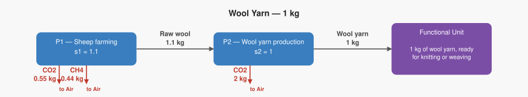

# Example: `/functional-unit wool_yarn`

This is a recorded example of the `functional-unit` teaching skill in action,
using the `wool_yarn` case study from `skills_references/wool_yarn/`.

The skill reads `recipe_card.md` for that case study and teaches the concept
of functional unit using real data, Socratic questions, and fashion business context.

---

## The conversation

---

**AI:** Before we look at any numbers — here is a question to start with.

Imagine you work in the sustainability team at a knitwear brand. Your supplier
sends you a data sheet saying their wool has a carbon footprint of **15 kg CO₂
equivalent**.

Before you accept that number, what is the single most important question you
would ask them about it?

---

**Student:** I'm not sure.

---

**AI:** That's a perfectly normal reaction — this trips up a lot of people at
first, including professionals who work in sustainability every day.

Here is a hint: the number "15 kg CO₂ equivalent" is incomplete on its own.
Think about how prices work in retail — you wouldn't accept a quote that just
said "£50" without knowing whether that was per item, per dozen, or per
kilogram. The same problem applies here.

So the question to ask the supplier is: **"15 kg CO₂ equivalent — per what?"**

Per kilogram of yarn? Per sweater? Per tonne of fiber? The answer completely
changes whether that number is good, bad, or meaningless.

In LCA — Life Cycle Assessment, which is the method we use to measure
environmental impact — this is called the **functional unit**. It is the
precise definition of exactly what is being measured. Without it, no two
sustainability claims can be fairly compared.

For this case study, the functional unit is: **1 kg of wool yarn, ready for
knitting or weaving.**

Not per sweater, not per season — per kilogram of yarn at the point it leaves
the mill. That unit was chosen because it measures the output of the supply
chain we are studying (farm → mill), and it lets a buyer compare two yarn
suppliers on equal footing.

Here is a question to test that idea: what if one supplier reports their
footprint per kilogram of yarn, and another reports it per finished sweater —
and the sweaters happen to use different amounts of yarn? Could you still
compare those two numbers fairly?

---

**Student:** I don't think so but I am not sure.

---

**AI:** You are exactly right — you could not compare them fairly, and your
instinct is correct.

Here is why. Think of it like comparing two coffee shops on price. If one
charges £3 per small cup and another charges £4 per large cup, you cannot
just say the first one is cheaper — the cups are different sizes. You would
need to convert both to the same unit, like price per millilitre, before the
comparison means anything.

The same problem happens with yarn. If Supplier A reports **per kilogram of
yarn** and Supplier B reports **per finished sweater**, and Supplier B's
sweaters happen to use 400 grams of yarn while Supplier A's use 600 grams —
the numbers are measuring completely different things. Supplier B could look
better on paper simply because their sweaters are lighter, not because their
farming or spinning is cleaner.

This is exactly why the functional unit matters so much in sustainability
reporting. It forces everyone to measure the same thing, so comparisons
are honest.

Here is a real-world connection: the **Higg Index** (used by many fashion
brands) and the **Product Environmental Footprint** standard (used across
the EU) both require the functional unit to be stated upfront in any
environmental claim. Without it, the number cannot be verified or compared.

Now here is a what-if question to push this one step further: what if instead
of measuring per kilogram of yarn, a brand measured per **year of wearing** —
so the study included how long the garment actually lasts in a wardrobe?
Would that change which fiber looks more sustainable?

---

**Student:** I think yes, but again I'm not sure.

---

**AI:** You are right again — and this one is actually one of the most important
ideas in fashion sustainability, so it is worth slowing down on.

Here is a simple way to think about it. Imagine two jumpers:

- **Jumper A** — made from cheap acrylic yarn, costs £20, falls apart after one year
- **Jumper B** — made from quality wool yarn, costs £80, lasts five years

If you measure the carbon footprint **per jumper**, Jumper A looks better — it
used less material and less energy to make. But if you measure **per year of
use**, you need five Jumper A's to cover the same five years. Suddenly the
picture completely reverses.

This is why the functional unit in a study of a long-lasting product often
includes a time period — "one garment worn for one year" or "one garment worn
for its full lifetime." It forces the comparison to reflect what the customer
actually gets, not just what came off the production line.

For our wool yarn study, the functional unit is simply **1 kg of yarn at the
mill gate** — because this study is focused on the supply chain up to that
point, not the garment's whole life. A different study, covering the full
garment lifecycle, would need a different functional unit.

That is actually a sign of good LCA practice: the functional unit should match
the question you are trying to answer.

You have now worked through the core idea. To summarise in one sentence: **a
sustainability number means nothing without knowing exactly what it is
measuring — and the functional unit is that definition.**

Would you like to look at the actual supply chain for this wool yarn — the two
steps from sheep to mill — to see where the emissions actually come from?

---

**Student:** Yes.

---

**AI:** The wool yarn supply chain has just two steps — it is about as simple
as a supply chain gets, which makes it a great place to start.

```
Sheep farming  →  Wool yarn production
     P1                   P2  ← this is where the 1 kg of yarn is produced
```

**P1 — Sheep farming** is where the raw fleece comes from. The sheep eat,
live, and breathe — and as part of their digestion, they release methane gas.
The farm also uses energy for machinery, feed, and water. This step produces
raw wool, which still has grease, dirt, and vegetable matter in it.

**P2 — Wool yarn production** is the mill. The raw fleece is washed
(scouring), combed to align the fibres (carding), and then twisted into yarn
(spinning). It takes **1.1 kg of raw wool to produce 1.0 kg of yarn** — about
10% is lost as waste in the washing and combing process.

Here are the two supply chain diagrams for this case study.

**Structure diagram** — shows how the processes connect, no numbers:


**Scaled diagram** — shows the actual flow amounts and scaling factors:



Here is what might surprise you about this chain: the mill step uses a lot of
hot water and energy, so it produces quite a bit of CO₂. You might expect that
to be the biggest environmental problem. But the sheep farm turns out to
dominate the picture — and not because of CO₂.

Would you like to find out why?

---

**Student:** Yes.

---

**AI:** Here are the raw emissions from each step — just the actual kilograms
of gas released, before any conversion:

| Step | CO₂ released | CH₄ released |
|---|---|---|
| P1 Sheep farming (scaled to 1.1 kg) | 0.55 kg | 0.44 kg |
| P2 Yarn production | 2.00 kg | 0 kg |

Looking at just these numbers, the mill produces more CO₂ than the farm. And
the methane from the sheep — 0.44 kg — looks quite small in comparison.

So here is the question: **which of these two steps do you think is responsible
for more of the climate damage — the farm or the mill?**

---

**Student:** P2.

---

**AI:** A completely reasonable guess — and that is exactly what most people
say when they see those numbers for the first time.

But the answer is actually **P1, the sheep farm** — by a very large margin.
Here is why.

CO₂ and methane are both greenhouse gases, but they are not equally damaging
to the climate. Methane traps heat roughly **27.9 times more effectively** than
CO₂ over a 100-year period. So when scientists compare different gases, they
convert everything into a common unit called **CO₂ equivalent** — think of it
like converting currencies so you can add them up.

When you apply that conversion to the wool yarn numbers:

| Step | CO₂ | CH₄ × 27.9 | Total CO₂ equivalent |
|---|---|---|---|
| P1 Sheep farming | 0.55 kg | 0.44 × 27.9 = **12.3 kg** | **12.8 kg CO₂ eq** |
| P2 Yarn production | 2.00 kg | — | **2.0 kg CO₂ eq** |
| **Total** | | | **~14.8 kg CO₂ eq** |

The sheep farm is responsible for about **86% of the climate impact** of that
kilogram of yarn — almost all of it from methane produced during digestion,
not from energy use.

This is the single biggest surprise in wool sustainability. The "natural" label
does not mean low-carbon. The animal itself is the main source of emissions,
and no amount of renewable energy at the mill changes that.

Would you like to go deeper on how those conversions work — why methane gets
that 27.9 multiplier — or would you like to try the same functional unit
lesson with a different product?

---

**Student:** Yes, tell me about the multiplier.

---

**AI:** Great question — and once you understand this, the whole idea of
comparing different gases clicks into place.

The multiplier comes from a measure called **GWP100 — Global Warming Potential
over 100 years**. Here is the intuition behind it.

Both CO₂ and methane work by trapping heat in the atmosphere — like a blanket
around the Earth. But they behave very differently:

- **CO₂** is a thin, long-lasting blanket. It is not the most intense
  heat-trapper, but once it is in the atmosphere it stays there for **hundreds
  of years**. It is slow but persistent.

- **Methane** is a thick, short-lived blanket. It traps heat much more
  intensely than CO₂ — but it breaks down in the atmosphere in about **12
  years**, converting into CO₂ and water.

So scientists needed a way to compare them fairly. They chose a **100-year
window** and asked: if you release 1 kg of methane today, how much warming
does it cause over the next 100 years compared to 1 kg of CO₂?

The answer is **27.9 times more** — that is the GWP100 value for methane. It
is not a fixed physical constant; it is a policy choice about the time window.
If you used a **20-year window** instead, methane looks even worse — about 81
times more potent — because you are capturing more of its intense early warming
before it breaks down.

Think of it this way: methane is like a very spicy dish that hits you hard
immediately but fades. CO₂ is like a slow-building heat that lingers for
hours. Which one seems worse depends on whether you are measuring the first
20 minutes or the whole evening.

This choice of time window — 20 years vs 100 years — is actually one of the
live debates in fashion sustainability right now, because a brand focused on
near-term climate targets would weight methane much more heavily than one
reporting against a 2100 deadline.

---

## What this example demonstrates

- The skill opened with a practical business question, not a definition
- The student answered "I'm not sure" three times — and was guided forward each time without being told they were wrong
- Real numbers from the recipe card appeared only after the concept was established
- The conversation moved naturally from functional unit → supply chain structure → raw emissions → characterization factors, following the student's curiosity
- Every technical term (LCA, functional unit, GWP100, CO₂ equivalent) was explained immediately in plain language
- The lesson ended with a real industry connection (Higg Index, EU PEF, near-term vs long-term climate targets)
