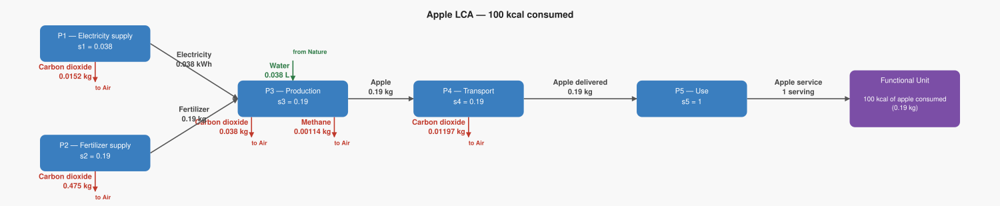
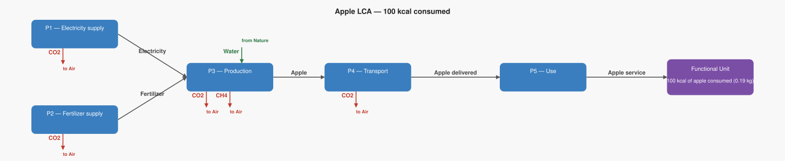

# LCA Results: Apple LCA — 100 kcal consumed

Generated: 2026-06-18 17:47  |  openLCA system ID: `723600eb-74cd-493d-ae39-621f8473fa46`

## Step 1 — Goal and Scope

**Goal:** Calculate the total CO₂ and CH₄ emitted to provide 100 kcal of fresh apple (0.19 kg), tracing the supply chain from farm through transport to consumption. Based on the apple example from the Constructing Inventories lecture slides. Simplified version: no cardboard, no packaging, no co-products, no waste.

**Functional unit:** 1.0 serving — 100 kcal of apple consumed (0.19 kg)

**Reference flow vector f:**

```
  f[1] = 0.0   (Apple)
  f[2] = 0.0   (Apple delivered)
  f[3] = 0.0   (Electricity)
  f[4] = 0.0   (Fertilizer)
  f[5] = 1.0   (Apple service)
```

## Step 2 — Technology Matrix A

Columns = processes, rows = products.  `+` = produced, `−` = consumed.

| | P1 — Electricity supply | P2 — Fertilizer supply | P3 — Production | P4 — Transport | P5 — Use |
|---|---:|---:|---:|---:|---:|
| **Apple** |  0   |  0   | +1.00 | -1.00 |  0   |
| **Apple delivered** |  0   |  0   |  0   | +1.00 | -0.19 |
| **Electricity** | +1.00 |  0   | -0.20 |  0   |  0   |
| **Fertilizer** |  0   | +1.00 | -1.00 |  0   |  0   |
| **Apple service** |  0   |  0   |  0   |  0   | +1.00 |

## Step 3 — Scaling Vector  s = A⁻¹ · f

How many times each process must run to deliver exactly f:

| Process | Scale factor |
|---|---:|
| P1 — Electricity supply | **0.0380** |
| P2 — Fertilizer supply | **0.1900** |
| P3 — Production | **0.1900** |
| P4 — Transport | **0.1900** |
| P5 — Use | **1.0000** |

## Step 4 — Intervention Matrix B

Columns = processes, rows = elementary flows (biosphere).
`+` = emission (exits to environment)  `−` = resource extraction (enters from environment).

| | P1 — Electricity supply | P2 — Fertilizer supply | P3 — Production | P4 — Transport | P5 — Use |
|---|---:|---:|---:|---:|---:|
| **Carbon dioxide** | +0.40 | +2.50 | +0.20 | +0.06 |  0   |
| **Methane** |  0   |  0   | +0.01 |  0   |  0   |
| **Water** |  0   |  0   | -0.20 |  0   |  0   |

## Step 5 — LCI Results  B · s

**Emissions to environment:**

| Flow | Numpy result | openLCA result | Unit | Match |
|---|---:|---:|---|:---:|
| **Carbon dioxide** | 0.5402 | 0.5402 | kg | ✓ |
| **Methane** | 0.0011 | 0.0011 | kg | ✓ |

**Resources from environment (amounts consumed):**

| Flow | Numpy result | openLCA result | Unit | Match |
|---|---:|---:|---|:---:|
| **Water** | 0.0380 | 0.0380 | L | ✓ |

## Step 6 — Scaled Emissions by Process  (B · diag(s))

Each cell = emission rate × scaling factor.  Columns sum to the LCI totals in Step 5.

| Process | s | Carbon dioxide | Methane |
|---|---:|---:|---:|
| P1 — Electricity supply | 0.0380 | 0.0152 | 0 |
| P2 — Fertilizer supply | 0.1900 | 0.4750 | 0 |
| P3 — Production | 0.1900 | 0.0380 | 0.0011 |
| P4 — Transport | 0.1900 | 0.0120 | 0 |
| P5 — Use | 1.0000 | 0 | 0 |
| **Total** | | **0.5402** | **0.0011** |

**Resource extractions by process:**

| Process | s | Water |
|---|---:|---:|
| P1 — Electricity supply | 0.0380 | 0 |
| P2 — Fertilizer supply | 0.1900 | 0 |
| P3 — Production | 0.1900 | 0.0380 |
| P4 — Transport | 0.1900 | 0 |
| P5 — Use | 1.0000 | 0 |
| **Total** | | **0.0380** |

## Step 7 — LCIA Results  (TRACI 2.2)

Characterization factors from the database. Each impact category score is the sum of all elementary flow contributions as computed by the openLCA engine.

| Impact Category | Score | Unit |
|---|---:|---|
| Ozone depletion | **0.000000** | kg CFC-11 eq |
| Ecotoxicity | **0.000000** | CTUe |
| Respiratory effects (Particulate) | **0.000000** | kg PM2.5 eq |
| Acidification | **0.000000** | kg SO2 eq |
| Carcinogenics | **0.000000** | CTUh |
| Global warming | **0.568670** | kg CO2 eq |
| Smog (Photochemical Oxidation Formation) | **0.000016** | kg O3 eq |
| Non carcinogenics | **0.000000** | CTUh |
| Eutrophication: freshwater | **0.000000** | kg P eq |
| Eutrophication: marine | **0.000000** | kg N eq |

## Summary

**LCIA Method:** TRACI 2.2

> **Ozone depletion: 0.000000 kg CFC-11 eq** per 1.0 serving of 100 kcal of apple consumed (0.19 kg)
> **Ecotoxicity: 0.000000 CTUe** per 1.0 serving of 100 kcal of apple consumed (0.19 kg)
> **Respiratory effects (Particulate): 0.000000 kg PM2.5 eq** per 1.0 serving of 100 kcal of apple consumed (0.19 kg)
> **Acidification: 0.000000 kg SO2 eq** per 1.0 serving of 100 kcal of apple consumed (0.19 kg)
> **Carcinogenics: 0.000000 CTUh** per 1.0 serving of 100 kcal of apple consumed (0.19 kg)
> **Global warming: 0.568670 kg CO2 eq** per 1.0 serving of 100 kcal of apple consumed (0.19 kg)
> **Smog (Photochemical Oxidation Formation): 0.000016 kg O3 eq** per 1.0 serving of 100 kcal of apple consumed (0.19 kg)
> **Non carcinogenics: 0.000000 CTUh** per 1.0 serving of 100 kcal of apple consumed (0.19 kg)
> **Eutrophication: freshwater: 0.000000 kg P eq** per 1.0 serving of 100 kcal of apple consumed (0.19 kg)
> **Eutrophication: marine: 0.000000 kg N eq** per 1.0 serving of 100 kcal of apple consumed (0.19 kg)

## Product System Graphs

### Scaled (with amounts)



### Structure (flow names only)



---
*Generated by `lca_scripts/lca_analysis.py` using openLCA gdt-server v2*