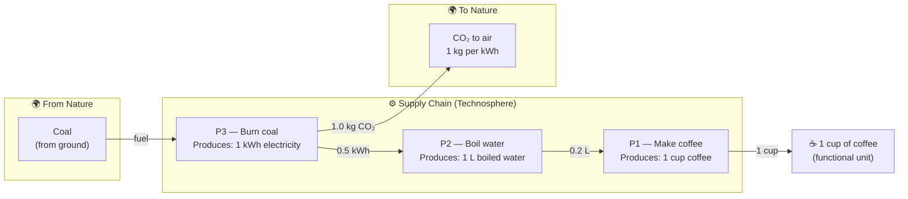

---
# ─────────────────────────────────────────────────────────────
# LCA Analysis Specification
# Run with:  python3 lca_scripts/lca_analysis.py lca_analysis/coffee/analysis.md
# ─────────────────────────────────────────────────────────────

name: Coffee LCA — one cup
goal: >
  Calculate the total CO₂ emitted to produce one cup of coffee,
  tracing the full chain from electricity generation through
  boiling water to brewing.

functional_unit:
  description: One cup of coffee
  amount: 1.0
  unit: cup

units:
  cup: Cup count
  L:   Volume
  kWh: Energy
  kg:  Mass

products:
  - { name: Coffee,        unit: cup }
  - { name: Boiled water,  unit: L   }
  - { name: Electricity,   unit: kWh }

elementary_flows:
  emissions:
    - { name: CO2 to air, unit: kg }

processes:
  - name: P1 — Make coffee
    reference_output: { flow: Coffee,       amount: 1.0 }
    inputs:
      - { flow: Boiled water, amount: 0.2 }

  - name: P2 — Boil water
    reference_output: { flow: Boiled water, amount: 1.0 }
    inputs:
      - { flow: Electricity,  amount: 0.5 }

  - name: P3 — Burn coal
    reference_output: { flow: Electricity,  amount: 1.0 }
    emissions:
      - { flow: CO2 to air,   amount: 1.0 }

reference_process: P1 — Make coffee
---

## About this analysis

Simple three-process chain used to introduce LCA matrix mathematics.

The chain is: coal combustion → electricity → boiling water → coffee.
All CO₂ originates in P3; P1 and P2 have no direct emissions.

Expected result: **0.1 kg CO₂ per cup**.

---

## Product Graph

