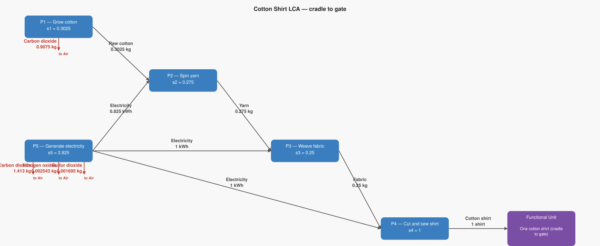
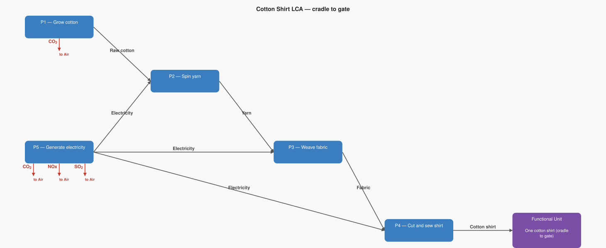

# LCA Results: Cotton Shirt LCA — cradle to gate

Generated: 2026-06-14 01:51  |  openLCA system ID: `563af41e-1fd9-49e8-9d35-f92753551620`

## Step 1 — Goal and Scope

**Goal:** Calculate the total CO₂ emitted to produce one cotton shirt, tracing the full supply chain from cotton farming through yarn spinning, fabric weaving, and garment assembly.

**Functional unit:** 1.0 shirt — One cotton shirt (cradle to gate)

**Reference flow vector f:**

```
  f[1] = 0.0   (Raw cotton)
  f[2] = 0.0   (Yarn)
  f[3] = 0.0   (Fabric)
  f[4] = 1.0   (Cotton shirt)
  f[5] = 0.0   (Electricity)
```

## Step 2 — Technology Matrix A

Columns = processes, rows = products.  `+` = produced, `−` = consumed.

| | P1 — Grow cotton | P2 — Spin yarn | P3 — Weave fabric | P4 — Cut and sew shirt | P5 — Generate electricity |
|---|---:|---:|---:|---:|---:|
| **Raw cotton** | +1.00 | -1.10 |  0   |  0   |  0   |
| **Yarn** |  0   | +1.00 | -1.10 |  0   |  0   |
| **Fabric** |  0   |  0   | +1.00 | -0.25 |  0   |
| **Cotton shirt** |  0   |  0   |  0   | +1.00 |  0   |
| **Electricity** |  0   | -3.00 | -4.00 | -1.00 | +1.00 |

## Step 3 — Scaling Vector  s = A⁻¹ · f

How many times each process must run to deliver exactly f:

| Process | Scale factor |
|---|---:|
| P1 — Grow cotton | **0.3025** |
| P2 — Spin yarn | **0.2750** |
| P3 — Weave fabric | **0.2500** |
| P4 — Cut and sew shirt | **1.0000** |
| P5 — Generate electricity | **2.8250** |

## Step 4 — Intervention Matrix B

Columns = processes, rows = elementary flows (biosphere).
`+` = emission (exits to environment)  `−` = resource extraction (enters from environment).

| | P1 — Grow cotton | P2 — Spin yarn | P3 — Weave fabric | P4 — Cut and sew shirt | P5 — Generate electricity |
|---|---:|---:|---:|---:|---:|
| **Carbon dioxide** | +3.00 |  0   |  0   |  0   | +0.50 |
| **Nitrogen oxides** |  0   |  0   |  0   |  0   | +0.00 |
| **Sulfur dioxide** |  0   |  0   |  0   |  0   | +0.00 |

## Step 5 — LCI Results  B · s

**Emissions to environment:**

| Flow | Numpy result | openLCA result | Unit | Match |
|---|---:|---:|---|:---:|
| **Carbon dioxide** | 2.3200 | 2.3200 | kg | ✓ |
| **Nitrogen oxides** | 0.0025 | 0.0025 | kg | ✓ |
| **Sulfur dioxide** | 0.0017 | 0.0017 | kg | ✓ |

## Step 6 — Scaled Emissions by Process  (B · diag(s))

Each cell = emission rate × scaling factor.  Columns sum to the LCI totals in Step 5.

| Process | s | Carbon dioxide | Nitrogen oxides | Sulfur dioxide |
|---|---:|---:|---:|---:|
| P1 — Grow cotton | 0.3025 | 0.9075 | 0 | 0 |
| P2 — Spin yarn | 0.2750 | 0 | 0 | 0 |
| P3 — Weave fabric | 0.2500 | 0 | 0 | 0 |
| P4 — Cut and sew shirt | 1.0000 | 0 | 0 | 0 |
| P5 — Generate electricity | 2.8250 | 1.4125 | 0.0025 | 0.0017 |
| **Total** | | **2.3200** | **0.0025** | **0.0017** |

## Step 7 — LCIA Results  (TRACI 2.2)

Characterization factors from the database. Each impact category score is the sum of all elementary flow contributions as computed by the openLCA engine.

| Impact Category | Score | Unit |
|---|---:|---|
| Human health - cancer | **0.000000** | CTUcancer |
| Acidification | **0.003475** | kg SO2 eq |
| Eutrophication (Freshwater) | **0.000000** | kg P eq |
| Human health - particulate matter | **0.000122** | PM 2.5 eq |
| Smog formation | **0.063038** | kg O3 eq |
| Human health - non-cancer | **0.000000** | CTUnoncancer |
| Ozone depletion | **0.000000** | kg CFC-11 eq |
| Global warming | **2.320000** | kg CO2 eq |

## Summary

**LCIA Method:** TRACI 2.2

> **Human health - cancer: 0.000000 CTUcancer** per 1.0 shirt of One cotton shirt (cradle to gate)
> **Acidification: 0.003475 kg SO2 eq** per 1.0 shirt of One cotton shirt (cradle to gate)
> **Eutrophication (Freshwater): 0.000000 kg P eq** per 1.0 shirt of One cotton shirt (cradle to gate)
> **Human health - particulate matter: 0.000122 PM 2.5 eq** per 1.0 shirt of One cotton shirt (cradle to gate)
> **Smog formation: 0.063038 kg O3 eq** per 1.0 shirt of One cotton shirt (cradle to gate)
> **Human health - non-cancer: 0.000000 CTUnoncancer** per 1.0 shirt of One cotton shirt (cradle to gate)
> **Ozone depletion: 0.000000 kg CFC-11 eq** per 1.0 shirt of One cotton shirt (cradle to gate)
> **Global warming: 2.320000 kg CO2 eq** per 1.0 shirt of One cotton shirt (cradle to gate)

## Product System Graphs

### Scaled (with amounts)



### Structure (flow names only)



---
*Generated by `lca_scripts/lca_analysis.py` using openLCA gdt-server v2*