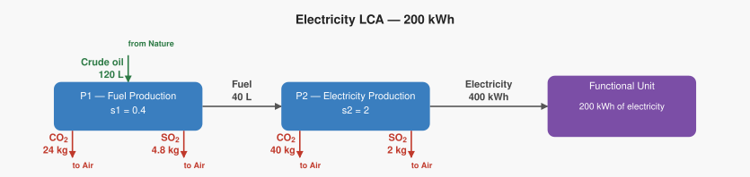
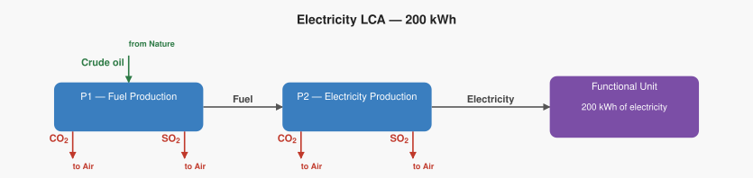

# LCA Results: Electricity LCA — 200 kWh

Generated: 2026-06-18 17:47  |  openLCA system ID: `5a02b78b-d895-4b1f-a92a-9a72d659b167`

## Step 1 — Goal and Scope

**Goal:** Calculate the total emissions and resources needed to produce 200 kWh of electricity from crude oil, tracing through fuel production to electricity generation.

**Functional unit:** 200 kWh — 200 kWh of electricity

**Reference flow vector f:**

```
  f[1] = 0.0   (Fuel)
  f[2] = 200   (Electricity)
```

## Step 2 — Technology Matrix A

Columns = processes, rows = products.  `+` = produced, `−` = consumed.

| | P1 — Fuel Production | P2 — Electricity Production |
|---|---:|---:|
| **Fuel** | +100.00 | -20.00 |
| **Electricity** |  0   | +100.00 |

## Step 3 — Scaling Vector  s = A⁻¹ · f

How many times each process must run to deliver exactly f:

| Process | Scale factor |
|---|---:|
| P1 — Fuel Production | **0.4000** |
| P2 — Electricity Production | **2.0000** |

## Step 4 — Intervention Matrix B

Columns = processes, rows = elementary flows (biosphere).
`+` = emission (exits to environment)  `−` = resource extraction (enters from environment).

| | P1 — Fuel Production | P2 — Electricity Production |
|---|---:|---:|
| **Carbon dioxide** | +60.00 | +20.00 |
| **Sulfur dioxide** | +12.00 | +1.00 |
| **Crude oil** | -300.00 |  0   |

## Step 5 — LCI Results  B · s

**Emissions to environment:**

| Flow | Numpy result | openLCA result | Unit | Match |
|---|---:|---:|---|:---:|
| **Carbon dioxide** | 64.0000 | 64.0000 | kg | ✓ |
| **Sulfur dioxide** | 6.8000 | 6.8000 | kg | ✓ |

**Resources from environment (amounts consumed):**

| Flow | Numpy result | openLCA result | Unit | Match |
|---|---:|---:|---|:---:|
| **Crude oil** | 120.0000 | 120.0000 | L | ✓ |

## Step 6 — Scaled Emissions by Process  (B · diag(s))

Each cell = emission rate × scaling factor.  Columns sum to the LCI totals in Step 5.

| Process | s | Carbon dioxide | Sulfur dioxide |
|---|---:|---:|---:|
| P1 — Fuel Production | 0.4000 | 24.0000 | 4.8000 |
| P2 — Electricity Production | 2.0000 | 40.0000 | 2.0000 |
| **Total** | | **64.0000** | **6.8000** |

**Resource extractions by process:**

| Process | s | Crude oil |
|---|---:|---:|
| P1 — Fuel Production | 0.4000 | 120.0000 |
| P2 — Electricity Production | 2.0000 | 0 |
| **Total** | | **120.0000** |

## Step 7 — LCIA Results  (TRACI 2.2)

Characterization factors from the database. Each impact category score is the sum of all elementary flow contributions as computed by the openLCA engine.

| Impact Category | Score | Unit |
|---|---:|---|
| Ozone depletion | **0.000000** | kg CFC-11 eq |
| Ecotoxicity | **0.000000** | CTUe |
| Respiratory effects (Particulate) | **0.415556** | kg PM2.5 eq |
| Acidification | **6.800000** | kg SO2 eq |
| Carcinogenics | **0.000000** | CTUh |
| Global warming | **64.000000** | kg CO2 eq |
| Smog (Photochemical Oxidation Formation) | **0.000000** | kg O3 eq |
| Non carcinogenics | **0.000000** | CTUh |
| Eutrophication: freshwater | **0.000000** | kg P eq |
| Eutrophication: marine | **0.000000** | kg N eq |

## Summary

**LCIA Method:** TRACI 2.2

> **Ozone depletion: 0.000000 kg CFC-11 eq** per 200 kWh of 200 kWh of electricity
> **Ecotoxicity: 0.000000 CTUe** per 200 kWh of 200 kWh of electricity
> **Respiratory effects (Particulate): 0.415556 kg PM2.5 eq** per 200 kWh of 200 kWh of electricity
> **Acidification: 6.800000 kg SO2 eq** per 200 kWh of 200 kWh of electricity
> **Carcinogenics: 0.000000 CTUh** per 200 kWh of 200 kWh of electricity
> **Global warming: 64.000000 kg CO2 eq** per 200 kWh of 200 kWh of electricity
> **Smog (Photochemical Oxidation Formation): 0.000000 kg O3 eq** per 200 kWh of 200 kWh of electricity
> **Non carcinogenics: 0.000000 CTUh** per 200 kWh of 200 kWh of electricity
> **Eutrophication: freshwater: 0.000000 kg P eq** per 200 kWh of 200 kWh of electricity
> **Eutrophication: marine: 0.000000 kg N eq** per 200 kWh of 200 kWh of electricity

## Product System Graphs

### Scaled (with amounts)



### Structure (flow names only)



---
*Generated by `lca_scripts/lca_analysis.py` using openLCA gdt-server v2*