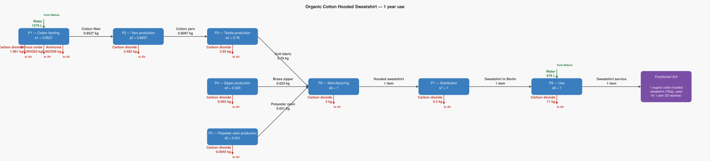
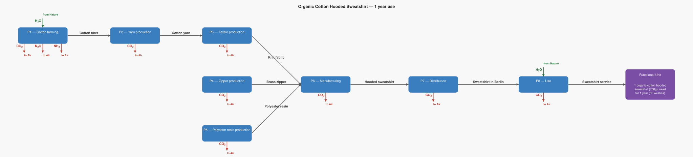

# LCA Results: Organic Cotton Hooded Sweatshirt — 1 year use

Generated: 2026-06-14 02:19  |  openLCA system ID: `109b4469-ad6e-4a6a-9520-e68f422a353c`

## Step 1 — Goal and Scope

**Goal:** Reproduce the supply chain structure from the GreenDelta/OpenLCA hooded sweatshirt case study. Functional unit: 1 organic cotton 2XL hooded sweatshirt (750g), used for 1 year (worn twice a week, washed once a week = 52 washes). Emission factors are approximate, calibrated to match the report's total of 26 kg CO2 eq per sweater per year (EF 3.0 method, base case: Maharashtra, India).

**Functional unit:** 1.0 item — 1 organic cotton hooded sweatshirt (750g), used for 1 year (52 washes)

**Reference flow vector f:**

```
  f[1] = 0.0   (Cotton fiber)
  f[2] = 0.0   (Cotton yarn)
  f[3] = 0.0   (Knit fabric)
  f[4] = 0.0   (Brass zipper)
  f[5] = 0.0   (Polyester resin)
  f[6] = 0.0   (Hooded sweatshirt)
  f[7] = 0.0   (Sweatshirt in Berlin)
  f[8] = 1.0   (Sweatshirt service)
```

## Step 2 — Technology Matrix A

Columns = processes, rows = products.  `+` = produced, `−` = consumed.

| | P1 — Cotton farming | P2 — Yarn production | P3 — Textile production | P4 — Zipper production | P5 — Polyester resin production | P6 — Manufacturing | P7 — Distribution | P8 — Use |
|---|---:|---:|---:|---:|---:|---:|---:|---:|
| **Cotton fiber** | +1.00 | -1.05 |  0   |  0   |  0   |  0   |  0   |  0   |
| **Cotton yarn** |  0   | +1.00 | -1.02 |  0   |  0   |  0   |  0   |  0   |
| **Knit fabric** |  0   |  0   | +1.00 |  0   |  0   | -0.79 |  0   |  0   |
| **Brass zipper** |  0   |  0   |  0   | +1.00 |  0   | -0.02 |  0   |  0   |
| **Polyester resin** |  0   |  0   |  0   |  0   | +1.00 | -0.02 |  0   |  0   |
| **Hooded sweatshirt** |  0   |  0   |  0   |  0   |  0   | +1.00 | -1.00 |  0   |
| **Sweatshirt in Berlin** |  0   |  0   |  0   |  0   |  0   |  0   | +1.00 | -1.00 |
| **Sweatshirt service** |  0   |  0   |  0   |  0   |  0   |  0   |  0   | +1.00 |

## Step 3 — Scaling Vector  s = A⁻¹ · f

How many times each process must run to deliver exactly f:

| Process | Scale factor |
|---|---:|
| P1 — Cotton farming | **0.8527** |
| P2 — Yarn production | **0.8097** |
| P3 — Textile production | **0.7900** |
| P4 — Zipper production | **0.0230** |
| P5 — Polyester resin production | **0.0210** |
| P6 — Manufacturing | **1.0000** |
| P7 — Distribution | **1.0000** |
| P8 — Use | **1.0000** |

## Step 4 — Intervention Matrix B

Columns = processes, rows = elementary flows (biosphere).
`+` = emission (exits to environment)  `−` = resource extraction (enters from environment).

| | P1 — Cotton farming | P2 — Yarn production | P3 — Textile production | P4 — Zipper production | P5 — Polyester resin production | P6 — Manufacturing | P7 — Distribution | P8 — Use |
|---|---:|---:|---:|---:|---:|---:|---:|---:|
| **Carbon dioxide** | +2.30 | +4.30 | +5.00 | +4.00 | +4.50 | +3.00 | +2.50 | +11.00 |
| **Nitrous oxide** | +0.01 |  0   |  0   |  0   |  0   |  0   |  0   |  0   |
| **Ammonia** | +0.00 |  0   |  0   |  0   |  0   |  0   |  0   |  0   |
| **Water** | -1500.00 |  0   |  0   |  0   |  0   |  0   |  0   | -676.00 |

## Step 5 — LCI Results  B · s

**Emissions to environment:**

| Flow | Numpy result | openLCA result | Unit | Match |
|---|---:|---:|---|:---:|
| **Carbon dioxide** | 26.0796 | 26.0796 | kg | ✓ |
| **Nitrous oxide** | 0.0043 | 0.0043 | kg | ✓ |
| **Ammonia** | 0.0026 | 0.0026 | kg | ✓ |

**Resources from environment (amounts consumed):**

| Flow | Numpy result | openLCA result | Unit | Match |
|---|---:|---:|---|:---:|
| **Water** | 1955.0001 | 1955.0001 | L | ✓ |

## Step 6 — Scaled Emissions by Process  (B · diag(s))

Each cell = emission rate × scaling factor.  Columns sum to the LCI totals in Step 5.

| Process | s | Carbon dioxide | Nitrous oxide | Ammonia |
|---|---:|---:|---:|---:|
| P1 — Cotton farming | 0.8527 | 1.9611 | 0.0043 | 0.0026 |
| P2 — Yarn production | 0.8097 | 3.4819 | 0 | 0 |
| P3 — Textile production | 0.7900 | 3.9500 | 0 | 0 |
| P4 — Zipper production | 0.0230 | 0.0920 | 0 | 0 |
| P5 — Polyester resin production | 0.0210 | 0.0945 | 0 | 0 |
| P6 — Manufacturing | 1.0000 | 3.0000 | 0 | 0 |
| P7 — Distribution | 1.0000 | 2.5000 | 0 | 0 |
| P8 — Use | 1.0000 | 11.0000 | 0 | 0 |
| **Total** | | **26.0796** | **0.0043** | **0.0026** |

**Resource extractions by process:**

| Process | s | Water |
|---|---:|---:|
| P1 — Cotton farming | 0.8527 | 1279.0001 |
| P2 — Yarn production | 0.8097 | 0 |
| P3 — Textile production | 0.7900 | 0 |
| P4 — Zipper production | 0.0230 | 0 |
| P5 — Polyester resin production | 0.0210 | 0 |
| P6 — Manufacturing | 1.0000 | 0 |
| P7 — Distribution | 1.0000 | 0 |
| P8 — Use | 1.0000 | 676.0000 |
| **Total** | | **1955.0001** |

## Step 7 — LCIA Results  (TRACI 2.2)

Characterization factors from the database. Each impact category score is the sum of all elementary flow contributions as computed by the openLCA engine.

| Impact Category | Score | Unit |
|---|---:|---|
| Human health - cancer | **0.000000** | CTUcancer |
| Acidification | **0.004809** | kg SO2 eq |
| Eutrophication (Freshwater) | **0.000000** | kg P eq |
| Human health - particulate matter | **0.000171** | PM 2.5 eq |
| Smog formation | **0.000000** | kg O3 eq |
| Human health - non-cancer | **0.000000** | CTUnoncancer |
| Ozone depletion | **0.000000** | kg CFC-11 eq |
| Global warming | **27.350032** | kg CO2 eq |

## Summary

**LCIA Method:** TRACI 2.2

> **Human health - cancer: 0.000000 CTUcancer** per 1.0 item of 1 organic cotton hooded sweatshirt (750g), used for 1 year (52 washes)
> **Acidification: 0.004809 kg SO2 eq** per 1.0 item of 1 organic cotton hooded sweatshirt (750g), used for 1 year (52 washes)
> **Eutrophication (Freshwater): 0.000000 kg P eq** per 1.0 item of 1 organic cotton hooded sweatshirt (750g), used for 1 year (52 washes)
> **Human health - particulate matter: 0.000171 PM 2.5 eq** per 1.0 item of 1 organic cotton hooded sweatshirt (750g), used for 1 year (52 washes)
> **Smog formation: 0.000000 kg O3 eq** per 1.0 item of 1 organic cotton hooded sweatshirt (750g), used for 1 year (52 washes)
> **Human health - non-cancer: 0.000000 CTUnoncancer** per 1.0 item of 1 organic cotton hooded sweatshirt (750g), used for 1 year (52 washes)
> **Ozone depletion: 0.000000 kg CFC-11 eq** per 1.0 item of 1 organic cotton hooded sweatshirt (750g), used for 1 year (52 washes)
> **Global warming: 27.350032 kg CO2 eq** per 1.0 item of 1 organic cotton hooded sweatshirt (750g), used for 1 year (52 washes)

## Product System Graphs

### Scaled (with amounts)



### Structure (flow names only)



---
*Generated by `lca_scripts/lca_analysis.py` using openLCA gdt-server v2*