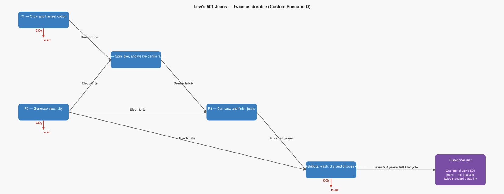

# LCA Results: Levi's 501 Jeans — twice as durable (Custom Scenario D)

Generated: 2026-06-12 00:32  |  openLCA system ID: `e8ccf3e3-f94f-43fa-bc8b-b1c5837b3c6a`

## Step 1 — Goal and Scope

**Goal:** Model the impact of jeans that last twice as long as average. If the product lifetime doubles, only half a manufacturing cycle is needed to cover the same period of use — so P4 only demands 0.5 pairs of finished jeans instead of 1.0. Consumer care washing stays the same (you still wash the same number of times per wear over the period). Question: how much does product durability reduce the lifecycle footprint compared to buying a replacement pair?

**Functional unit:** 1.0 pair — One pair of Levi's 501 jeans — full lifecycle, twice standard durability

**Reference flow vector f:**

```
  f[1] = 0.0   (Raw cotton)
  f[2] = 0.0   (Denim fabric)
  f[3] = 0.0   (Finished jeans)
  f[4] = 1.0   (Levis 501 jeans full lifecycle)
  f[5] = 0.0   (Electricity)
```

## Step 2 — Technology Matrix A

Columns = processes, rows = products.  `+` = produced, `−` = consumed.

| | P1 — Grow and harvest cotton | P2 — Spin, dye, and weave denim fabric | P3 — Cut, sew, and finish jeans | P4 — Distribute, wash, dry, and dispose of jeans | P5 — Generate electricity |
|---|---:|---:|---:|---:|---:|
| **Raw cotton** | +1.00 | -1.25 |  0   |  0   |  0   |
| **Denim fabric** |  0   | +1.00 | -0.80 |  0   |  0   |
| **Finished jeans** |  0   |  0   | +1.00 | -0.50 |  0   |
| **Levis 501 jeans full lifecycle** |  0   |  0   |  0   | +1.00 |  0   |
| **Electricity** |  0   | -22.50 | -5.20 | -25.00 | +1.00 |

## Step 3 — Scaling Vector  s = A⁻¹ · f

How many times each process must run to deliver exactly f:

| Process | Scale factor |
|---|---:|
| P1 — Grow and harvest cotton | **0.5000** |
| P2 — Spin, dye, and weave denim fabric | **0.4000** |
| P3 — Cut, sew, and finish jeans | **0.5000** |
| P4 — Distribute, wash, dry, and dispose of jeans | **1.0000** |
| P5 — Generate electricity | **36.6000** |

## Step 4 — Intervention Matrix B

Columns = processes, rows = elementary flows (biosphere).
`+` = emission (exits to environment)  `−` = resource extraction (enters from environment).

| | P1 — Grow and harvest cotton | P2 — Spin, dye, and weave denim fabric | P3 — Cut, sew, and finish jeans | P4 — Distribute, wash, dry, and dispose of jeans | P5 — Generate electricity |
|---|---:|---:|---:|---:|---:|
| **CO2 to air** | +2.90 |  0   |  0   | +6.40 | +0.50 |

## Step 5 — LCI Results  B · s

**Emissions to environment:**

| Flow | Numpy result | openLCA result | Unit | Match |
|---|---:|---:|---|:---:|
| **CO2 to air** | 26.1500 | 26.1500 | kg | ✓ |

## Step 6 — Scaled Emissions by Process  (B · diag(s))

Each cell = emission rate × scaling factor.  Columns sum to the LCI totals in Step 5.

| Process | s | CO2 to air |
|---|---:|---:|
| P1 — Grow and harvest cotton | 0.5000 | 1.4500 |
| P2 — Spin, dye, and weave denim fabric | 0.4000 | 0 |
| P3 — Cut, sew, and finish jeans | 0.5000 | 0 |
| P4 — Distribute, wash, dry, and dispose of jeans | 1.0000 | 6.4000 |
| P5 — Generate electricity | 36.6000 | 18.3000 |
| **Total** | | **26.1500** |

## Summary

$$
\text{Total emissions} = B \cdot A^{-1} \cdot f
$$

> **CO2 to air: 26.1500 kg** per 1.0 pair of One pair of Levi's 501 jeans — full lifecycle, twice standard durability

## Product System Graphs

### Scaled (with amounts)


### Structure (flow names only)



---
*Generated by `lca_scripts/lca_analysis.py` using openLCA gdt-server v2*