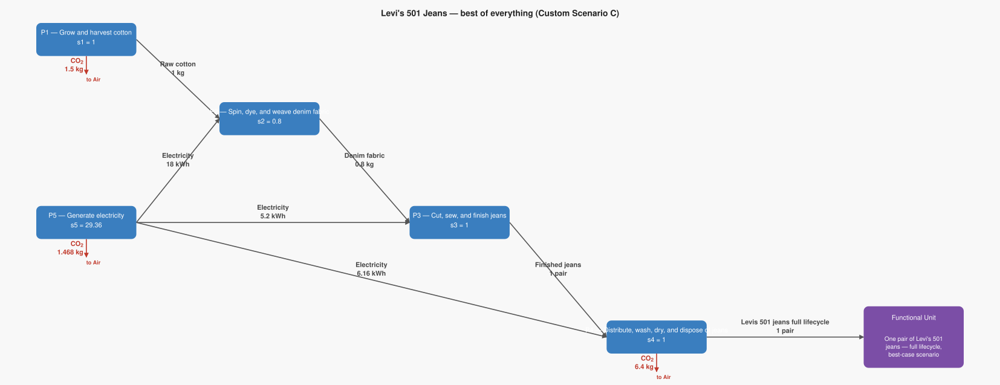
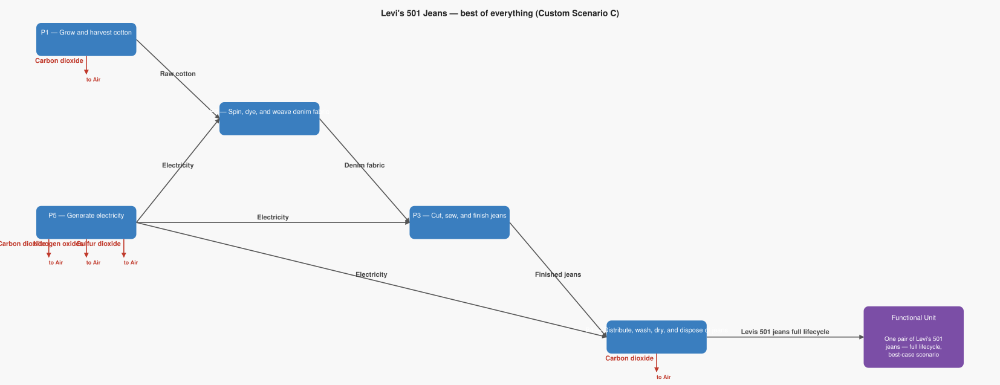

# LCA Results: Levi's 501 Jeans — best of everything (Custom Scenario C)

Generated: 2026-06-14 02:12  |  openLCA system ID: `7016f5db-bc48-449e-a9fe-367376a964dd`

## Step 1 — Goal and Scope

**Goal:** Model the theoretical minimum footprint for a pair of Levi's 501 jeans by combining all available levers simultaneously: organic cotton farm, renewable energy supply chain, and best-practice consumer washing (every 10 wears). This is the absolute floor — what would the footprint be if every decision in the entire lifecycle were made as sustainably as possible?

**Functional unit:** 1.0 pair — One pair of Levi's 501 jeans — full lifecycle, best-case scenario

**Reference flow vector f:**

```
  f[1] = 0.0   (Raw cotton)
  f[2] = 0.0   (Denim fabric)
  f[3] = 0.0   (Finished jeans)
  f[4] = 1.0   (Levis 501 jeans full lifecycle)
  f[5] = 0.0   (Electricity)
```

## Step 2 — Technology Matrix A

Columns = processes, rows = products.  `+` = produced, `−` = consumed.

| | P1 — Grow and harvest cotton | P2 — Spin, dye, and weave denim fabric | P3 — Cut, sew, and finish jeans | P4 — Distribute, wash, dry, and dispose of jeans | P5 — Generate electricity |
|---|---:|---:|---:|---:|---:|
| **Raw cotton** | +1.00 | -1.25 |  0   |  0   |  0   |
| **Denim fabric** |  0   | +1.00 | -0.80 |  0   |  0   |
| **Finished jeans** |  0   |  0   | +1.00 | -1.00 |  0   |
| **Levis 501 jeans full lifecycle** |  0   |  0   |  0   | +1.00 |  0   |
| **Electricity** |  0   | -22.50 | -5.20 | -6.16 | +1.00 |

## Step 3 — Scaling Vector  s = A⁻¹ · f

How many times each process must run to deliver exactly f:

| Process | Scale factor |
|---|---:|
| P1 — Grow and harvest cotton | **1.0000** |
| P2 — Spin, dye, and weave denim fabric | **0.8000** |
| P3 — Cut, sew, and finish jeans | **1.0000** |
| P4 — Distribute, wash, dry, and dispose of jeans | **1.0000** |
| P5 — Generate electricity | **29.3600** |

## Step 4 — Intervention Matrix B

Columns = processes, rows = elementary flows (biosphere).
`+` = emission (exits to environment)  `−` = resource extraction (enters from environment).

| | P1 — Grow and harvest cotton | P2 — Spin, dye, and weave denim fabric | P3 — Cut, sew, and finish jeans | P4 — Distribute, wash, dry, and dispose of jeans | P5 — Generate electricity |
|---|---:|---:|---:|---:|---:|
| **Carbon dioxide** | +1.50 |  0   |  0   | +6.40 | +0.05 |
| **Nitrogen oxides** |  0   |  0   |  0   |  0   | +0.00 |
| **Sulfur dioxide** |  0   |  0   |  0   |  0   | +0.00 |

## Step 5 — LCI Results  B · s

**Emissions to environment:**

| Flow | Numpy result | openLCA result | Unit | Match |
|---|---:|---:|---|:---:|
| **Carbon dioxide** | 9.3680 | 9.3680 | kg | ✓ |
| **Nitrogen oxides** | 0.0026 | 0.0026 | kg | ✓ |
| **Sulfur dioxide** | 0.0018 | 0.0018 | kg | ✓ |

## Step 6 — Scaled Emissions by Process  (B · diag(s))

Each cell = emission rate × scaling factor.  Columns sum to the LCI totals in Step 5.

| Process | s | Carbon dioxide | Nitrogen oxides | Sulfur dioxide |
|---|---:|---:|---:|---:|
| P1 — Grow and harvest cotton | 1.0000 | 1.5000 | 0 | 0 |
| P2 — Spin, dye, and weave denim fabric | 0.8000 | 0 | 0 | 0 |
| P3 — Cut, sew, and finish jeans | 1.0000 | 0 | 0 | 0 |
| P4 — Distribute, wash, dry, and dispose of jeans | 1.0000 | 6.4000 | 0 | 0 |
| P5 — Generate electricity | 29.3600 | 1.4680 | 0.0026 | 0.0018 |
| **Total** | | **9.3680** | **0.0026** | **0.0018** |

## Step 7 — LCIA Results  (TRACI 2.2)

Characterization factors from the database. Each impact category score is the sum of all elementary flow contributions as computed by the openLCA engine.

| Impact Category | Score | Unit |
|---|---:|---|
| Human health - cancer | **0.000000** | CTUcancer |
| Acidification | **0.003611** | kg SO2 eq |
| Eutrophication (Freshwater) | **0.000000** | kg P eq |
| Human health - particulate matter | **0.000127** | PM 2.5 eq |
| Smog formation | **0.065515** | kg O3 eq |
| Human health - non-cancer | **0.000000** | CTUnoncancer |
| Ozone depletion | **0.000000** | kg CFC-11 eq |
| Global warming | **9.368000** | kg CO2 eq |

## Summary

**LCIA Method:** TRACI 2.2

> **Human health - cancer: 0.000000 CTUcancer** per 1.0 pair of One pair of Levi's 501 jeans — full lifecycle, best-case scenario
> **Acidification: 0.003611 kg SO2 eq** per 1.0 pair of One pair of Levi's 501 jeans — full lifecycle, best-case scenario
> **Eutrophication (Freshwater): 0.000000 kg P eq** per 1.0 pair of One pair of Levi's 501 jeans — full lifecycle, best-case scenario
> **Human health - particulate matter: 0.000127 PM 2.5 eq** per 1.0 pair of One pair of Levi's 501 jeans — full lifecycle, best-case scenario
> **Smog formation: 0.065515 kg O3 eq** per 1.0 pair of One pair of Levi's 501 jeans — full lifecycle, best-case scenario
> **Human health - non-cancer: 0.000000 CTUnoncancer** per 1.0 pair of One pair of Levi's 501 jeans — full lifecycle, best-case scenario
> **Ozone depletion: 0.000000 kg CFC-11 eq** per 1.0 pair of One pair of Levi's 501 jeans — full lifecycle, best-case scenario
> **Global warming: 9.368000 kg CO2 eq** per 1.0 pair of One pair of Levi's 501 jeans — full lifecycle, best-case scenario

## Product System Graphs

### Scaled (with amounts)



### Structure (flow names only)



---
*Generated by `lca_scripts/lca_analysis.py` using openLCA gdt-server v2*