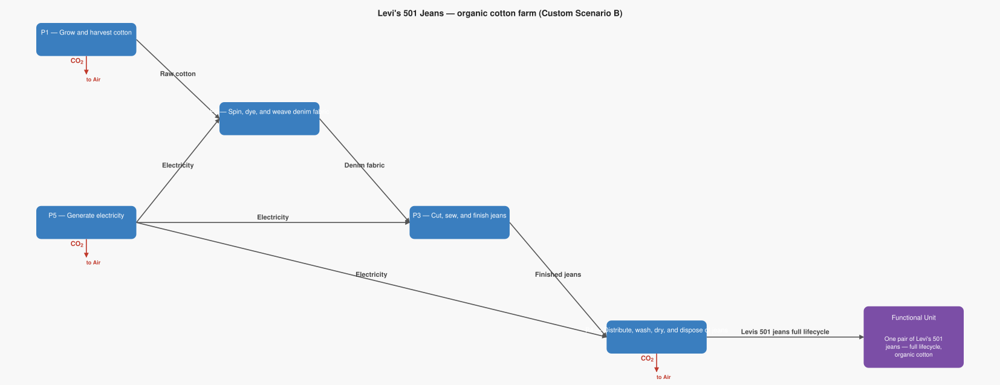

# LCA Results: Levi's 501 Jeans — organic cotton farm (Custom Scenario B)

Generated: 2026-06-18 17:49  |  openLCA system ID: `1179b55c-44a7-4178-b0dc-8e501f8680e1`

## Step 1 — Goal and Scope

**Goal:** Model the impact of switching from conventional cotton to organic cotton. Organic cotton avoids synthetic nitrogen fertilisers, which are a major source of CO₂ and N₂O emissions on conventional cotton farms. The farm emission factor drops from 2.9 kg to 1.5 kg CO₂ per kg of raw cotton. Everything else is identical to the baseline. Question: is the "organic cotton" label actually meaningful for climate impact?

**Functional unit:** 1.0 pair — One pair of Levi's 501 jeans — full lifecycle, organic cotton

**Reference flow vector f:**

```
  f[1] = 0.0   (Raw cotton)
  f[2] = 0.0   (Denim fabric)
  f[3] = 0.0   (Finished jeans)
  f[4] = 1.0   (Levis 501 jeans full lifecycle)
  f[5] = 0.0   (Electricity)
```

## Step 2 — Technology Matrix A

Columns = processes, rows = products.  `+` = produced, `−` = consumed.

| | P1 — Grow and harvest cotton | P2 — Spin, dye, and weave denim fabric | P3 — Cut, sew, and finish jeans | P4 — Distribute, wash, dry, and dispose of jeans | P5 — Generate electricity |
|---|---:|---:|---:|---:|---:|
| **Raw cotton** | +1.00 | -1.25 |  0   |  0   |  0   |
| **Denim fabric** |  0   | +1.00 | -0.80 |  0   |  0   |
| **Finished jeans** |  0   |  0   | +1.00 | -1.00 |  0   |
| **Levis 501 jeans full lifecycle** |  0   |  0   |  0   | +1.00 |  0   |
| **Electricity** |  0   | -22.50 | -5.20 | -25.00 | +1.00 |

## Step 3 — Scaling Vector  s = A⁻¹ · f

How many times each process must run to deliver exactly f:

| Process | Scale factor |
|---|---:|
| P1 — Grow and harvest cotton | **1.0000** |
| P2 — Spin, dye, and weave denim fabric | **0.8000** |
| P3 — Cut, sew, and finish jeans | **1.0000** |
| P4 — Distribute, wash, dry, and dispose of jeans | **1.0000** |
| P5 — Generate electricity | **48.2000** |

## Step 4 — Intervention Matrix B

Columns = processes, rows = elementary flows (biosphere).
`+` = emission (exits to environment)  `−` = resource extraction (enters from environment).

| | P1 — Grow and harvest cotton | P2 — Spin, dye, and weave denim fabric | P3 — Cut, sew, and finish jeans | P4 — Distribute, wash, dry, and dispose of jeans | P5 — Generate electricity |
|---|---:|---:|---:|---:|---:|
| **Carbon dioxide** | +1.50 |  0   |  0   | +6.40 | +0.50 |
| **Nitrogen oxides** |  0   |  0   |  0   |  0   | +0.00 |
| **Sulfur dioxide** |  0   |  0   |  0   |  0   | +0.00 |

## Step 5 — LCI Results  B · s

**Emissions to environment:**

| Flow | Numpy result | openLCA result | Unit | Match |
|---|---:|---:|---|:---:|
| **Carbon dioxide** | 32.0000 | 32.0000 | kg | ✓ |
| **Nitrogen oxides** | 0.0434 | 0.0434 | kg | ✓ |
| **Sulfur dioxide** | 0.0289 | 0.0289 | kg | ✓ |

## Step 6 — Scaled Emissions by Process  (B · diag(s))

Each cell = emission rate × scaling factor.  Columns sum to the LCI totals in Step 5.

| Process | s | Carbon dioxide | Nitrogen oxides | Sulfur dioxide |
|---|---:|---:|---:|---:|
| P1 — Grow and harvest cotton | 1.0000 | 1.5000 | 0 | 0 |
| P2 — Spin, dye, and weave denim fabric | 0.8000 | 0 | 0 | 0 |
| P3 — Cut, sew, and finish jeans | 1.0000 | 0 | 0 | 0 |
| P4 — Distribute, wash, dry, and dispose of jeans | 1.0000 | 6.4000 | 0 | 0 |
| P5 — Generate electricity | 48.2000 | 24.1000 | 0.0434 | 0.0289 |
| **Total** | | **32.0000** | **0.0434** | **0.0289** |

## Step 7 — LCIA Results  (TRACI 2.2)

Characterization factors from the database. Each impact category score is the sum of all elementary flow contributions as computed by the openLCA engine.

| Impact Category | Score | Unit |
|---|---:|---|
| Ozone depletion | **0.000000** | kg CFC-11 eq |
| Ecotoxicity | **0.000000** | CTUe |
| Respiratory effects (Particulate) | **0.002081** | kg PM2.5 eq |
| Acidification | **0.059286** | kg SO2 eq |
| Carcinogenics | **0.000000** | CTUh |
| Global warming | **32.000000** | kg CO2 eq |
| Smog (Photochemical Oxidation Formation) | **1.075390** | kg O3 eq |
| Non carcinogenics | **0.000000** | CTUh |
| Eutrophication: freshwater | **0.000000** | kg P eq |
| Eutrophication: marine | **0.000222** | kg N eq |

## Summary

**LCIA Method:** TRACI 2.2

> **Ozone depletion: 0.000000 kg CFC-11 eq** per 1.0 pair of One pair of Levi's 501 jeans — full lifecycle, organic cotton
> **Ecotoxicity: 0.000000 CTUe** per 1.0 pair of One pair of Levi's 501 jeans — full lifecycle, organic cotton
> **Respiratory effects (Particulate): 0.002081 kg PM2.5 eq** per 1.0 pair of One pair of Levi's 501 jeans — full lifecycle, organic cotton
> **Acidification: 0.059286 kg SO2 eq** per 1.0 pair of One pair of Levi's 501 jeans — full lifecycle, organic cotton
> **Carcinogenics: 0.000000 CTUh** per 1.0 pair of One pair of Levi's 501 jeans — full lifecycle, organic cotton
> **Global warming: 32.000000 kg CO2 eq** per 1.0 pair of One pair of Levi's 501 jeans — full lifecycle, organic cotton
> **Smog (Photochemical Oxidation Formation): 1.075390 kg O3 eq** per 1.0 pair of One pair of Levi's 501 jeans — full lifecycle, organic cotton
> **Non carcinogenics: 0.000000 CTUh** per 1.0 pair of One pair of Levi's 501 jeans — full lifecycle, organic cotton
> **Eutrophication: freshwater: 0.000000 kg P eq** per 1.0 pair of One pair of Levi's 501 jeans — full lifecycle, organic cotton
> **Eutrophication: marine: 0.000222 kg N eq** per 1.0 pair of One pair of Levi's 501 jeans — full lifecycle, organic cotton

## Product System Graphs

### Scaled (with amounts)


### Structure (flow names only)



---
*Generated by `lca_scripts/lca_analysis.py` using openLCA gdt-server v2*