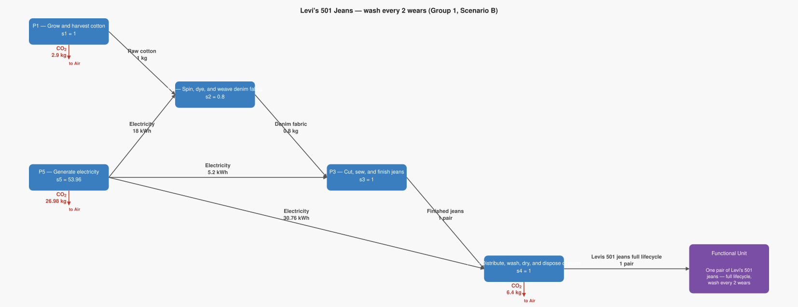
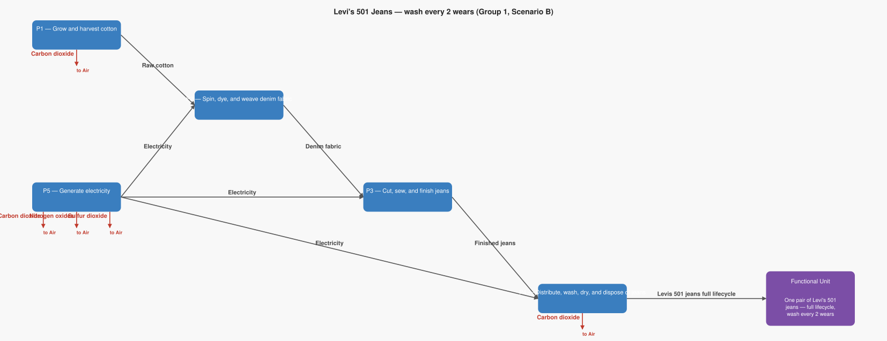

# LCA Results: Levi's 501 Jeans — wash every 2 wears (Group 1, Scenario B)

Generated: 2026-06-18 17:50  |  openLCA system ID: `670793b9-5dc1-44ef-8f10-089c6ae0b2f4`

## Step 1 — Goal and Scope

**Goal:** Reproduce the Levi's 2015 LCA consumer care scenario where the consumer washes their jeans once every 2 times they wear them. This is close to the US average (which is every 2.3 wears). US consumer, conventional washing machine, average mix of cold/warm water and tumble dry. Based on Levi Strauss & Co.'s 2015 LCA study.

**Functional unit:** 1.0 pair — One pair of Levi's 501 jeans — full lifecycle, wash every 2 wears

**Reference flow vector f:**

```
  f[1] = 0.0   (Raw cotton)
  f[2] = 0.0   (Denim fabric)
  f[3] = 0.0   (Finished jeans)
  f[4] = 1.0   (Levis 501 jeans full lifecycle)
  f[5] = 0.0   (Electricity)
```

## Step 2 — Technology Matrix A

Columns = processes, rows = products.  `+` = produced, `−` = consumed.

| | P1 — Grow and harvest cotton | P2 — Spin, dye, and weave denim fabric | P3 — Cut, sew, and finish jeans | P4 — Distribute, wash, dry, and dispose of jeans | P5 — Generate electricity |
|---|---:|---:|---:|---:|---:|
| **Raw cotton** | +1.00 | -1.25 |  0   |  0   |  0   |
| **Denim fabric** |  0   | +1.00 | -0.80 |  0   |  0   |
| **Finished jeans** |  0   |  0   | +1.00 | -1.00 |  0   |
| **Levis 501 jeans full lifecycle** |  0   |  0   |  0   | +1.00 |  0   |
| **Electricity** |  0   | -22.50 | -5.20 | -30.76 | +1.00 |

## Step 3 — Scaling Vector  s = A⁻¹ · f

How many times each process must run to deliver exactly f:

| Process | Scale factor |
|---|---:|
| P1 — Grow and harvest cotton | **1.0000** |
| P2 — Spin, dye, and weave denim fabric | **0.8000** |
| P3 — Cut, sew, and finish jeans | **1.0000** |
| P4 — Distribute, wash, dry, and dispose of jeans | **1.0000** |
| P5 — Generate electricity | **53.9600** |

## Step 4 — Intervention Matrix B

Columns = processes, rows = elementary flows (biosphere).
`+` = emission (exits to environment)  `−` = resource extraction (enters from environment).

| | P1 — Grow and harvest cotton | P2 — Spin, dye, and weave denim fabric | P3 — Cut, sew, and finish jeans | P4 — Distribute, wash, dry, and dispose of jeans | P5 — Generate electricity |
|---|---:|---:|---:|---:|---:|
| **Carbon dioxide** | +2.90 |  0   |  0   | +6.40 | +0.50 |
| **Nitrogen oxides** |  0   |  0   |  0   |  0   | +0.00 |
| **Sulfur dioxide** |  0   |  0   |  0   |  0   | +0.00 |

## Step 5 — LCI Results  B · s

**Emissions to environment:**

| Flow | Numpy result | openLCA result | Unit | Match |
|---|---:|---:|---|:---:|
| **Carbon dioxide** | 36.2800 | 36.2800 | kg | ✓ |
| **Nitrogen oxides** | 0.0486 | 0.0486 | kg | ✓ |
| **Sulfur dioxide** | 0.0324 | 0.0324 | kg | ✓ |

## Step 6 — Scaled Emissions by Process  (B · diag(s))

Each cell = emission rate × scaling factor.  Columns sum to the LCI totals in Step 5.

| Process | s | Carbon dioxide | Nitrogen oxides | Sulfur dioxide |
|---|---:|---:|---:|---:|
| P1 — Grow and harvest cotton | 1.0000 | 2.9000 | 0 | 0 |
| P2 — Spin, dye, and weave denim fabric | 0.8000 | 0 | 0 | 0 |
| P3 — Cut, sew, and finish jeans | 1.0000 | 0 | 0 | 0 |
| P4 — Distribute, wash, dry, and dispose of jeans | 1.0000 | 6.4000 | 0 | 0 |
| P5 — Generate electricity | 53.9600 | 26.9800 | 0.0486 | 0.0324 |
| **Total** | | **36.2800** | **0.0486** | **0.0324** |

## Step 7 — LCIA Results  (TRACI 2.2)

Characterization factors from the database. Each impact category score is the sum of all elementary flow contributions as computed by the openLCA engine.

| Impact Category | Score | Unit |
|---|---:|---|
| Ozone depletion | **0.000000** | kg CFC-11 eq |
| Ecotoxicity | **0.000000** | CTUe |
| Respiratory effects (Particulate) | **0.002329** | kg PM2.5 eq |
| Acidification | **0.066371** | kg SO2 eq |
| Carcinogenics | **0.000000** | CTUh |
| Global warming | **36.280000** | kg CO2 eq |
| Smog (Photochemical Oxidation Formation) | **1.203902** | kg O3 eq |
| Non carcinogenics | **0.000000** | CTUh |
| Eutrophication: freshwater | **0.000000** | kg P eq |
| Eutrophication: marine | **0.000248** | kg N eq |

## Summary

**LCIA Method:** TRACI 2.2

> **Ozone depletion: 0.000000 kg CFC-11 eq** per 1.0 pair of One pair of Levi's 501 jeans — full lifecycle, wash every 2 wears
> **Ecotoxicity: 0.000000 CTUe** per 1.0 pair of One pair of Levi's 501 jeans — full lifecycle, wash every 2 wears
> **Respiratory effects (Particulate): 0.002329 kg PM2.5 eq** per 1.0 pair of One pair of Levi's 501 jeans — full lifecycle, wash every 2 wears
> **Acidification: 0.066371 kg SO2 eq** per 1.0 pair of One pair of Levi's 501 jeans — full lifecycle, wash every 2 wears
> **Carcinogenics: 0.000000 CTUh** per 1.0 pair of One pair of Levi's 501 jeans — full lifecycle, wash every 2 wears
> **Global warming: 36.280000 kg CO2 eq** per 1.0 pair of One pair of Levi's 501 jeans — full lifecycle, wash every 2 wears
> **Smog (Photochemical Oxidation Formation): 1.203902 kg O3 eq** per 1.0 pair of One pair of Levi's 501 jeans — full lifecycle, wash every 2 wears
> **Non carcinogenics: 0.000000 CTUh** per 1.0 pair of One pair of Levi's 501 jeans — full lifecycle, wash every 2 wears
> **Eutrophication: freshwater: 0.000000 kg P eq** per 1.0 pair of One pair of Levi's 501 jeans — full lifecycle, wash every 2 wears
> **Eutrophication: marine: 0.000248 kg N eq** per 1.0 pair of One pair of Levi's 501 jeans — full lifecycle, wash every 2 wears

## Product System Graphs

### Scaled (with amounts)



### Structure (flow names only)



---
*Generated by `lca_scripts/lca_analysis.py` using openLCA gdt-server v2*