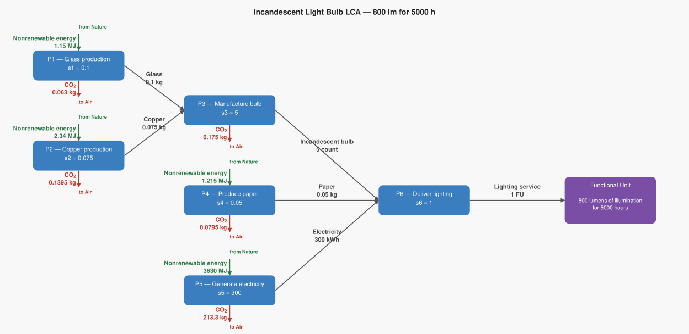
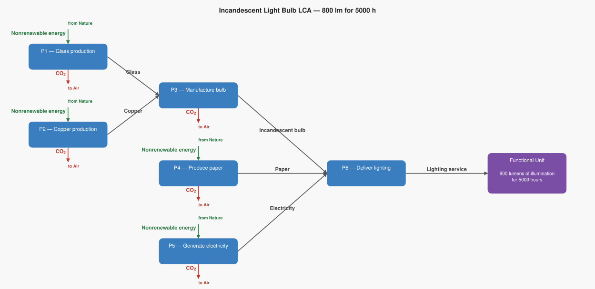

# LCA Results: Incandescent Light Bulb LCA — 800 lm for 5000 h

Generated: 2026-06-14 02:19  |  openLCA system ID: `dabc9b3f-1e77-4949-86ac-0c8a395cd074`

## Step 1 — Goal and Scope

**Goal:** Calculate the total CO₂ emitted to provide 800 lumens of illumination for 5000 hours using incandescent light bulbs, tracing through material extraction, manufacturing, packaging, and electricity generation.

**Functional unit:** 1 FU — 800 lumens of illumination for 5000 hours

**Reference flow vector f:**

```
  f[1] = 0.0   (Glass)
  f[2] = 0.0   (Copper)
  f[3] = 0.0   (Incandescent bulb)
  f[4] = 0.0   (Paper)
  f[5] = 0.0   (Electricity)
  f[6] = 1   (Lighting service)
```

## Step 2 — Technology Matrix A

Columns = processes, rows = products.  `+` = produced, `−` = consumed.

| | P1 — Glass production | P2 — Copper production | P3 — Manufacture bulb | P4 — Produce paper | P5 — Generate electricity | P6 — Deliver lighting |
|---|---:|---:|---:|---:|---:|---:|
| **Glass** | +1.00 |  0   | -0.02 |  0   |  0   |  0   |
| **Copper** |  0   | +1.00 | -0.01 |  0   |  0   |  0   |
| **Incandescent bulb** |  0   |  0   | +1.00 |  0   |  0   | -5.00 |
| **Paper** |  0   |  0   |  0   | +1.00 |  0   | -0.05 |
| **Electricity** |  0   |  0   |  0   |  0   | +1.00 | -300.00 |
| **Lighting service** |  0   |  0   |  0   |  0   |  0   | +1.00 |

## Step 3 — Scaling Vector  s = A⁻¹ · f

How many times each process must run to deliver exactly f:

| Process | Scale factor |
|---|---:|
| P1 — Glass production | **0.1000** |
| P2 — Copper production | **0.0750** |
| P3 — Manufacture bulb | **5.0000** |
| P4 — Produce paper | **0.0500** |
| P5 — Generate electricity | **300.0000** |
| P6 — Deliver lighting | **1.0000** |

## Step 4 — Intervention Matrix B

Columns = processes, rows = elementary flows (biosphere).
`+` = emission (exits to environment)  `−` = resource extraction (enters from environment).

| | P1 — Glass production | P2 — Copper production | P3 — Manufacture bulb | P4 — Produce paper | P5 — Generate electricity | P6 — Deliver lighting |
|---|---:|---:|---:|---:|---:|---:|
| **Carbon dioxide** | +0.63 | +1.86 | +0.04 | +1.59 | +0.71 |  0   |
| **Nonrenewable energy** | -11.50 | -31.20 |  0   | -24.30 | -12.10 |  0   |

## Step 5 — LCI Results  B · s

**Emissions to environment:**

| Flow | Numpy result | openLCA result | Unit | Match |
|---|---:|---:|---|:---:|
| **Carbon dioxide** | 213.7570 | 213.7570 | kg | ✓ |

**Resources from environment (amounts consumed):**

| Flow | Numpy result | openLCA result | Unit | Match |
|---|---:|---:|---|:---:|
| **Nonrenewable energy** | 3634.7050 | 3634.7050 | MJ | ✓ |

## Step 6 — Scaled Emissions by Process  (B · diag(s))

Each cell = emission rate × scaling factor.  Columns sum to the LCI totals in Step 5.

| Process | s | Carbon dioxide |
|---|---:|---:|
| P1 — Glass production | 0.1000 | 0.0630 |
| P2 — Copper production | 0.0750 | 0.1395 |
| P3 — Manufacture bulb | 5.0000 | 0.1750 |
| P4 — Produce paper | 0.0500 | 0.0795 |
| P5 — Generate electricity | 300.0000 | 213.3000 |
| P6 — Deliver lighting | 1.0000 | 0 |
| **Total** | | **213.7570** |

**Resource extractions by process:**

| Process | s | Nonrenewable energy |
|---|---:|---:|
| P1 — Glass production | 0.1000 | 1.1500 |
| P2 — Copper production | 0.0750 | 2.3400 |
| P3 — Manufacture bulb | 5.0000 | 0 |
| P4 — Produce paper | 0.0500 | 1.2150 |
| P5 — Generate electricity | 300.0000 | 3630.0000 |
| P6 — Deliver lighting | 1.0000 | 0 |
| **Total** | | **3634.7050** |

## Step 7 — LCIA Results  (TRACI 2.2)

Characterization factors from the database. Each impact category score is the sum of all elementary flow contributions as computed by the openLCA engine.

| Impact Category | Score | Unit |
|---|---:|---|
| Human health - cancer | **0.000000** | CTUcancer |
| Acidification | **0.000000** | kg SO2 eq |
| Eutrophication (Freshwater) | **0.000000** | kg P eq |
| Human health - particulate matter | **0.000000** | PM 2.5 eq |
| Smog formation | **0.000000** | kg O3 eq |
| Human health - non-cancer | **0.000000** | CTUnoncancer |
| Ozone depletion | **0.000000** | kg CFC-11 eq |
| Global warming | **213.757000** | kg CO2 eq |

## Summary

**LCIA Method:** TRACI 2.2

> **Human health - cancer: 0.000000 CTUcancer** per 1 FU of 800 lumens of illumination for 5000 hours
> **Acidification: 0.000000 kg SO2 eq** per 1 FU of 800 lumens of illumination for 5000 hours
> **Eutrophication (Freshwater): 0.000000 kg P eq** per 1 FU of 800 lumens of illumination for 5000 hours
> **Human health - particulate matter: 0.000000 PM 2.5 eq** per 1 FU of 800 lumens of illumination for 5000 hours
> **Smog formation: 0.000000 kg O3 eq** per 1 FU of 800 lumens of illumination for 5000 hours
> **Human health - non-cancer: 0.000000 CTUnoncancer** per 1 FU of 800 lumens of illumination for 5000 hours
> **Ozone depletion: 0.000000 kg CFC-11 eq** per 1 FU of 800 lumens of illumination for 5000 hours
> **Global warming: 213.757000 kg CO2 eq** per 1 FU of 800 lumens of illumination for 5000 hours

## Product System Graphs

### Scaled (with amounts)



### Structure (flow names only)



---
*Generated by `lca_scripts/lca_analysis.py` using openLCA gdt-server v2*