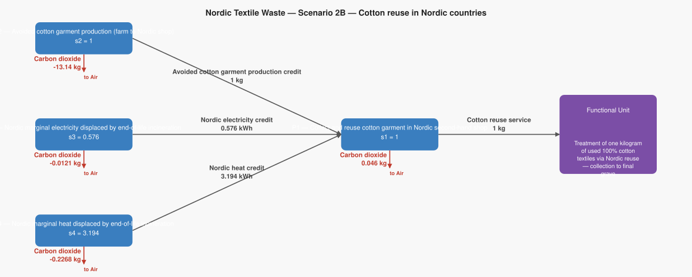
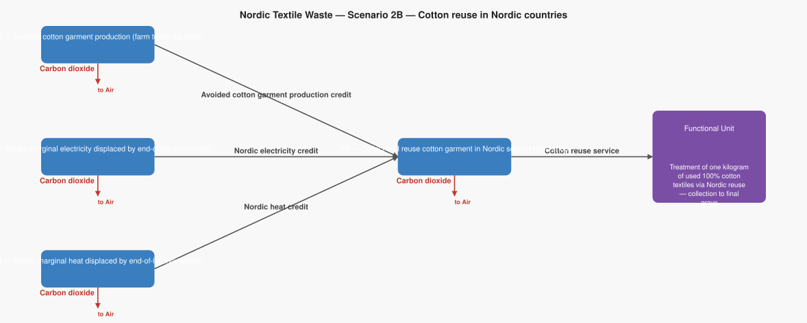

# LCA Results: Nordic Textile Waste — Scenario 2B — Cotton reuse in Nordic countries

Generated: 2026-06-12 08:29  |  openLCA system ID: `f89e450f-06c1-4aaf-a6b7-7d89beae5bb1`

## Step 1 — Goal and Scope

**Goal:** Model the climate change benefit of reusing one kilogram of used 100% cotton textiles through Nordic second-hand shops, rather than incinerating them. When a consumer buys a second-hand cotton garment instead of a new one, the production of an entirely new cotton garment is avoided — from growing the raw cotton in the field, through spinning, weaving, dyeing, cutting, sewing, and shipping from Asia to Scandinavia. That avoided production is a very large CO₂ credit. At the end of its second life, the garment is still incinerated with energy recovery (same as Scenario 2A). Based on Schmidt et al., TemaNord 2016:537.

**Functional unit:** 1.0 kg — Treatment of one kilogram of used 100% cotton textiles via Nordic reuse — collection to final grave

**Reference flow vector f:**

```
  f[1] = 1.0   (Cotton reuse service)
  f[2] = 0.0   (Avoided cotton garment production credit)
  f[3] = 0.0   (Nordic electricity credit)
  f[4] = 0.0   (Nordic heat credit)
```

## Step 2 — Technology Matrix A

Columns = processes, rows = products.  `+` = produced, `−` = consumed.

| | P1 — Collect and reuse cotton garment in Nordic second-hand shop | P2 — Avoided cotton garment production (farm to Nordic shop) | P3 — Nordic marginal electricity displaced by end-of-life incineration | P4 — Nordic marginal heat displaced by end-of-life incineration |
|---|---:|---:|---:|---:|
| **Cotton reuse service** | +1.00 |  0   |  0   |  0   |
| **Avoided cotton garment production credit** | -1.00 | +1.00 |  0   |  0   |
| **Nordic electricity credit** | -0.58 |  0   | +1.00 |  0   |
| **Nordic heat credit** | -3.19 |  0   |  0   | +1.00 |

## Step 3 — Scaling Vector  s = A⁻¹ · f

How many times each process must run to deliver exactly f:

| Process | Scale factor |
|---|---:|
| P1 — Collect and reuse cotton garment in Nordic second-hand shop | **1.0000** |
| P2 — Avoided cotton garment production (farm to Nordic shop) | **1.0000** |
| P3 — Nordic marginal electricity displaced by end-of-life incineration | **0.5760** |
| P4 — Nordic marginal heat displaced by end-of-life incineration | **3.1940** |

## Step 4 — Intervention Matrix B

Columns = processes, rows = elementary flows (biosphere).
`+` = emission (exits to environment)  `−` = resource extraction (enters from environment).

| | P1 — Collect and reuse cotton garment in Nordic second-hand shop | P2 — Avoided cotton garment production (farm to Nordic shop) | P3 — Nordic marginal electricity displaced by end-of-life incineration | P4 — Nordic marginal heat displaced by end-of-life incineration |
|---|---:|---:|---:|---:|
| **CO2 to air** | +0.05 | -13.14 | -0.02 | -0.07 |

## Step 5 — LCI Results  B · s

**Emissions to environment:**

| Flow | Numpy result | openLCA result | Unit | Match |
|---|---:|---:|---|:---:|
| **CO2 to air** | -13.3329 | -13.3329 | kg | ✓ |

## Step 6 — Scaled Emissions by Process  (B · diag(s))

Each cell = emission rate × scaling factor.  Columns sum to the LCI totals in Step 5.

| Process | s | CO2 to air |
|---|---:|---:|
| P1 — Collect and reuse cotton garment in Nordic second-hand shop | 1.0000 | 0.0460 |
| P2 — Avoided cotton garment production (farm to Nordic shop) | 1.0000 | -13.1400 |
| P3 — Nordic marginal electricity displaced by end-of-life incineration | 0.5760 | -0.0121 |
| P4 — Nordic marginal heat displaced by end-of-life incineration | 3.1940 | -0.2268 |
| **Total** | | **-13.3329** |

## Summary

$$
\text{Total emissions} = B \cdot A^{-1} \cdot f
$$

> **CO2 to air: -13.3329 kg** per 1.0 kg of Treatment of one kilogram of used 100% cotton textiles via Nordic reuse — collection to final grave

## Product System Graphs

### Scaled (with amounts)



### Structure (flow names only)



---
*Generated by `lca_scripts/lca_analysis.py` using openLCA gdt-server v2*