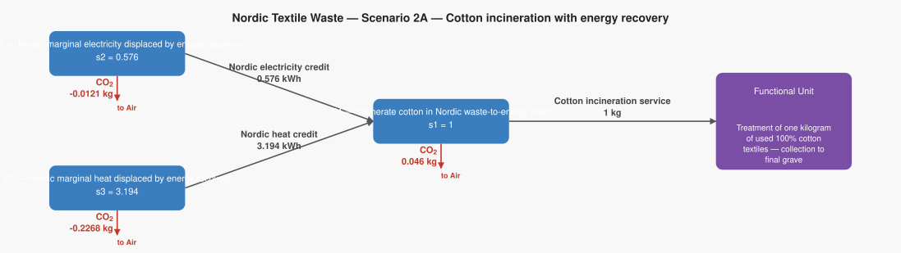
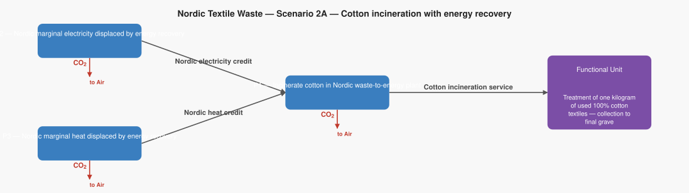

# LCA Results: Nordic Textile Waste — Scenario 2A — Cotton incineration with energy recovery

Generated: 2026-06-18 17:51  |  openLCA system ID: `d7e5eac6-be64-4909-bc19-d75ae2cdd094`

## Step 1 — Goal and Scope

**Goal:** Model the climate change impact of incinerating one kilogram of used 100% cotton textiles at a Nordic waste-to-energy plant, including the credit for electricity and heat recovered. The system boundary starts at the point of textile collection (end of life) and ends at final disposal. Cotton fibre is biogenic (plant-based) so its CO₂ when burned is excluded — only fossil CO₂ from auxiliary materials (dyes, finishes, processing chemicals) is counted. Avoided burdens from displaced Nordic marginal electricity and heat are included as CO₂ credits. Based on Schmidt et al., TemaNord 2016:537.

**Functional unit:** 1.0 kg — Treatment of one kilogram of used 100% cotton textiles — collection to final grave

**Reference flow vector f:**

```
  f[1] = 1.0   (Cotton incineration service)
  f[2] = 0.0   (Nordic electricity credit)
  f[3] = 0.0   (Nordic heat credit)
```

## Step 2 — Technology Matrix A

Columns = processes, rows = products.  `+` = produced, `−` = consumed.

| | P1 — Incinerate cotton in Nordic waste-to-energy plant | P2 — Nordic marginal electricity displaced by energy recovery | P3 — Nordic marginal heat displaced by energy recovery |
|---|---:|---:|---:|
| **Cotton incineration service** | +1.00 |  0   |  0   |
| **Nordic electricity credit** | -0.58 | +1.00 |  0   |
| **Nordic heat credit** | -3.19 |  0   | +1.00 |

## Step 3 — Scaling Vector  s = A⁻¹ · f

How many times each process must run to deliver exactly f:

| Process | Scale factor |
|---|---:|
| P1 — Incinerate cotton in Nordic waste-to-energy plant | **1.0000** |
| P2 — Nordic marginal electricity displaced by energy recovery | **0.5760** |
| P3 — Nordic marginal heat displaced by energy recovery | **3.1940** |

## Step 4 — Intervention Matrix B

Columns = processes, rows = elementary flows (biosphere).
`+` = emission (exits to environment)  `−` = resource extraction (enters from environment).

| | P1 — Incinerate cotton in Nordic waste-to-energy plant | P2 — Nordic marginal electricity displaced by energy recovery | P3 — Nordic marginal heat displaced by energy recovery |
|---|---:|---:|---:|
| **Carbon dioxide** | +0.05 | -0.02 | -0.07 |

## Step 5 — LCI Results  B · s

**Emissions to environment:**

| Flow | Numpy result | openLCA result | Unit | Match |
|---|---:|---:|---|:---:|
| **Carbon dioxide** | -0.1929 | -0.1929 | kg | ✓ |

## Step 6 — Scaled Emissions by Process  (B · diag(s))

Each cell = emission rate × scaling factor.  Columns sum to the LCI totals in Step 5.

| Process | s | Carbon dioxide |
|---|---:|---:|
| P1 — Incinerate cotton in Nordic waste-to-energy plant | 1.0000 | 0.0460 |
| P2 — Nordic marginal electricity displaced by energy recovery | 0.5760 | -0.0121 |
| P3 — Nordic marginal heat displaced by energy recovery | 3.1940 | -0.2268 |
| **Total** | | **-0.1929** |

## Step 7 — LCIA Results  (TRACI 2.2)

Characterization factors from the database. Each impact category score is the sum of all elementary flow contributions as computed by the openLCA engine.

| Impact Category | Score | Unit |
|---|---:|---|
| Ozone depletion | **0.000000** | kg CFC-11 eq |
| Ecotoxicity | **0.000000** | CTUe |
| Respiratory effects (Particulate) | **0.000000** | kg PM2.5 eq |
| Acidification | **0.000000** | kg SO2 eq |
| Carcinogenics | **0.000000** | CTUh |
| Global warming | **-0.192870** | kg CO2 eq |
| Smog (Photochemical Oxidation Formation) | **0.000000** | kg O3 eq |
| Non carcinogenics | **0.000000** | CTUh |
| Eutrophication: freshwater | **0.000000** | kg P eq |
| Eutrophication: marine | **0.000000** | kg N eq |

## Summary

**LCIA Method:** TRACI 2.2

> **Ozone depletion: 0.000000 kg CFC-11 eq** per 1.0 kg of Treatment of one kilogram of used 100% cotton textiles — collection to final grave
> **Ecotoxicity: 0.000000 CTUe** per 1.0 kg of Treatment of one kilogram of used 100% cotton textiles — collection to final grave
> **Respiratory effects (Particulate): 0.000000 kg PM2.5 eq** per 1.0 kg of Treatment of one kilogram of used 100% cotton textiles — collection to final grave
> **Acidification: 0.000000 kg SO2 eq** per 1.0 kg of Treatment of one kilogram of used 100% cotton textiles — collection to final grave
> **Carcinogenics: 0.000000 CTUh** per 1.0 kg of Treatment of one kilogram of used 100% cotton textiles — collection to final grave
> **Global warming: -0.192870 kg CO2 eq** per 1.0 kg of Treatment of one kilogram of used 100% cotton textiles — collection to final grave
> **Smog (Photochemical Oxidation Formation): 0.000000 kg O3 eq** per 1.0 kg of Treatment of one kilogram of used 100% cotton textiles — collection to final grave
> **Non carcinogenics: 0.000000 CTUh** per 1.0 kg of Treatment of one kilogram of used 100% cotton textiles — collection to final grave
> **Eutrophication: freshwater: 0.000000 kg P eq** per 1.0 kg of Treatment of one kilogram of used 100% cotton textiles — collection to final grave
> **Eutrophication: marine: 0.000000 kg N eq** per 1.0 kg of Treatment of one kilogram of used 100% cotton textiles — collection to final grave

## Product System Graphs

### Scaled (with amounts)



### Structure (flow names only)



---
*Generated by `lca_scripts/lca_analysis.py` using openLCA gdt-server v2*