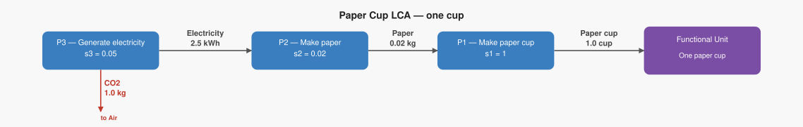
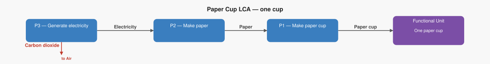

# LCA Results: Paper Cup LCA — one cup

Generated: 2026-06-14 02:11  |  openLCA system ID: `263c008e-378f-4143-8cd9-d8206d5afc43`

## Step 1 — Goal and Scope

**Goal:** Calculate the total CO₂ emitted to produce one paper cup, tracing the full chain from electricity generation through paper manufacturing to cup production.

**Functional unit:** 1.0 cup — One paper cup

**Reference flow vector f:**

```
  f[1] = 1.0   (Paper cup)
  f[2] = 0.0   (Paper)
  f[3] = 0.0   (Electricity)
```

## Step 2 — Technology Matrix A

Columns = processes, rows = products.  `+` = produced, `−` = consumed.

| | P1 — Make paper cup | P2 — Make paper | P3 — Generate electricity |
|---|---:|---:|---:|
| **Paper cup** | +1.00 |  0   |  0   |
| **Paper** | -0.02 | +1.00 |  0   |
| **Electricity** |  0   | -2.50 | +1.00 |

## Step 3 — Scaling Vector  s = A⁻¹ · f

How many times each process must run to deliver exactly f:

| Process | Scale factor |
|---|---:|
| P1 — Make paper cup | **1.0000** |
| P2 — Make paper | **0.0200** |
| P3 — Generate electricity | **0.0500** |

## Step 4 — Intervention Matrix B

Columns = processes, rows = elementary flows (biosphere).
`+` = emission (exits to environment)  `−` = resource extraction (enters from environment).

| | P1 — Make paper cup | P2 — Make paper | P3 — Generate electricity |
|---|---:|---:|---:|
| **Carbon dioxide** |  0   |  0   | +1.00 |

## Step 5 — LCI Results  B · s

**Emissions to environment:**

| Flow | Numpy result | openLCA result | Unit | Match |
|---|---:|---:|---|:---:|
| **Carbon dioxide** | 0.0500 | 0.0500 | kg | ✓ |

## Step 6 — Scaled Emissions by Process  (B · diag(s))

Each cell = emission rate × scaling factor.  Columns sum to the LCI totals in Step 5.

| Process | s | Carbon dioxide |
|---|---:|---:|
| P1 — Make paper cup | 1.0000 | 0 |
| P2 — Make paper | 0.0200 | 0 |
| P3 — Generate electricity | 0.0500 | 0.0500 |
| **Total** | | **0.0500** |

## Step 7 — LCIA Results  (TRACI 2.2)

Characterization factors from the database. Each impact category score is the sum of all elementary flow contributions as computed by the openLCA engine.

| Impact Category | Score | Unit |
|---|---:|---|
| Human health - cancer | **0.000000** | CTUcancer |
| Acidification | **0.000000** | kg SO2 eq |
| Eutrophication (Freshwater) | **0.000000** | kg P eq |
| Human health - particulate matter | **0.000000** | PM 2.5 eq |
| Smog formation | **0.000000** | kg O3 eq |
| Human health - non-cancer | **0.000000** | CTUnoncancer |
| Ozone depletion | **0.000000** | kg CFC-11 eq |
| Global warming | **0.050000** | kg CO2 eq |

## Summary

**LCIA Method:** TRACI 2.2

> **Human health - cancer: 0.000000 CTUcancer** per 1.0 cup of One paper cup
> **Acidification: 0.000000 kg SO2 eq** per 1.0 cup of One paper cup
> **Eutrophication (Freshwater): 0.000000 kg P eq** per 1.0 cup of One paper cup
> **Human health - particulate matter: 0.000000 PM 2.5 eq** per 1.0 cup of One paper cup
> **Smog formation: 0.000000 kg O3 eq** per 1.0 cup of One paper cup
> **Human health - non-cancer: 0.000000 CTUnoncancer** per 1.0 cup of One paper cup
> **Ozone depletion: 0.000000 kg CFC-11 eq** per 1.0 cup of One paper cup
> **Global warming: 0.050000 kg CO2 eq** per 1.0 cup of One paper cup

## Product System Graphs

### Scaled (with amounts)



### Structure (flow names only)



---
*Generated by `lca_scripts/lca_analysis.py` using openLCA gdt-server v2*