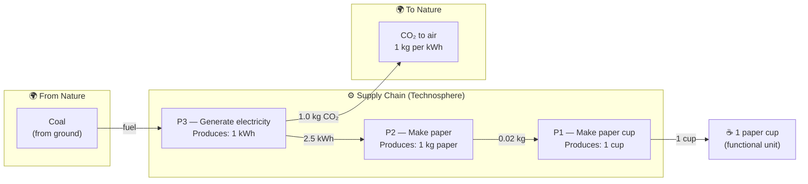

## About this analysis

Simple three-process chain used to study the carbon footprint of a disposable paper cup.

The chain is: electricity generation → paper manufacturing → cup production.
All CO₂ originates in P3 (generating electricity by burning coal); P1 and P2 have no direct emissions.

Expected result: **0.05 kg CO₂ per cup**.

---

## Product Graph

