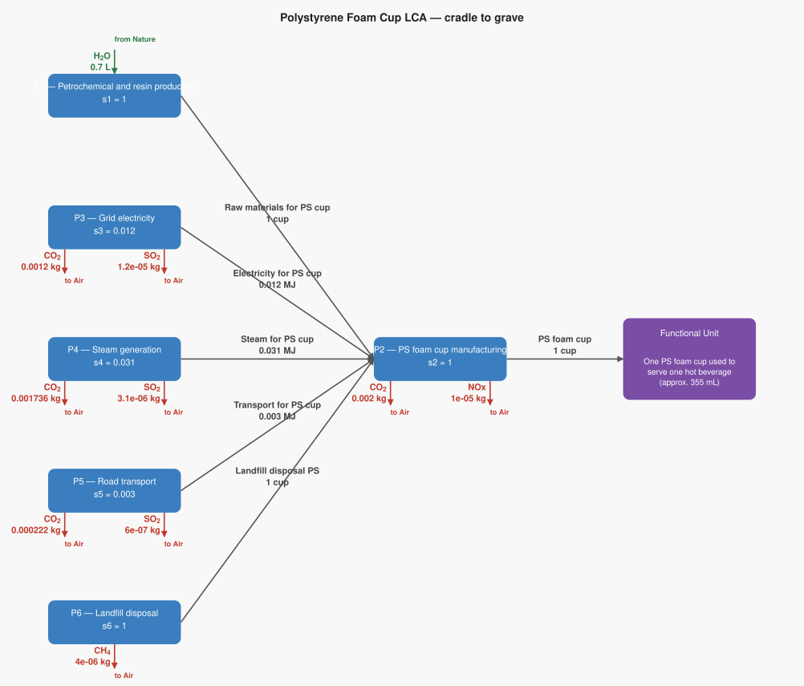
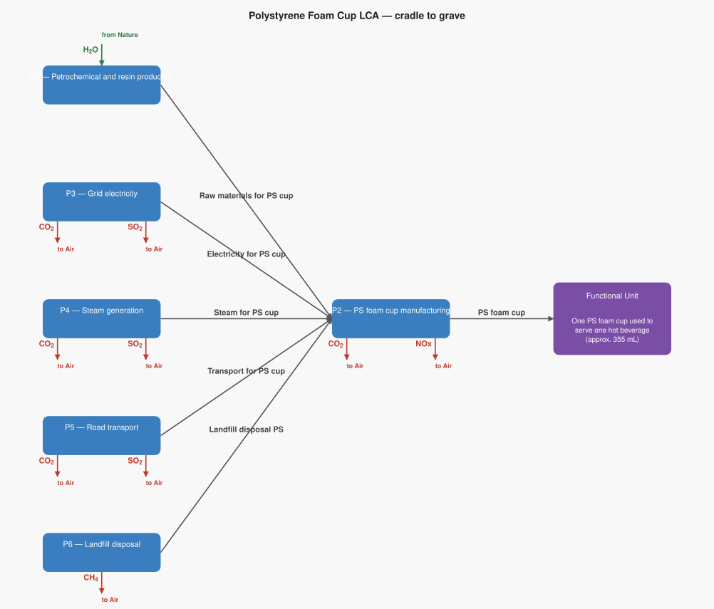

# LCA Results: Polystyrene Foam Cup LCA — cradle to grave

Generated: 2026-06-18 20:57  |  openLCA system ID: `8e680487-733d-43f2-af53-19bada3c1467`

## Step 1 — Goal and Scope

**Goal:** Calculate the total environmental impact of producing and disposing of one polystyrene (PS) foam cup used to serve one hot beverage, tracing the full supply chain from petrochemical feedstock through manufacturing, distribution, and landfill disposal. Compare with the paper cup to determine which has lower impact.

**Functional unit:** 1 cup — One PS foam cup used to serve one hot beverage (approx. 355 mL)

**Reference flow vector f:**

```
  f[1] = 0.0   (Raw materials for PS cup)
  f[2] = 1   (PS foam cup)
  f[3] = 0.0   (Electricity for PS cup)
  f[4] = 0.0   (Steam for PS cup)
  f[5] = 0.0   (Transport for PS cup)
  f[6] = 0.0   (Landfill disposal PS)
```

## Step 2 — Technology Matrix A

Columns = processes, rows = products.  `+` = produced, `−` = consumed.

| | P1 — Petrochemical and resin production | P2 — PS foam cup manufacturing | P3 — Grid electricity | P4 — Steam generation | P5 — Road transport | P6 — Landfill disposal |
|---|---:|---:|---:|---:|---:|---:|
| **Raw materials for PS cup** | +1.00 | -1.00 |  0   |  0   |  0   |  0   |
| **PS foam cup** |  0   | +1.00 |  0   |  0   |  0   |  0   |
| **Electricity for PS cup** |  0   | -0.01 | +1.00 |  0   |  0   |  0   |
| **Steam for PS cup** |  0   | -0.03 |  0   | +1.00 |  0   |  0   |
| **Transport for PS cup** |  0   | -0.00 |  0   |  0   | +1.00 |  0   |
| **Landfill disposal PS** |  0   | -1.00 |  0   |  0   |  0   | +1.00 |

## Step 3 — Scaling Vector  s = A⁻¹ · f

How many times each process must run to deliver exactly f:

| Process | Scale factor |
|---|---:|
| P1 — Petrochemical and resin production | **1.0000** |
| P2 — PS foam cup manufacturing | **1.0000** |
| P3 — Grid electricity | **0.0120** |
| P4 — Steam generation | **0.0310** |
| P5 — Road transport | **0.0030** |
| P6 — Landfill disposal | **1.0000** |

## Step 4 — Intervention Matrix B

Columns = processes, rows = elementary flows (biosphere).
`+` = emission (exits to environment)  `−` = resource extraction (enters from environment).

| | P1 — Petrochemical and resin production | P2 — PS foam cup manufacturing | P3 — Grid electricity | P4 — Steam generation | P5 — Road transport | P6 — Landfill disposal |
|---|---:|---:|---:|---:|---:|---:|
| **Carbon dioxide** |  0   | +0.00 | +0.10 | +0.06 | +0.07 |  0   |
| **Methane** |  0   |  0   |  0   |  0   |  0   | +0.00 |
| **Sulfur dioxide** |  0   |  0   | +0.00 | +0.00 | +0.00 |  0   |
| **Nitrogen oxides** |  0   | +0.00 |  0   |  0   |  0   |  0   |
| **Water** | -0.70 |  0   |  0   |  0   |  0   |  0   |

## Step 5 — LCI Results  B · s

**Emissions to environment:**

| Flow | Numpy result | openLCA result | Unit | Match |
|---|---:|---:|---|:---:|
| **Carbon dioxide** | 0.0052 | 0.0052 | kg | ✓ |
| **Methane** | 0.0000 | 0.0000 | kg | ✓ |
| **Sulfur dioxide** | 0.0000 | 0.0000 | kg | ✓ |
| **Nitrogen oxides** | 0.0000 | 0.0000 | kg | ✓ |

**Resources from environment (amounts consumed):**

| Flow | Numpy result | openLCA result | Unit | Match |
|---|---:|---:|---|:---:|
| **Water** | 0.7000 | 0.7000 | L | ✓ |

## Step 6 — Scaled Emissions by Process  (B · diag(s))

Each cell = emission rate × scaling factor.  Columns sum to the LCI totals in Step 5.

| Process | s | Carbon dioxide | Methane | Sulfur dioxide | Nitrogen oxides |
|---|---:|---:|---:|---:|---:|
| P1 — Petrochemical and resin production | 1.0000 | 0 | 0 | 0 | 0 |
| P2 — PS foam cup manufacturing | 1.0000 | 0.0020 | 0 | 0 | 0.0000 |
| P3 — Grid electricity | 0.0120 | 0.0012 | 0 | 0.0000 | 0 |
| P4 — Steam generation | 0.0310 | 0.0017 | 0 | 0.0000 | 0 |
| P5 — Road transport | 0.0030 | 0.0002 | 0 | 0.0000 | 0 |
| P6 — Landfill disposal | 1.0000 | 0 | 0.0000 | 0 | 0 |
| **Total** | | **0.0052** | **0.0000** | **0.0000** | **0.0000** |

**Resource extractions by process:**

| Process | s | Water |
|---|---:|---:|
| P1 — Petrochemical and resin production | 1.0000 | 0.7000 |
| P2 — PS foam cup manufacturing | 1.0000 | 0 |
| P3 — Grid electricity | 0.0120 | 0 |
| P4 — Steam generation | 0.0310 | 0 |
| P5 — Road transport | 0.0030 | 0 |
| P6 — Landfill disposal | 1.0000 | 0 |
| **Total** | | **0.7000** |

## Step 7 — LCIA Results  (TRACI 2.2)

Characterization factors from the database. Each impact category score is the sum of all elementary flow contributions as computed by the openLCA engine.

| Impact Category | Score | Unit |
|---|---:|---|
| Ozone depletion | **0.000000** | kg CFC-11 eq |
| Ecotoxicity | **0.000000** | CTUe |
| Respiratory effects (Particulate) | **0.000001** | kg PM2.5 eq |
| Acidification | **0.000023** | kg SO2 eq |
| Global warming | **0.005258** | kg CO2 eq |
| Smog (Photochemical Oxidation Formation) | **0.000248** | kg O3 eq |
| Eutrophication: freshwater | **0.000000** | kg P eq |
| Eutrophication: marine | **0.000001** | kg N eq |

## Summary

**LCIA Method:** TRACI 2.2

> **Ozone depletion: 0.000000 kg CFC-11 eq** per 1 cup of One PS foam cup used to serve one hot beverage (approx. 355 mL)
> **Ecotoxicity: 0.000000 CTUe** per 1 cup of One PS foam cup used to serve one hot beverage (approx. 355 mL)
> **Respiratory effects (Particulate): 0.000001 kg PM2.5 eq** per 1 cup of One PS foam cup used to serve one hot beverage (approx. 355 mL)
> **Acidification: 0.000023 kg SO2 eq** per 1 cup of One PS foam cup used to serve one hot beverage (approx. 355 mL)
> **Global warming: 0.005258 kg CO2 eq** per 1 cup of One PS foam cup used to serve one hot beverage (approx. 355 mL)
> **Smog (Photochemical Oxidation Formation): 0.000248 kg O3 eq** per 1 cup of One PS foam cup used to serve one hot beverage (approx. 355 mL)
> **Eutrophication: freshwater: 0.000000 kg P eq** per 1 cup of One PS foam cup used to serve one hot beverage (approx. 355 mL)
> **Eutrophication: marine: 0.000001 kg N eq** per 1 cup of One PS foam cup used to serve one hot beverage (approx. 355 mL)

## Product System Graphs

### Scaled (with amounts)



### Structure (flow names only)



---
*Generated by `lca_scripts/lca_analysis.py` using openLCA gdt-server v2*