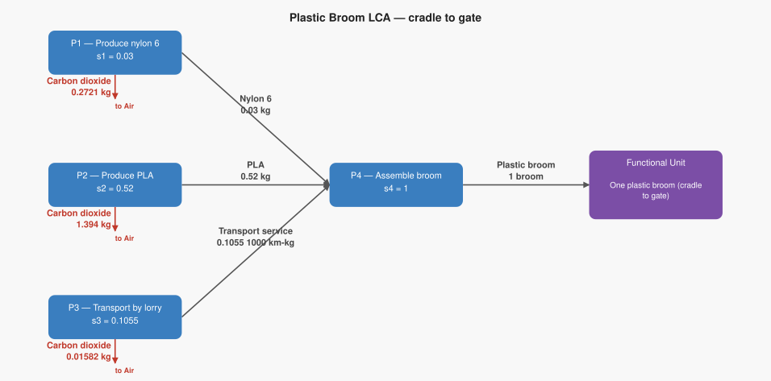
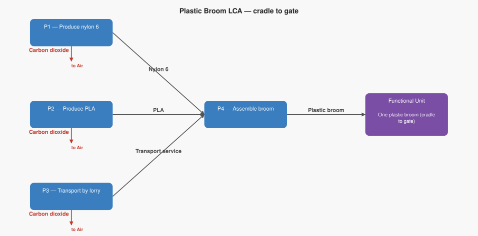

# LCA Results: Plastic Broom LCA — cradle to gate

Generated: 2026-06-18 17:51  |  openLCA system ID: `157cabb1-fbda-4377-bb70-9cb800a25c78`

## Step 1 — Goal and Scope

**Goal:** Calculate the total CO₂ emitted to produce one plastic broom with a PLA handle and nylon 6 bristles, tracing through raw material production and transport to the factory gate.

**Functional unit:** 1 broom — One plastic broom (cradle to gate)

**Reference flow vector f:**

```
  f[1] = 0.0   (Nylon 6)
  f[2] = 0.0   (PLA)
  f[3] = 0.0   (Transport service)
  f[4] = 1   (Plastic broom)
```

## Step 2 — Technology Matrix A

Columns = processes, rows = products.  `+` = produced, `−` = consumed.

| | P1 — Produce nylon 6 | P2 — Produce PLA | P3 — Transport by lorry | P4 — Assemble broom |
|---|---:|---:|---:|---:|
| **Nylon 6** | +1.00 |  0   |  0   | -0.03 |
| **PLA** |  0   | +1.00 |  0   | -0.52 |
| **Transport service** |  0   |  0   | +1.00 | -0.11 |
| **Plastic broom** |  0   |  0   |  0   | +1.00 |

## Step 3 — Scaling Vector  s = A⁻¹ · f

How many times each process must run to deliver exactly f:

| Process | Scale factor |
|---|---:|
| P1 — Produce nylon 6 | **0.0300** |
| P2 — Produce PLA | **0.5200** |
| P3 — Transport by lorry | **0.1055** |
| P4 — Assemble broom | **1.0000** |

## Step 4 — Intervention Matrix B

Columns = processes, rows = elementary flows (biosphere).
`+` = emission (exits to environment)  `−` = resource extraction (enters from environment).

| | P1 — Produce nylon 6 | P2 — Produce PLA | P3 — Transport by lorry | P4 — Assemble broom |
|---|---:|---:|---:|---:|
| **Carbon dioxide** | +9.07 | +2.68 | +0.15 |  0   |

## Step 5 — LCI Results  B · s

**Emissions to environment:**

| Flow | Numpy result | openLCA result | Unit | Match |
|---|---:|---:|---|:---:|
| **Carbon dioxide** | 1.6815 | 1.6815 | kg | ✓ |

## Step 6 — Scaled Emissions by Process  (B · diag(s))

Each cell = emission rate × scaling factor.  Columns sum to the LCI totals in Step 5.

| Process | s | Carbon dioxide |
|---|---:|---:|
| P1 — Produce nylon 6 | 0.0300 | 0.2721 |
| P2 — Produce PLA | 0.5200 | 1.3936 |
| P3 — Transport by lorry | 0.1055 | 0.0158 |
| P4 — Assemble broom | 1.0000 | 0 |
| **Total** | | **1.6815** |

## Step 7 — LCIA Results  (TRACI 2.2)

Characterization factors from the database. Each impact category score is the sum of all elementary flow contributions as computed by the openLCA engine.

| Impact Category | Score | Unit |
|---|---:|---|
| Ozone depletion | **0.000000** | kg CFC-11 eq |
| Ecotoxicity | **0.000000** | CTUe |
| Respiratory effects (Particulate) | **0.000000** | kg PM2.5 eq |
| Acidification | **0.000000** | kg SO2 eq |
| Carcinogenics | **0.000000** | CTUh |
| Global warming | **1.681525** | kg CO2 eq |
| Smog (Photochemical Oxidation Formation) | **0.000000** | kg O3 eq |
| Non carcinogenics | **0.000000** | CTUh |
| Eutrophication: freshwater | **0.000000** | kg P eq |
| Eutrophication: marine | **0.000000** | kg N eq |

## Summary

**LCIA Method:** TRACI 2.2

> **Ozone depletion: 0.000000 kg CFC-11 eq** per 1 broom of One plastic broom (cradle to gate)
> **Ecotoxicity: 0.000000 CTUe** per 1 broom of One plastic broom (cradle to gate)
> **Respiratory effects (Particulate): 0.000000 kg PM2.5 eq** per 1 broom of One plastic broom (cradle to gate)
> **Acidification: 0.000000 kg SO2 eq** per 1 broom of One plastic broom (cradle to gate)
> **Carcinogenics: 0.000000 CTUh** per 1 broom of One plastic broom (cradle to gate)
> **Global warming: 1.681525 kg CO2 eq** per 1 broom of One plastic broom (cradle to gate)
> **Smog (Photochemical Oxidation Formation): 0.000000 kg O3 eq** per 1 broom of One plastic broom (cradle to gate)
> **Non carcinogenics: 0.000000 CTUh** per 1 broom of One plastic broom (cradle to gate)
> **Eutrophication: freshwater: 0.000000 kg P eq** per 1 broom of One plastic broom (cradle to gate)
> **Eutrophication: marine: 0.000000 kg N eq** per 1 broom of One plastic broom (cradle to gate)

## Product System Graphs

### Scaled (with amounts)



### Structure (flow names only)



---
*Generated by `lca_scripts/lca_analysis.py` using openLCA gdt-server v2*