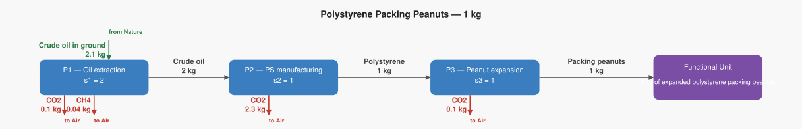
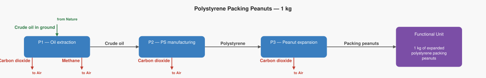

# LCA Results: Polystyrene Packing Peanuts — 1 kg

Generated: 2026-06-18 17:51  |  openLCA system ID: `699644f1-a8da-4c29-986e-f4e184396ee5`

## Step 1 — Goal and Scope

**Goal:** Illustrative supply chain for 1 kg of expanded polystyrene (EPS) packing peanuts. Key fact: 1 kg of polystyrene requires ~2 kg of crude oil — 1 kg becomes the plastic itself, and 1 kg is burned for the energy needed to manufacture it. Numbers are illustrative approximations based on Jolliet et al. (1994).

**Functional unit:** 1.0 kg — 1 kg of expanded polystyrene packing peanuts

**Reference flow vector f:**

```
  f[1] = 0.0   (Crude oil)
  f[2] = 0.0   (Polystyrene)
  f[3] = 1.0   (Packing peanuts)
```

## Step 2 — Technology Matrix A

Columns = processes, rows = products.  `+` = produced, `−` = consumed.

| | P1 — Oil extraction | P2 — PS manufacturing | P3 — Peanut expansion |
|---|---:|---:|---:|
| **Crude oil** | +1.00 | -2.00 |  0   |
| **Polystyrene** |  0   | +1.00 | -1.00 |
| **Packing peanuts** |  0   |  0   | +1.00 |

## Step 3 — Scaling Vector  s = A⁻¹ · f

How many times each process must run to deliver exactly f:

| Process | Scale factor |
|---|---:|
| P1 — Oil extraction | **2.0000** |
| P2 — PS manufacturing | **1.0000** |
| P3 — Peanut expansion | **1.0000** |

## Step 4 — Intervention Matrix B

Columns = processes, rows = elementary flows (biosphere).
`+` = emission (exits to environment)  `−` = resource extraction (enters from environment).

| | P1 — Oil extraction | P2 — PS manufacturing | P3 — Peanut expansion |
|---|---:|---:|---:|
| **Carbon dioxide** | +0.05 | +2.30 | +0.10 |
| **Methane** | +0.02 |  0   |  0   |
| **Crude oil in ground** | -1.05 |  0   |  0   |

## Step 5 — LCI Results  B · s

**Emissions to environment:**

| Flow | Numpy result | openLCA result | Unit | Match |
|---|---:|---:|---|:---:|
| **Carbon dioxide** | 2.5000 | 2.5000 | kg | ✓ |
| **Methane** | 0.0400 | 0.0400 | kg | ✓ |

**Resources from environment (amounts consumed):**

| Flow | Numpy result | openLCA result | Unit | Match |
|---|---:|---:|---|:---:|
| **Crude oil in ground** | 2.1000 | 2.1000 | kg | ✓ |

## Step 6 — Scaled Emissions by Process  (B · diag(s))

Each cell = emission rate × scaling factor.  Columns sum to the LCI totals in Step 5.

| Process | s | Carbon dioxide | Methane |
|---|---:|---:|---:|
| P1 — Oil extraction | 2.0000 | 0.1000 | 0.0400 |
| P2 — PS manufacturing | 1.0000 | 2.3000 | 0 |
| P3 — Peanut expansion | 1.0000 | 0.1000 | 0 |
| **Total** | | **2.5000** | **0.0400** |

**Resource extractions by process:**

| Process | s | Crude oil in ground |
|---|---:|---:|
| P1 — Oil extraction | 2.0000 | 2.1000 |
| P2 — PS manufacturing | 1.0000 | 0 |
| P3 — Peanut expansion | 1.0000 | 0 |
| **Total** | | **2.1000** |

## Step 7 — LCIA Results  (TRACI 2.2)

Characterization factors from the database. Each impact category score is the sum of all elementary flow contributions as computed by the openLCA engine.

| Impact Category | Score | Unit |
|---|---:|---|
| Ozone depletion | **0.000000** | kg CFC-11 eq |
| Ecotoxicity | **0.000000** | CTUe |
| Respiratory effects (Particulate) | **0.000000** | kg PM2.5 eq |
| Acidification | **0.000000** | kg SO2 eq |
| Carcinogenics | **0.000000** | CTUh |
| Global warming | **3.500000** | kg CO2 eq |
| Smog (Photochemical Oxidation Formation) | **0.000575** | kg O3 eq |
| Non carcinogenics | **0.000000** | CTUh |
| Eutrophication: freshwater | **0.000000** | kg P eq |
| Eutrophication: marine | **0.000000** | kg N eq |

## Summary

**LCIA Method:** TRACI 2.2

> **Ozone depletion: 0.000000 kg CFC-11 eq** per 1.0 kg of 1 kg of expanded polystyrene packing peanuts
> **Ecotoxicity: 0.000000 CTUe** per 1.0 kg of 1 kg of expanded polystyrene packing peanuts
> **Respiratory effects (Particulate): 0.000000 kg PM2.5 eq** per 1.0 kg of 1 kg of expanded polystyrene packing peanuts
> **Acidification: 0.000000 kg SO2 eq** per 1.0 kg of 1 kg of expanded polystyrene packing peanuts
> **Carcinogenics: 0.000000 CTUh** per 1.0 kg of 1 kg of expanded polystyrene packing peanuts
> **Global warming: 3.500000 kg CO2 eq** per 1.0 kg of 1 kg of expanded polystyrene packing peanuts
> **Smog (Photochemical Oxidation Formation): 0.000575 kg O3 eq** per 1.0 kg of 1 kg of expanded polystyrene packing peanuts
> **Non carcinogenics: 0.000000 CTUh** per 1.0 kg of 1 kg of expanded polystyrene packing peanuts
> **Eutrophication: freshwater: 0.000000 kg P eq** per 1.0 kg of 1 kg of expanded polystyrene packing peanuts
> **Eutrophication: marine: 0.000000 kg N eq** per 1.0 kg of 1 kg of expanded polystyrene packing peanuts

## Product System Graphs

### Scaled (with amounts)



### Structure (flow names only)



---
*Generated by `lca_scripts/lca_analysis.py` using openLCA gdt-server v2*