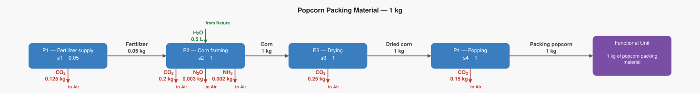
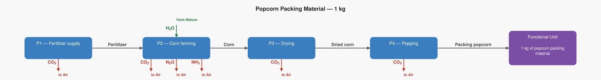

# LCA Results: Popcorn Packing Material — 1 kg

Generated: 2026-06-18 17:52  |  openLCA system ID: `a609aac4-018e-4a9c-be45-50fefddb04e5`

## Step 1 — Goal and Scope

**Goal:** Illustrative supply chain for 1 kg of popcorn used as loose-fill packing material (an alternative to polystyrene packing peanuts). The corn is grown, dried, then blown with hot air to expand it into packaging fill. Numbers are illustrative approximations based on Jolliet et al. (1994).

**Functional unit:** 1.0 kg — 1 kg of popcorn packing material

**Reference flow vector f:**

```
  f[1] = 0.0   (Fertilizer)
  f[2] = 0.0   (Corn)
  f[3] = 0.0   (Dried corn)
  f[4] = 1.0   (Packing popcorn)
```

## Step 2 — Technology Matrix A

Columns = processes, rows = products.  `+` = produced, `−` = consumed.

| | P1 — Fertilizer supply | P2 — Corn farming | P3 — Drying | P4 — Popping |
|---|---:|---:|---:|---:|
| **Fertilizer** | +1.00 | -0.05 |  0   |  0   |
| **Corn** |  0   | +1.00 | -1.00 |  0   |
| **Dried corn** |  0   |  0   | +1.00 | -1.00 |
| **Packing popcorn** |  0   |  0   |  0   | +1.00 |

## Step 3 — Scaling Vector  s = A⁻¹ · f

How many times each process must run to deliver exactly f:

| Process | Scale factor |
|---|---:|
| P1 — Fertilizer supply | **0.0500** |
| P2 — Corn farming | **1.0000** |
| P3 — Drying | **1.0000** |
| P4 — Popping | **1.0000** |

## Step 4 — Intervention Matrix B

Columns = processes, rows = elementary flows (biosphere).
`+` = emission (exits to environment)  `−` = resource extraction (enters from environment).

| | P1 — Fertilizer supply | P2 — Corn farming | P3 — Drying | P4 — Popping |
|---|---:|---:|---:|---:|
| **Carbon dioxide** | +2.50 | +0.20 | +0.25 | +0.15 |
| **Nitrous oxide** |  0   | +0.00 |  0   |  0   |
| **Ammonia** |  0   | +0.00 |  0   |  0   |
| **Water** |  0   | -0.50 |  0   |  0   |

## Step 5 — LCI Results  B · s

**Emissions to environment:**

| Flow | Numpy result | openLCA result | Unit | Match |
|---|---:|---:|---|:---:|
| **Carbon dioxide** | 0.7250 | 0.7250 | kg | ✓ |
| **Nitrous oxide** | 0.0030 | 0.0030 | kg | ✓ |
| **Ammonia** | 0.0020 | 0.0020 | kg | ✓ |

**Resources from environment (amounts consumed):**

| Flow | Numpy result | openLCA result | Unit | Match |
|---|---:|---:|---|:---:|
| **Water** | 0.5000 | 0.5000 | L | ✓ |

## Step 6 — Scaled Emissions by Process  (B · diag(s))

Each cell = emission rate × scaling factor.  Columns sum to the LCI totals in Step 5.

| Process | s | Carbon dioxide | Nitrous oxide | Ammonia |
|---|---:|---:|---:|---:|
| P1 — Fertilizer supply | 0.0500 | 0.1250 | 0 | 0 |
| P2 — Corn farming | 1.0000 | 0.2000 | 0.0030 | 0.0020 |
| P3 — Drying | 1.0000 | 0.2500 | 0 | 0 |
| P4 — Popping | 1.0000 | 0.1500 | 0 | 0 |
| **Total** | | **0.7250** | **0.0030** | **0.0020** |

**Resource extractions by process:**

| Process | s | Water |
|---|---:|---:|
| P1 — Fertilizer supply | 0.0500 | 0 |
| P2 — Corn farming | 1.0000 | 0.5000 |
| P3 — Drying | 1.0000 | 0 |
| P4 — Popping | 1.0000 | 0 |
| **Total** | | **0.5000** |

## Step 7 — LCIA Results  (TRACI 2.2)

Characterization factors from the database. Each impact category score is the sum of all elementary flow contributions as computed by the openLCA engine.

| Impact Category | Score | Unit |
|---|---:|---|
| Ozone depletion | **0.000000** | kg CFC-11 eq |
| Ecotoxicity | **0.000000** | CTUe |
| Respiratory effects (Particulate) | **0.000133** | kg PM2.5 eq |
| Acidification | **0.003760** | kg SO2 eq |
| Carcinogenics | **0.000000** | CTUh |
| Global warming | **0.725000** | kg CO2 eq |
| Smog (Photochemical Oxidation Formation) | **0.000000** | kg O3 eq |
| Non carcinogenics | **0.000000** | CTUh |
| Eutrophication: freshwater | **0.000000** | kg P eq |
| Eutrophication: marine | **0.001757** | kg N eq |

## Summary

**LCIA Method:** TRACI 2.2

> **Ozone depletion: 0.000000 kg CFC-11 eq** per 1.0 kg of 1 kg of popcorn packing material
> **Ecotoxicity: 0.000000 CTUe** per 1.0 kg of 1 kg of popcorn packing material
> **Respiratory effects (Particulate): 0.000133 kg PM2.5 eq** per 1.0 kg of 1 kg of popcorn packing material
> **Acidification: 0.003760 kg SO2 eq** per 1.0 kg of 1 kg of popcorn packing material
> **Carcinogenics: 0.000000 CTUh** per 1.0 kg of 1 kg of popcorn packing material
> **Global warming: 0.725000 kg CO2 eq** per 1.0 kg of 1 kg of popcorn packing material
> **Smog (Photochemical Oxidation Formation): 0.000000 kg O3 eq** per 1.0 kg of 1 kg of popcorn packing material
> **Non carcinogenics: 0.000000 CTUh** per 1.0 kg of 1 kg of popcorn packing material
> **Eutrophication: freshwater: 0.000000 kg P eq** per 1.0 kg of 1 kg of popcorn packing material
> **Eutrophication: marine: 0.001757 kg N eq** per 1.0 kg of 1 kg of popcorn packing material

## Product System Graphs

### Scaled (with amounts)



### Structure (flow names only)



---
*Generated by `lca_scripts/lca_analysis.py` using openLCA gdt-server v2*