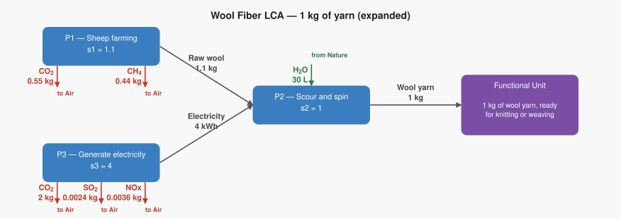
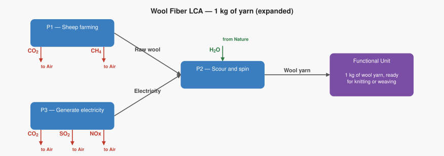

# LCA Results: Wool Fiber LCA — 1 kg of yarn (expanded)

Generated: 2026-06-18 19:03  |  openLCA system ID: `edf78a32-0194-4670-b1ff-936e562c2a87`

## Step 1 — Goal and Scope

**Goal:** Calculate the climate and air-quality impact of producing 1 kg of wool yarn, tracing the full supply chain from sheep farming through scouring, spinning, and the electricity that powers the mill. This expanded version separates electricity into its own process to show which impacts come from the farm vs. the mill energy supply.

**Functional unit:** 1.0 kg — 1 kg of wool yarn, ready for knitting or weaving

**Reference flow vector f:**

```
  f[1] = 0.0   (Raw wool)
  f[2] = 1.0   (Wool yarn)
  f[3] = 0.0   (Electricity)
```

## Step 2 — Technology Matrix A

Columns = processes, rows = products.  `+` = produced, `−` = consumed.

| | P1 — Sheep farming | P2 — Scour and spin | P3 — Generate electricity |
|---|---:|---:|---:|
| **Raw wool** | +1.00 | -1.10 |  0   |
| **Wool yarn** |  0   | +1.00 |  0   |
| **Electricity** |  0   | -4.00 | +1.00 |

## Step 3 — Scaling Vector  s = A⁻¹ · f

How many times each process must run to deliver exactly f:

| Process | Scale factor |
|---|---:|
| P1 — Sheep farming | **1.1000** |
| P2 — Scour and spin | **1.0000** |
| P3 — Generate electricity | **4.0000** |

## Step 4 — Intervention Matrix B

Columns = processes, rows = elementary flows (biosphere).
`+` = emission (exits to environment)  `−` = resource extraction (enters from environment).

| | P1 — Sheep farming | P2 — Scour and spin | P3 — Generate electricity |
|---|---:|---:|---:|
| **Carbon dioxide** | +0.50 |  0   | +0.50 |
| **Methane** | +0.40 |  0   |  0   |
| **Sulfur dioxide** |  0   |  0   | +0.00 |
| **Nitrogen oxides** |  0   |  0   | +0.00 |
| **Water** |  0   | -30.00 |  0   |

## Step 5 — LCI Results  B · s

**Emissions to environment:**

| Flow | Numpy result | openLCA result | Unit | Match |
|---|---:|---:|---|:---:|
| **Carbon dioxide** | 2.5500 | 2.5500 | kg | ✓ |
| **Methane** | 0.4400 | 0.4400 | kg | ✓ |
| **Sulfur dioxide** | 0.0024 | 0.0024 | kg | ✓ |
| **Nitrogen oxides** | 0.0036 | 0.0036 | kg | ✓ |

**Resources from environment (amounts consumed):**

| Flow | Numpy result | openLCA result | Unit | Match |
|---|---:|---:|---|:---:|
| **Water** | 30.0000 | 30.0000 | L | ✓ |

## Step 6 — Scaled Emissions by Process  (B · diag(s))

Each cell = emission rate × scaling factor.  Columns sum to the LCI totals in Step 5.

| Process | s | Carbon dioxide | Methane | Sulfur dioxide | Nitrogen oxides |
|---|---:|---:|---:|---:|---:|
| P1 — Sheep farming | 1.1000 | 0.5500 | 0.4400 | 0 | 0 |
| P2 — Scour and spin | 1.0000 | 0 | 0 | 0 | 0 |
| P3 — Generate electricity | 4.0000 | 2.0000 | 0 | 0.0024 | 0.0036 |
| **Total** | | **2.5500** | **0.4400** | **0.0024** | **0.0036** |

**Resource extractions by process:**

| Process | s | Water |
|---|---:|---:|
| P1 — Sheep farming | 1.1000 | 0 |
| P2 — Scour and spin | 1.0000 | 30.0000 |
| P3 — Generate electricity | 4.0000 | 0 |
| **Total** | | **30.0000** |

## Summary

$$
\text{Total emissions} = B \cdot A^{-1} \cdot f
$$

> **Carbon dioxide: 2.5500 kg** per 1.0 kg of 1 kg of wool yarn, ready for knitting or weaving
> **Methane: 0.4400 kg** per 1.0 kg of 1 kg of wool yarn, ready for knitting or weaving
> **Sulfur dioxide: 0.0024 kg** per 1.0 kg of 1 kg of wool yarn, ready for knitting or weaving
> **Nitrogen oxides: 0.0036 kg** per 1.0 kg of 1 kg of wool yarn, ready for knitting or weaving

## Product System Graphs

### Scaled (with amounts)



### Structure (flow names only)



---
*Generated by `lca_scripts/lca_analysis.py` using openLCA gdt-server v2*