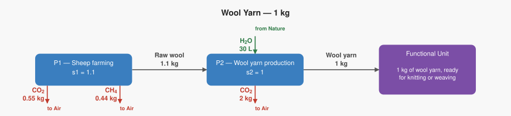

# LCA Results: Wool Yarn — 1 kg

Generated: 2026-06-14 02:22  |  openLCA system ID: `b9807050-4fa3-4ccc-baf8-b98c3c77470c`

## Step 1 — Goal and Scope

**Goal:** Calculate the climate impact of producing 1 kg of wool yarn, tracing the supply chain from sheep farming through scouring and spinning. This is a 2-process chain designed to show how methane (CH4) from livestock completely dominates the climate impact once characterization factors are applied — even though the raw kg of CH4 looks small compared to the CO2 from processing.

**Functional unit:** 1.0 kg — 1 kg of wool yarn, ready for knitting or weaving

**Reference flow vector f:**

```
  f[1] = 0.0   (Raw wool)
  f[2] = 1.0   (Wool yarn)
```

## Step 2 — Technology Matrix A

Columns = processes, rows = products.  `+` = produced, `−` = consumed.

| | P1 — Sheep farming | P2 — Wool yarn production |
|---|---:|---:|
| **Raw wool** | +1.00 | -1.10 |
| **Wool yarn** |  0   | +1.00 |

## Step 3 — Scaling Vector  s = A⁻¹ · f

How many times each process must run to deliver exactly f:

| Process | Scale factor |
|---|---:|
| P1 — Sheep farming | **1.1000** |
| P2 — Wool yarn production | **1.0000** |

## Step 4 — Intervention Matrix B

Columns = processes, rows = elementary flows (biosphere).
`+` = emission (exits to environment)  `−` = resource extraction (enters from environment).

| | P1 — Sheep farming | P2 — Wool yarn production |
|---|---:|---:|
| **Carbon dioxide** | +0.50 | +2.00 |
| **Methane** | +0.40 |  0   |
| **Water** |  0   | -30.00 |

## Step 5 — LCI Results  B · s

**Emissions to environment:**

| Flow | Numpy result | openLCA result | Unit | Match |
|---|---:|---:|---|:---:|
| **Carbon dioxide** | 2.5500 | 2.5500 | kg | ✓ |
| **Methane** | 0.4400 | 0.4400 | kg | ✓ |

**Resources from environment (amounts consumed):**

| Flow | Numpy result | openLCA result | Unit | Match |
|---|---:|---:|---|:---:|
| **Water** | 30.0000 | 30.0000 | L | ✓ |

## Step 6 — Scaled Emissions by Process  (B · diag(s))

Each cell = emission rate × scaling factor.  Columns sum to the LCI totals in Step 5.

| Process | s | Carbon dioxide | Methane |
|---|---:|---:|---:|
| P1 — Sheep farming | 1.1000 | 0.5500 | 0.4400 |
| P2 — Wool yarn production | 1.0000 | 2.0000 | 0 |
| **Total** | | **2.5500** | **0.4400** |

**Resource extractions by process:**

| Process | s | Water |
|---|---:|---:|
| P1 — Sheep farming | 1.1000 | 0 |
| P2 — Wool yarn production | 1.0000 | 30.0000 |
| **Total** | | **30.0000** |

## Step 7 — LCIA Results  (TRACI 2.2)

Characterization factors from the database. Each impact category score is the sum of all elementary flow contributions as computed by the openLCA engine.

| Impact Category | Score | Unit |
|---|---:|---|
| Human health - cancer | **0.000000** | CTUcancer |
| Acidification | **0.000000** | kg SO2 eq |
| Eutrophication (Freshwater) | **0.000000** | kg P eq |
| Human health - particulate matter | **0.000000** | PM 2.5 eq |
| Smog formation | **0.006327** | kg O3 eq |
| Human health - non-cancer | **0.000000** | CTUnoncancer |
| Ozone depletion | **0.000000** | kg CFC-11 eq |
| Global warming | **13.550000** | kg CO2 eq |

## Summary

**LCIA Method:** TRACI 2.2

> **Human health - cancer: 0.000000 CTUcancer** per 1.0 kg of 1 kg of wool yarn, ready for knitting or weaving
> **Acidification: 0.000000 kg SO2 eq** per 1.0 kg of 1 kg of wool yarn, ready for knitting or weaving
> **Eutrophication (Freshwater): 0.000000 kg P eq** per 1.0 kg of 1 kg of wool yarn, ready for knitting or weaving
> **Human health - particulate matter: 0.000000 PM 2.5 eq** per 1.0 kg of 1 kg of wool yarn, ready for knitting or weaving
> **Smog formation: 0.006327 kg O3 eq** per 1.0 kg of 1 kg of wool yarn, ready for knitting or weaving
> **Human health - non-cancer: 0.000000 CTUnoncancer** per 1.0 kg of 1 kg of wool yarn, ready for knitting or weaving
> **Ozone depletion: 0.000000 kg CFC-11 eq** per 1.0 kg of 1 kg of wool yarn, ready for knitting or weaving
> **Global warming: 13.550000 kg CO2 eq** per 1.0 kg of 1 kg of wool yarn, ready for knitting or weaving

## Product System Graphs

### Scaled (with amounts)



### Structure (flow names only)


---
*Generated by `lca_scripts/lca_analysis.py` using openLCA gdt-server v2*