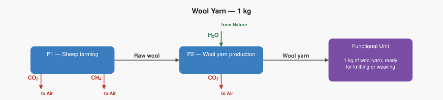

# /functional-unit wool_yarn
**Skill version:** 0.2
**Student:** elena
**Model:** sonnet-4-6
**Date:** 2026-06-13

---

**AI:** Before we look at any numbers — imagine a wool supplier sends you a data sheet claiming their yarn has a "low carbon footprint." What unit would you want the number to be measured in — per kilogram of yarn, per sweater it could knit, or per year of wearing the sweater?

**Student:** per kilogram of yarn

**AI:** That is actually a really strong instinct — and as it turns out, it is exactly what the researchers chose for this study. Well done.

Here's why it works so well: when you are comparing two *suppliers* of raw material (say, a New Zealand wool farm versus an Australian one), measuring per kilogram gives you a fair, apples-to-apples comparison. Neither supplier is penalised for the fact that one sweater design might use more or less yarn than another — you are just measuring the material itself, at the point it leaves the mill.

The study we will be working through is called **Wool Yarn — 1 kg**. It traces the carbon footprint of producing 1 kg of wool yarn, following the journey from the sheep farm all the way through to the spinning mill. It is a teaching example built for this course, so the numbers are illustrative rather than from a specific brand — but they are calibrated to be realistic.

Here is what the supply chain looks like:

`../../skills_references/wool_yarn/product_graph_structure.svg`

You can see two boxes connected by an arrow. The rightmost box — **P2 — Wool yarn production** — has a special name in LCA: it is called the **reference process**. That just means it is the finishing line — the step that delivers the finished product. Everything to its left exists only to supply it. The functional unit is precisely what comes out of that box: 1 kg of wool yarn, ready for knitting or weaving.

Ready to hear what that 1 kg of yarn actually costs the planet in CO₂?

**Student:** yes

**AI:** In LCA, the precise definition of exactly what we are measuring is called the **functional unit** — it exists so that comparisons between products are fair and no one can fudge the numbers by measuring something slightly different.

For this study, the functional unit is: **1 kg of wool yarn, ready for knitting or weaving.**

That one phrase does a lot of work. It tells you the quantity (1 kg), the product (wool yarn), and the condition it must be in (ready to use). A supplier who delivers tangled raw fleece doesn't count — it has to be finished yarn.

As for the carbon cost: producing that 1 kg releases roughly **14.9 kg of CO₂ equivalent**. To put that in perspective, that is about the same as driving a car for 120 kilometres. And here is the surprising part — about 86% of that footprint comes not from the factory, but from the sheep farm. The methane that sheep release during digestion (yes, from belching) is a very potent greenhouse gas, and it adds up fast.

One unit that would give a misleading answer here would be *per sweater* — because sweater sizes vary wildly, and a chunky-knit jumper uses three times as much yarn as a fine-knit one, making fair comparisons almost impossible.

What if a competing wool supplier measured their footprint *per sweater produced* instead of per kilogram — could that make their yarn look better or worse than yours, even if the underlying process was identical?

**Student:** it could make their yarn look better

**AI:** Exactly right — and that is a really important insight.

If a competitor's yarn is used mainly in lightweight, fine-knit designs that only need 200g per sweater, then measuring "per sweater" makes their footprint look tiny — even if the yarn itself is produced in exactly the same way as yours. Meanwhile, your yarn might go into heavy winter knitwear using 600g per sweater, so your "per sweater" number looks three times worse — through no fault of your production process at all.

This is why unit choice is never neutral. A supplier, a brand, or even a certification body can make a product look more or less sustainable just by choosing a different measuring stick — without changing a single thing about how it is made.

So as a buyer or merchandiser, the very first question to ask when a supplier hands you a sustainability certificate is: **"Per what unit?"** A carbon number without a clear unit attached to it is not a claim you can act on — it is just a number.

---

That wraps up the five steps for wool yarn! Would you like to see how the functional unit works in a different area — for example, footwear, home textiles, or retail logistics?

**Student:** yes, show me footwear. Is this a new example?

**AI:** Great question — and good instinct to ask! No, it is not a full new case study like the wool yarn one we just worked through. Think of it more like a bonus example from a reference guide. The wool yarn lesson had its own dedicated file with real numbers to calculate; this is a shorter illustration designed to show how the *same concept* applies in a completely different corner of the fashion industry.

When researchers do an LCA on a pair of shoes, a very common functional unit is:

**1 pair of shoes, worn for 3 years.**

Notice how different this feels from the yarn example. Instead of just measuring a material at the factory gate, this unit *includes time*. Why? Because with footwear, how long the product lasts matters enormously for whether it is actually sustainable.

Imagine two trainers:
- Brand A: costs £40, footprint of 8 kg CO₂, falls apart after 6 months
- Brand B: costs £120, footprint of 14 kg CO₂, lasts 3 years

Measured **per pair produced**, Brand A looks much better. But measured **per pair worn for 3 years**, you would need to buy Brand A six times over — meaning 48 kg CO₂ total — compared to Brand B's 14 kg CO₂.

The unit "1 pair worn for 3 years" stops a cheap, short-lived product from hiding behind a low production number.

Would you like to explore another area — home textiles or retail logistics — or does this feel like a good place to wrap up for today?

**Student:** can you quit the skill?
