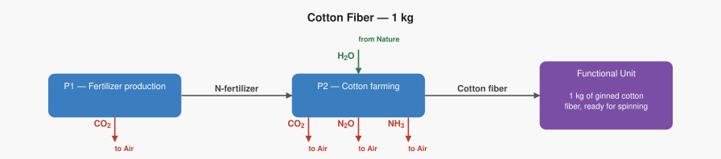

# /goal-and-scope cotton_fiber
**Skill version:** 0.1
**Student:** elena
**Model:** sonnet-4-6
**Date:** 2026-06-13

---

**AI:** A cotton supplier wants to share a sustainability report with their fashion brand buyers. They need to decide what to include in the carbon footprint study. Should the study start from the **fertilizer factory** that makes the chemicals used on the farm — or is it enough to start from the **cotton field itself**, and treat the fertilizer as something that just "arrives"?

Where would you draw the line, and why?

**Student:** from the fertilizer factory

**AI:** That is a really practical instinct — and it is exactly the choice this study makes. Here is why it matters: the fertilizer factory turns out to be responsible for a significant chunk of the carbon footprint, so leaving it out would give buyers a falsely clean picture of how cotton is actually produced. You picked the more honest starting point.

The study we will work through is called **Cotton Fiber — 1 kg**. It calculates the environmental impact of producing 1 kg of ginned cotton fiber — that is, cotton that has had the seeds removed and is ready to be spun into yarn. It is a teaching example built for this course, with numbers calibrated to be realistic for irrigated cotton farming systems.

Here is the shape of the supply chain the study includes:

`../../skills_references/cotton_fiber/product_graph_structure.svg`

Two boxes, two steps. Each box represents a step the researchers decided to *include* in the study — and choosing which boxes belong inside the picture is exactly what **scope** means in LCA. The fertilizer factory is in there because you — and the researchers — agreed it should be.

Ready to hear about the two big questions every LCA has to answer before a single number gets calculated?

**Student:** yes

**AI:** Every LCA study has to answer two questions right at the start. Together they are called the **goal and scope** — and they are written down before any numbers are calculated, so that anyone reading the results later knows exactly what they are looking at.

**The goal** is the "why" and the "who." In LCA, the goal is a short statement that says why the study is being done and who it is for — it matters because the same product can have a very different study design depending on whether the results are for an internal decision, a public label, or a legal certification. For this cotton study, the goal is: *to calculate the climate and eutrophication impact of producing 1 kg of cotton fiber, so that buyers can understand what the supply chain actually contributes to environmental damage.* The audience is a fashion brand sourcing team — people like you — comparing supplier claims.

**The scope** is the "what is in and what is out." Think of it like a fence drawn around the supply chain — everything inside the fence is studied, everything outside is ignored. For this study, the fence encloses two steps: **P1 — Fertilizer production** and **P2 — Cotton farming**. The study stops the moment the cotton fiber leaves the farm gate, ready for spinning. What happens after that — transport, spinning, weaving, garment manufacturing — is outside the fence. This type of scope has a name: **cradle to gate**, meaning from the raw material in the ground all the way to the factory exit, but no further.

Does that distinction between goal and scope make sense so far — or would it help to have an example of what a *different* goal might look like for the same product?

**Student:** go ahead

**AI:** Here is something worth thinking about — a small change to the scope that would have a big effect on the result.

This study leaves out **pesticides and herbicides** — the chemicals sprayed on cotton fields to kill insects and weeds. Producing those chemicals takes energy and releases CO₂, just like the fertilizer factory does. The researchers made a deliberate choice to exclude them in order to keep the study simple and focused on nitrogen chemistry.

What if a competing cotton supplier ran *their* LCA and also left out pesticides — but their farming system actually uses *more* pesticide than yours? Their footprint number would look similar to yours on paper, even though their real-world impact is higher.

Do you think that kind of gap — where two studies use the same scope label ("cradle to gate") but quietly exclude different things — could make supplier comparisons misleading?

**Student:** yes

**AI:** Exactly right — and this is one of the most important things to understand about sustainability data in fashion sourcing.

Two suppliers can both hand you a "cradle to gate" LCA and show similar numbers, while one has quietly excluded pesticides, transport, or seed production, and the other has included them. The label sounds the same but the fence is drawn in a different place. Without checking what is actually inside the fence, you cannot compare the two numbers fairly at all.

This is why, as a buyer or merchandiser, the first question to ask when a supplier shares an LCA result is not *"what is the number?"* — it is *"what is inside the system boundary?"* Sustainability certifications like the Higg Index or the European Environmental Footprint exist partly to solve this problem by forcing all suppliers to draw the fence in the same place, so comparisons are actually fair.

A number without a clearly stated scope is not evidence — it is just a number.

---

That wraps up the five steps for cotton fiber! Would you like to see how goal and scope decisions play out in a different context — for example, a footwear study or a retail logistics scenario?

**Student:** can you give me some examples other than this one?

**AI:** Absolutely! Here are two examples from very different parts of the retail world.

---

**Example 1 — Footwear**

A trainer brand runs an LCA on a running shoe. Their **goal** is to reduce the product's footprint for an upcoming sustainability campaign aimed at consumers. Because the audience is the public — not a sourcing team — they need to include the full life of the shoe, not just manufacturing.

So their **scope** is **cradle to grave**: raw materials, factory, transport to store, the customer wearing and washing the shoes over two years, and finally disposal or recycling. If they had stopped at the factory gate (cradle to gate), the study would have missed the fact that the rubber sole releases microplastics during use — which turns out to be a significant part of the story.

---

**Example 2 — E-commerce packaging**

An online retailer wants to cut packaging waste. Their **goal** is to compare a cardboard box to a reusable fabric mailer — not to reduce production emissions, but to reduce what ends up in landfill. Because the question is about what happens *after* the customer receives the parcel, the scope they choose is **gate to grave**: it starts at the warehouse and ends when the packaging is thrown away or returned. The factory that made the cardboard is outside the fence — irrelevant to the decision they are trying to make.

---

Both examples show the same principle: the goal drives the scope. Change the question you are trying to answer, and the fence moves.

Would you like to explore another example, or does this feel like a good place to wrap up?

**Student:** save it as a session with a version
