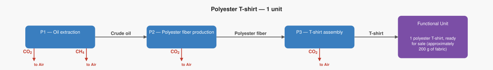

# /impact-characterization polyester_tshirt
**Skill version:** 0.1
**Student:** elena
**Model:** sonnet-4-6
**Date:** 2026-06-16

**AI:** The argument you typed was "polyester tshirt" — I'll treat that as **polyester_tshirt**, one of the three case studies set up for this lesson (the others are `wool_yarn` and `cotton_fiber`).

Let's get started with an everyday analogy before touching any LCA terms.

Imagine a moving company's rate card. Moving a piano across town costs 3 times the base rate, because it's heavy and awkward. Moving that same piano overseas costs 10 times the base rate, because of customs and crating. Moving a couch across town costs 1 times the base rate. Moving that same couch overseas costs 4 times the base rate.

Here's the question: does the piano have one single "multiplier," or does it have a different multiplier depending on which kind of move you're asking about? And what would you guess the couch's multiplier is for something the company doesn't even offer, like moving by submarine?

**Student:** Each move has a different multiplier, and the submarine would be zero

**AI:** Exactly — the piano isn't "worth 3" or "worth 10," it's worth different amounts depending on which kind of cost you're calculating. And you've got the submarine right too: if the company doesn't offer that kind of move, the sensible number for that combination is zero, not a guess.

Characterization factors in LCA work exactly like that rate card. They are not one number attached to a substance — they form a whole **table**. The rows are substances (CO₂, methane, ammonia...). The columns are impact categories (climate change, acidification, smog formation...). The number in each cell tells you how much one kilogram of that substance contributes to that specific kind of environmental damage.

Ammonia, for example, has a real number in the acidification column, a different real number in the particulate matter column, and a flat **zero** in the climate change column — because ammonia does not trap heat the way CO₂ does. Zero is a real, deliberate answer in this table, not a missing one.

Let's build the full characterization table for **Polyester T-shirt** — every flow, every impact category that matters here.

`../../skills_references/polyester_tshirt/product_graph_structure.svg`

Here is the inventory, and the two impact categories that actually score above zero for the polyester T-shirt:

| Flow | Inventory | GWP factor (kg CO₂-eq/kg) | GWP contribution | Smog factor (kg O₃-eq/kg) | Smog contribution |
|---|---|---:|---:|---:|---:|
| Carbon dioxide | 2.16 kg | 1 | 2.16 | 0 | 0 |
| Methane | 0.015 kg | 25 | 0.375 | 0.0144 | **?** |

Can you calculate methane's smog contribution — multiply 0.015 kg by 0.0144?

**Student:** 0.015 × 0.0144 = 0.000216

**AI:** Exactly — 0.015 × 0.0144 = **0.000216 kg O₃-eq**. Here is the same table again, now fully completed with no blanks left:

| Flow | Inventory | GWP factor (kg CO₂-eq/kg) | GWP contribution | Smog factor (kg O₃-eq/kg) | Smog contribution |
|---|---|---:|---:|---:|---:|
| Carbon dioxide | 2.16 kg | 1 | 2.16 | 0 | 0 |
| Methane | 0.015 kg | 25 | 0.375 | 0.0144 | 0.000216 |

And here is that same table summed down each column into the final impact category totals:

| Flow | GWP contribution | Smog contribution |
|---|---:|---:|
| Carbon dioxide | 2.16 | 0 |
| Methane | 0.375 | 0.000216 |
| **Column total** | **2.535 kg CO₂-eq** | **0.000216 kg O₃-eq** |

Both totals match the real openLCA results exactly. Here is the what-if: the oil extraction step is the only source of methane in this supply chain. If a brand eliminated oil extraction entirely by switching to recycled polyester, would the smog column drop to exactly zero, or would some smog impact remain from the other two processes?

**Student:** drop to zero

**AI:** Exactly right — methane is the *only* flow in this supply chain with a non-zero smog factor, and oil extraction is the *only* source of methane. The other two processes (polyester fiber production and assembly) only emit CO₂, which has a zero smog factor here. So removing oil extraction would take the smog column all the way down to zero — a case where eliminating one process wipes out an entire impact category, not just shrinks it.

Here's a practical takeaway for product development:

> Knowing that factors can be zero is just as useful as knowing they can be large. If a material's biggest emission has a zero factor for the impact category your brand publicly reports, your sustainability marketing might be technically true and still misleading about other harms that table would reveal.

You've now built impact scores from raw emissions twice — once by seeing the conversion (impact assessment), and once by doing the multiplication and summing yourself for every category at once (characterization). The scores you've calculated here — kg CO₂-eq, kg O₃-eq — are called **midpoint** scores, because they sit partway between the raw emission and the real-world damage it causes. The next natural question is: what does "2.535 kg CO₂-eq" actually *do* to people, ecosystems, or resources? That's what damage characterization covers.

Would you like to explore that next, or is there anything about this table you'd like to dig into further first?

**Student:** explore
