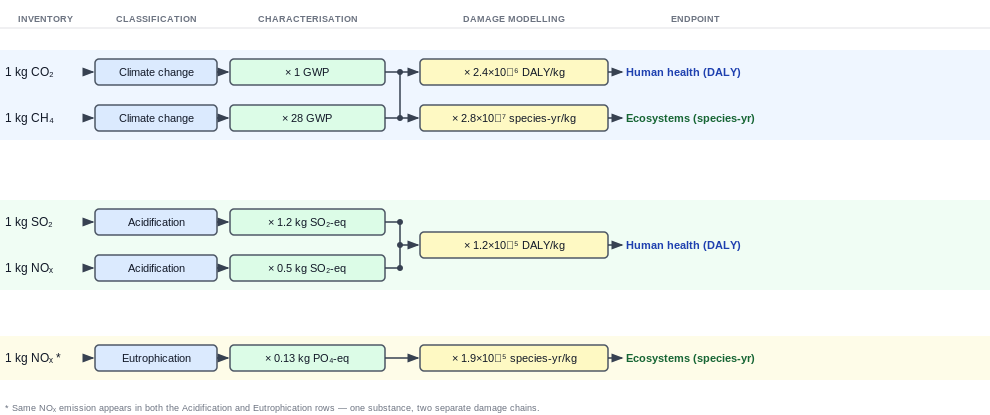

# LCIA Reference — Life Cycle Impact Assessment

## What is LCIA?

**LCIA** stands for **Life Cycle Impact Assessment**. It is the third phase of an LCA (after Goal & Scope and Inventory Analysis). The job of LCIA is to take the **inventory table** -- the list of all emissions and resource extractions from the supply chain — and translate those numbers into **meaningful environmental impacts**.

Think of it like a restaurant menu's nutritional information panel:

- The **inventory** (LCI) tells you "this meal contains 15 g of saturated fat, 120 mg of sodium, and 8 g of sugar."
- The **impact assessment** (LCIA) tells you "this meal contributes an estimated X% towards your daily risk of heart disease, Y% towards high blood pressure, and Z% towards diabetes risk."

Same idea — just for the planet instead of a person.

---

## The LCIA Framework

LCIA is built from four sequential steps:

```
Inventory (LCI)  →  Classification  →  Characterization  →  Normalisation & Weighting
                                            |
                                     [Midpoint level]
                                            |
                                   Damage modelling
                                            |
                                     [Endpoint level]
```

The two most important boxes are **Classification** and **Characterization**. Normalisation and weighting are optional (and less used in teaching LCA).

---

## Step 1 — Classification

**Classification** is the act of assigning each emission or extraction from the inventory to one or more **impact categories**.

An *impact category* is a type of environmental problem the emission contributes to. Common examples:

| Impact category | What it measures | Example contributor |
|---|---|---|
| Climate change (global warming) | Heat trapped in the atmosphere | CO₂, CH₄, N₂O |
| Eutrophication | Excess nutrients in water bodies | NOₓ, NH₃, phosphates |
| Acidification | Acid rain (damages soil, water, buildings) | SO₂, NOₓ |
| Ecotoxicity | Harm to plants and animals | Heavy metals, pesticides |
| Human toxicity | Harm to human health | Particulate matter, benzene |
| Ozone depletion | Thinning of the stratospheric ozone layer | CFCs, halons |
| Resource depletion (abiotic) | Using up non-renewable resources | Crude oil, copper ore |

Some substances contribute to *multiple* categories. For example, NOₓ contributes to both **climate change** and **acidification** and **eutrophication**. Classification simply notes that NOₓ belongs to all three.

The classification step is trivial once you have a method — you just look up each emission in a table to see which categories it affects.

---

## Step 2 — Characterization

**Characterization** is where the actual maths happens. For each substance in each category, we multiply its inventory amount by a **characterization factor** (CF) to convert it into a **common unit** for that category.

### Why is this needed?

Different emissions in the same category have different *potencies*. For climate change:

- 1 kg of CO₂ has a global warming potential (GWP) of **1** (it is the reference)
- 1 kg of CH₄ has a GWP of **28** (it traps 28x more heat over 100 years)
- 1 kg of N₂O has a GWP of **265**

So you cannot just add kilograms of each gas together. You must characterise each one first.

### The characterization formula

$$I_c = \sum_{i} \big( m_i \times CF_{i,c} \big)$$

Where:

| Symbol | Meaning |
|---|---|
| $I_c$ | Total impact score for category $c$ |
| $m_i$ | Mass (in kg) of substance $i$ emitted |
| $CF_{i,c}$ | Characterisation factor for substance $i$ in category $c$ |

### Example — climate change from a coffee cup

| Substance | Amount (kg) | $CF$ (kg CO₂-eq / kg) | Contribution |
|---|---|---|---|
| CO₂ | 0.10 | 1 | 0.10 kg CO₂-eq |
| CH₄ | 0.002 | 28 | 0.056 kg CO₂-eq |
| N₂O | 0.0005 | 265 | 0.1325 kg CO₂-eq |

$$I_{\text{climate}} = 0.10 + 0.056 + 0.1325 = 0.29 \text{ kg CO}_2\text{-eq}$$

So the cup's total contribution to climate change is **0.29 kg of CO₂-equivalent** -- a standardised unit that lets you compare across different greenhouse gases.

This same logic repeats for every impact category. For acidification, the common unit is **kg SO₂-eq**. For eutrophication, it is **kg PO₄3--eq**. For resource depletion, it is **kg Sb-eq** (antimony equivalents).

---

## Step 3 — Midpoints vs Endpoints

This is the most important conceptual distinction in LCIA.

### Midpoint indicators

A **midpoint** is a point *along the cause-effect chain*, before the final harm. It answers the question "how much does this contribute to a specific environmental problem?".

Examples of midpoint indicators:

| Midpoint category | Unit | What it tracks |
|---|---|---|
| Climate change | kg CO₂-eq | Heat trapped |
| Acidification | kg SO₂-eq | H+ ions released |
| Eutrophication | kg PO₄3--eq | Nutrients released |
| Ecotoxicity | CTUe | Potentially affected fraction of species |
| Ozone depletion | kg CFC-11-eq | Ozone destroyed |

Midpoints are relatively certain (the science is well-established for most of them) and are the standard output of most LCA studies.

### Endpoint indicators

An **endpoint** is the *final harm* to something we care about. Endpoints go further along the cause-effect chain to ask "so what does this actually damage?".

The three endpoint Areas of Protection (AoP) in most LCIA methods are:

| Area of Protection | What it measures | Unit |
|---|---|---|
| **Human health** | Years of healthy life lost | DALY (Disability-Adjusted Life Years) |
| **Ecosystem quality** | Species lost over time | species-yr |
| **Resource availability** | Extra cost to extract future resources | USD |

Going from a midpoint to an endpoint requires **damage modelling** -- and that introduces more uncertainty.

### The pathway from midpoint to endpoint

Take climate change as an example:

```
Climate change midpoint (kg CO₂-eq)
        v
Temperature increase (°C)
        v
Crop yield changes, disease spread, sea level rise
        v
Human health: DALYs from malnutrition, malaria, flooding
Ecosystem quality: species lost from habitat change
Resource availability: agricultural productivity loss
```

Each arrow is a *damage model* -- a scientific estimate of how a change at one level propagates to the next. Different LCIA methods use different damage models, which is why you can get slightly different endpoint results from the same inventory.

### The math

$$\text{Endpoint}_k = \sum_{c} \big( I_c \times DF_{c,k} \big)$$

Where:

| Symbol | Meaning |
|---|---|
| $\text{Endpoint}_k$ | Damage score for Area of Protection $k$ (e.g. human health in DALY) |
| $I_c$ | Midpoint impact score for category $c$ (e.g. kg CO₂-eq) |
| $DF_{c,k}$ | Damage factor linking midpoint $c$ to endpoint $k$ |

### Example — climate change midpoint to endpoint

Assuming a damage factor of $2.4 \times 10^{-6}$ DALY per kg CO₂-eq (a typical ReCiPe value):

$$
\begin{aligned}
\text{Endpoint}_{\text{human health}} &= 0.29 \text{ kg CO}_2\text{-eq} \times 2.4 \times 10^{-6} \text{ DALY/kg CO}_2\text{-eq} \\
&= 7.0 \times 10^{-7} \text{ DALY}
\end{aligned}
$$

This means the coffee cup's contribution to global warming causes an estimated loss of **0.7 millionths of a healthy life-year** -- a very small number for one cup, but significant when scaled to millions of cups per year.

---

## Visual summary of the chain



---

## The three levels of indicator certainty

| Level | Certainty | Meaning for decision-making |
|---|---|---|
| **Midpoint** | High | Scientifically robust. Compare products by kg CO₂-eq, kg SO₂-eq, etc. |
| **Endpoint (single score)** | Lower | The damage modelling introduces assumptions. Useful for communicating with non-specialists. |
| **Weighted single score** | Lowest | Requires value judgements (is climate change more important than toxicity?). Depends on whose values you use. |

Most LCA studies report midpoints. Endpoints are often added for communication. Weighted single scores are used when a single-number answer is needed (e.g. "Product A is 30% greener than Product B").

---

## Common LCIA methods

| Method | Origin | Midpoints | Endpoints | Notes |
|---|---|---|---|---|
| **ReCiPe 2016** | Netherlands | 18 | 3 (human health, ecosystems, resources) | Most widely used. Hierarchist perspective is the default. |
| **CML 2002 / 2016** | Netherlands | 10 | None (midpoint only) | Classic academic method. |
| **TRACI 2.1** | USA (EPA) | 10 | None | Common in North American LCA. |
| **ILCD 2011** | EU Commission | 16 | None | Recommended by the European Commission. |
| **IMPACT World+** | International | 18 | 4 (adds water and carbon) | Good for water footprinting. |
| **EF 3.0 / 3.1** | EU Commission | 16 | 4 | Used for EU Product Environmental Footprint (PEF). |

---

## Worked hypothetical example -- "WidgetCo" desk light

Let's walk through a full LCIA from inventory to midpoint to endpoint for a fictional product.

### Inventory (from LCI)

| Substance | Amount |
|---|---|
| CO₂ to air | 5.0 kg |
| CH₄ to air | 0.05 kg |
| SO₂ to air | 0.02 kg |
| NOₓ to air | 0.01 kg |
| Phosphate to water | 0.001 kg |

### Step 1 — Classification

| Substance | Affected categories |
|---|---|
| CO₂ | Climate change |
| CH₄ | Climate change |
| SO₂ | Acidification |
| NOₓ | Acidification, Eutrophication |
| Phosphate | Eutrophication |

### Step 2 — Characterisation (midpoints)

We use ReCiPe 2016 (Hierarchist) midpoint factors:

| Substance | Amount | Factor | Midpoint score | Unit |
|---|---|---|---|---|
| CO₂ | 5.0 kg | $\times 1$ | $= \mathbf{5.0}$ | kg CO₂-eq |
| CH₄ | 0.05 kg | $\times 28$ | $= \mathbf{1.4}$ | kg CO₂-eq |
| | | | $\mathbf{6.4\text{ kg CO}_2\text{-eq}}$ | *(Total climate change)* |
| SO₂ | 0.02 kg | $\times 1.0$ | $= \mathbf{0.02}$ | kg SO₂-eq |
| NOₓ | 0.01 kg | $\times 0.5$ | $= \mathbf{0.005}$ | kg SO₂-eq |
| | | | $\mathbf{0.025\text{ kg SO}_2\text{-eq}}$ | *(Total acidification)* |
| NOₓ | 0.01 kg | $\times 0.13$ | $= \mathbf{0.0013}$ | kg PO₄-eq |
| Phosphate | 0.001 kg | $\times 1.0$ | $= \mathbf{0.001}$ | kg PO₄-eq |
| | | | $\mathbf{0.0023\text{ kg PO}_4\text{-eq}}$ | *(Total eutrophication)* |

### Step 3 — Midpoint $\rightarrow$ Endpoint (damage modelling)

Using ReCiPe 2016 damage factors (Hierarchist):

| Midpoint score | $\times$ Damage factor | $=$ Endpoint contribution |
|---|---|---|
| $6.4$ kg CO₂-eq | $\times 2.4 \times 10^{-6}$ DALY/kg | $= 1.5 \times 10^{-5}$ DALY (human health) |
| $6.4$ kg CO₂-eq | $\times 2.8 \times 10^{-7}$ species-yr/kg | $= 1.8 \times 10^{-6}$ species-yr (ecosystems) |
| $0.025$ kg SO₂-eq | $\times 1.2 \times 10^{-5}$ DALY/kg | $= 3.0 \times 10^{-7}$ DALY (human health) |
| $0.0023$ kg PO₄-eq | $\times 1.9 \times 10^{-5}$ species-yr/kg | $= 4.4 \times 10^{-8}$ species-yr (ecosystems) |

Summing damage contributions:

$$
\begin{aligned}
\text{Human health} &= 1.5 \times 10^{-5} + 3.0 \times 10^{-7} \\
&= 1.5 \times 10^{-5} \text{ DALY} \\[2pt]
\text{Ecosystem quality} &= 1.8 \times 10^{-6} + 4.4 \times 10^{-8} \\
&= 1.8 \times 10^{-6} \text{ species-yr}
\end{aligned}
$$

The climate change midpoint dominates both endpoint categories — it accounts for nearly all the damage in this example.

---

## Key terms summary

| Term | Definition |
|---|---|
| **LCIA** | Life Cycle Impact Assessment — turning inventory data into environmental impact scores |
| **Impact category** | A type of environmental problem (climate change, acidification, etc.) |
| **Classification** | Assigning each emission to the categories it affects |
| **Characterisation** | Multiplying by characterisation factors to get a common-unit score |
| **Characterisation factor ($CF$)** | The potency of a substance in a given category (e.g. GWP = 28 for CH₄) |
| **Midpoint** | An indicator along the cause-effect chain, before final damage (kg CO₂-eq) |
| **Endpoint** | An indicator of final damage to something we value (DALY, species-yr) |
| **Damage factor ($DF$)** | The conversion factor from a midpoint to an endpoint |
| **Normalisation** | Dividing by a reference value (e.g. total EU emissions) to see relative significance |
| **Weighting** | Applying value-based weights to combine categories into a single score |
| **Area of Protection (AoP)** | The three things we ultimately want to protect: human health, ecosystems, resources |
| **DALY** | Disability-Adjusted Life Year — a measure of overall disease burden (1 DALY = one lost year of healthy life) |

---

## Further reading

- **ReCiPe 2016** -- www.rivm.nl/en/life-cycle-assessment-lca/recipe
- **ILCD Handbook** -- European Commission Joint Research Centre
- **ISO 14044** -- Section 4.4 (LCIA requirements in the ISO standard)
- **Jolliet et al. 2016** -- *Environmental Life Cycle Assessment*, Chapter 5
