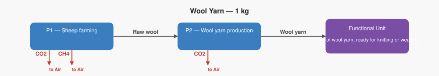

# Example: `/functional-unit wool_yarn` (v1 — with structure graph and reference process)

This is a recorded example of the `functional-unit` teaching skill in action,
using the `wool_yarn` case study from `skills_references/wool_yarn/`.

This version demonstrates the updated skill flow where the structure diagram
and reference process are introduced automatically in Step 2 — without the
student having to ask for them.

---

## The conversation

---

**AI:** A knitwear brand wants to put a carbon footprint label on their wool
yarn so buyers can compare it to other fibres.

What would you measure the footprint per — per kilogram of yarn, per sweater,
or per year of wearing?

---

**Student:** Per kilogram of yarn.

---

**AI:** That's a great instinct — and it's actually exactly what this study
uses. Per kilogram is the natural choice when you're measuring a raw material
at the point it leaves the mill, because it lets any buyer compare two yarn
suppliers on equal footing, regardless of what they plan to make with it.

The study we'll be working through is called **Wool Yarn — 1 kg**. It traces
the climate impact of producing 1 kg of wool yarn, following the supply chain
from the sheep farm through scouring and spinning at the mill. It's a teaching
example built for this course — the numbers are illustrative rather than from
a specific brand, but calibrated to be realistic.

Here's the supply chain diagram:



The rightmost box — **P2, Wool yarn production** — has a special name in LCA:
it's called the **reference process**. That just means it's the finishing line
— the step that delivers the finished product. Everything to its left (the
sheep farm) exists only to supply it. The functional unit is precisely what
comes out of that box: the thing we're measuring, and the point at which the
study stops.

So in LCA, this precise definition — **1 kg of wool yarn, ready for knitting
or weaving** — is called the **functional unit**. It rules out measuring per
sweater, for example, because different sweater designs use different amounts
of yarn, which would make comparisons unfair.

Here's a what-if to push the idea further: if a competitor yarn supplier
measured their footprint **per sweater** instead of per kilogram, and their
yarn happened to be thicker so each sweater used more of it — could they make
their yarn look better or worse than it really is?

---

**Student:** Yes, but I am just guessing sort of.

---

**AI:** That's a perfectly honest answer — and the instinct is right. Let's
make it concrete so it clicks properly.

Say Supplier A's yarn has a footprint of **15 kg CO₂ per kg of yarn**. Supplier
B's yarn has a footprint of **18 kg CO₂ per kg of yarn** — genuinely worse.
But Supplier B's yarn is thicker, so a sweater only needs 400 g of it, while
Supplier A's yarn needs 600 g per sweater.

Now watch what happens if both report **per sweater**:
- Supplier A: 15 × 0.6 = **9 kg CO₂ per sweater**
- Supplier B: 18 × 0.4 = **7.2 kg CO₂ per sweater**

Supplier B now looks better — even though their yarn is dirtier per kilogram.
The unit switch has completely reversed the comparison, just by hiding the fact
that the sweaters use different amounts of yarn.

This is exactly why choosing the right functional unit matters so much. When a
supplier sends you a sustainability number, the first thing to check is always:
**per what?** A number without a unit isn't a claim — it's just a number.

As a buyer or yarn sourcing manager, knowing this lets you ask the right
follow-up question the moment a supplier hands you a data sheet: "Is that per
kilogram of yarn, or per finished garment?" That one question tells you whether
the comparison is fair.

Would you like to explore this with more examples, or shall we move on to look
at the wool yarn supply chain in more detail?

---

**Student:** Yes, can I see more examples?

---

**AI:** Here are three that come up often in fashion and retail, each showing
a different version of the same trap.

---

**Fast fashion vs quality**

Brand A sells a £15 T-shirt, footprint 2 kg CO₂, but it pills after 10 washes
and gets thrown away. Brand B sells a £60 T-shirt, footprint 4 kg CO₂, that
lasts 200 washes over three years.

- Measured **per garment**: Brand B looks twice as bad.
- Measured **per wear**: Brand A = 2 ÷ 10 = **0.20 kg CO₂**. Brand B = 4 ÷
  200 = **0.02 kg CO₂**. Brand B is ten times better.

The wrong unit here is per garment — it hides the durability difference
completely, which is the whole point of the comparison.

---

**Cotton tote bag vs disposable paper bag**

Measured per bag produced, a cotton tote has a footprint of ~7 kg CO₂ versus
~0.04 kg CO₂ for a paper bag — the tote looks 175 times worse. But used 200
times, the tote's per-use footprint drops to 0.035 kg CO₂ — lower than a
single paper bag.

The wrong unit here is per bag produced for a product designed to be reused.
A cradle-to-gate number always makes reusable products look bad compared to
disposables.

---

**Chiffon vs denim fabric**

A fabric supplier claims their chiffon (80 g per square metre) has a lower
carbon footprint than denim (400 g per square metre), measured per square
metre. They're right — but a dress made from chiffon uses far more metres of
fabric than a pair of jeans. So the per-square-metre comparison is misleading
when the two products require very different amounts of material.

Per kilogram would be fairer for comparing raw materials; per finished garment
would be fairer if you want to compare actual products.

---

The pattern is always the same: the unit that makes a product look good tends
to be the one that hides the most important fact.

---

**Student:** Yes, let's go on.

---

**AI:** That wraps up the functional unit lesson — you've worked through all
the key ideas. To summarise in one sentence: **a sustainability number means
nothing without knowing precisely what it's measuring, and the functional unit
is that definition.**

The natural next step is the supply chain lesson, which goes deeper into that
diagram you saw — walking through what each box represents in the real world,
what flows along the arrows, and what the study boundary includes and leaves
out. You'd invoke it with:

```
/supply-chain wool_yarn
```

Want to jump straight into that, or is there anything about functional units
you'd like to come back to first?

---

## What this example demonstrates

- The student answered the opening question correctly (per kilogram) — the skill
  validated this warmly and confirmed it was the right choice before moving on,
  rather than treating a correct answer as a setup for a correction
- The case study introduction, structure diagram, and reference process all
  appeared in the same response, giving the student three things at once:
  context (what the study is), a visual (the supply chain), and vocabulary
  (reference process) — before the functional unit was named
- "Reference process" was introduced and defined in plain English immediately:
  "the finishing line — the step that delivers the finished product"
- The what-if question used yarn-specific numbers (Supplier A 600 g per sweater,
  Supplier B 400 g per sweater) to show how the per-sweater unit reverses the
  comparison — the maths was shown step by step so the student could follow it
- The student said "I am just guessing sort of" — an honest hedge — which was
  validated before the concrete example was given, so they didn't feel wrong
- Three wrong-unit examples (fast fashion vs quality, tote vs paper bag, chiffon
  vs denim) were provided when asked, using the reference table in the skill
- The lesson closed by naming the next skill (/supply-chain wool_yarn) so the
  student has a clear path forward
