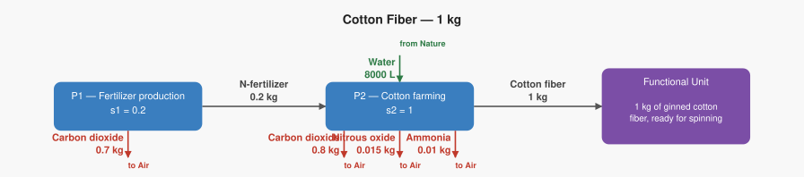

# LCA Results: Cotton Fiber — 1 kg

Generated: 2026-06-18 17:52  |  openLCA system ID: `25358292-0864-40ce-ae56-3ad007e09c1f`

## Step 1 — Goal and Scope

**Goal:** Calculate the climate and eutrophication impact of producing 1 kg of cotton fiber, tracing the supply chain from synthetic fertilizer production through cotton farming. This is a 2-process chain that introduces two impact categories at once — climate change (GWP100) and terrestrial eutrophication (EP-terrestrial) — and shows how the same emission (N2O from fertilised soil) contributes to both categories simultaneously. The key teaching moment is that cotton's "natural" reputation hides a chemistry problem in the field: N2O is 273 times more potent than CO2, and NH3 damages waterways and ecosystems independently of its climate contribution.

**Functional unit:** 1.0 kg — 1 kg of ginned cotton fiber, ready for spinning

**Reference flow vector f:**

```
  f[1] = 0.0   (N-fertilizer)
  f[2] = 1.0   (Cotton fiber)
```

## Step 2 — Technology Matrix A

Columns = processes, rows = products.  `+` = produced, `−` = consumed.

| | P1 — Fertilizer production | P2 — Cotton farming |
|---|---:|---:|
| **N-fertilizer** | +1.00 | -0.20 |
| **Cotton fiber** |  0   | +1.00 |

## Step 3 — Scaling Vector  s = A⁻¹ · f

How many times each process must run to deliver exactly f:

| Process | Scale factor |
|---|---:|
| P1 — Fertilizer production | **0.2000** |
| P2 — Cotton farming | **1.0000** |

## Step 4 — Intervention Matrix B

Columns = processes, rows = elementary flows (biosphere).
`+` = emission (exits to environment)  `−` = resource extraction (enters from environment).

| | P1 — Fertilizer production | P2 — Cotton farming |
|---|---:|---:|
| **Carbon dioxide** | +3.50 | +0.80 |
| **Nitrous oxide** |  0   | +0.01 |
| **Ammonia** |  0   | +0.01 |
| **Water** |  0   | -8000.00 |

## Step 5 — LCI Results  B · s

**Emissions to environment:**

| Flow | Numpy result | openLCA result | Unit | Match |
|---|---:|---:|---|:---:|
| **Carbon dioxide** | 1.5000 | 1.5000 | kg | ✓ |
| **Nitrous oxide** | 0.0150 | 0.0150 | kg | ✓ |
| **Ammonia** | 0.0100 | 0.0100 | kg | ✓ |

**Resources from environment (amounts consumed):**

| Flow | Numpy result | openLCA result | Unit | Match |
|---|---:|---:|---|:---:|
| **Water** | 8000.0000 | 8000.0000 | L | ✓ |

## Step 6 — Scaled Emissions by Process  (B · diag(s))

Each cell = emission rate × scaling factor.  Columns sum to the LCI totals in Step 5.

| Process | s | Carbon dioxide | Nitrous oxide | Ammonia |
|---|---:|---:|---:|---:|
| P1 — Fertilizer production | 0.2000 | 0.7000 | 0 | 0 |
| P2 — Cotton farming | 1.0000 | 0.8000 | 0.0150 | 0.0100 |
| **Total** | | **1.5000** | **0.0150** | **0.0100** |

**Resource extractions by process:**

| Process | s | Water |
|---|---:|---:|
| P1 — Fertilizer production | 0.2000 | 0 |
| P2 — Cotton farming | 1.0000 | 8000.0000 |
| **Total** | | **8000.0000** |

## Step 7 — LCIA Results  (TRACI 2.2)

Characterization factors from the database. Each impact category score is the sum of all elementary flow contributions as computed by the openLCA engine.

| Impact Category | Score | Unit |
|---|---:|---|
| Ozone depletion | **0.000000** | kg CFC-11 eq |
| Ecotoxicity | **0.000000** | CTUe |
| Respiratory effects (Particulate) | **0.000667** | kg PM2.5 eq |
| Acidification | **0.018800** | kg SO2 eq |
| Carcinogenics | **0.000000** | CTUh |
| Global warming | **1.500000** | kg CO2 eq |
| Smog (Photochemical Oxidation Formation) | **0.000000** | kg O3 eq |
| Non carcinogenics | **0.000000** | CTUh |
| Eutrophication: freshwater | **0.000000** | kg P eq |
| Eutrophication: marine | **0.008785** | kg N eq |

## Summary

**LCIA Method:** TRACI 2.2

> **Ozone depletion: 0.000000 kg CFC-11 eq** per 1.0 kg of 1 kg of ginned cotton fiber, ready for spinning
> **Ecotoxicity: 0.000000 CTUe** per 1.0 kg of 1 kg of ginned cotton fiber, ready for spinning
> **Respiratory effects (Particulate): 0.000667 kg PM2.5 eq** per 1.0 kg of 1 kg of ginned cotton fiber, ready for spinning
> **Acidification: 0.018800 kg SO2 eq** per 1.0 kg of 1 kg of ginned cotton fiber, ready for spinning
> **Carcinogenics: 0.000000 CTUh** per 1.0 kg of 1 kg of ginned cotton fiber, ready for spinning
> **Global warming: 1.500000 kg CO2 eq** per 1.0 kg of 1 kg of ginned cotton fiber, ready for spinning
> **Smog (Photochemical Oxidation Formation): 0.000000 kg O3 eq** per 1.0 kg of 1 kg of ginned cotton fiber, ready for spinning
> **Non carcinogenics: 0.000000 CTUh** per 1.0 kg of 1 kg of ginned cotton fiber, ready for spinning
> **Eutrophication: freshwater: 0.000000 kg P eq** per 1.0 kg of 1 kg of ginned cotton fiber, ready for spinning
> **Eutrophication: marine: 0.008785 kg N eq** per 1.0 kg of 1 kg of ginned cotton fiber, ready for spinning

## Product System Graphs

### Scaled (with amounts)



### Structure (flow names only)


---
*Generated by `lca_scripts/lca_analysis.py` using openLCA gdt-server v2*