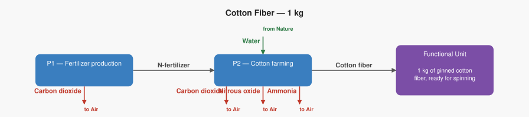

# Session: /functional-unit cotton_fiber
**Skill version:** 0.1  
**Date:** 2026-06-13  
**Case study:** Cotton Fiber — 1 kg  

---

**Claude:** Before we look at any numbers — imagine you're a sourcing manager at a fashion brand, and two cotton suppliers both send you a data sheet claiming their cotton has a lower carbon footprint. What is the very first question you would ask before you could even start comparing those two numbers?

**Student:** what unit was used

**Claude:** Exactly right — that is the single most important question, and experienced sustainability professionals ask it every time.

If one supplier measured their footprint per kilogram of cotton and the other measured it per bale (a bale is roughly 220 kg), the numbers are completely incomparable — even if the underlying environmental impact is identical. You'd be looking at 5.6 vs 1,232 and thinking one is catastrophically worse, when really they're the same.

That instinct — *per what?* — is the entire concept we're about to explore.

The study we'll be working through is called **Cotton Fiber — 1 kg**. The goal is to calculate the climate impact of producing cotton fiber, tracing the supply chain all the way back from the cotton field to the fertilizer factory that supplies it. It's a teaching example built for this course, so the numbers are illustrative rather than from a specific brand — but they're calibrated to be realistic for irrigated cotton systems.

Here's the shape of the supply chain:

You can see two boxes connected by an arrow. The rightmost box — **P2 — Cotton farming** — has a special name in LCA: it's called the **reference process**. That just means it's the finishing line — the step that delivers the finished product. Everything to its left exists only to supply it. The fertilizer factory (P1) is there for one reason only: to feed the cotton farm.

The functional unit is precisely what comes out of that reference process box.

What do you think comes out of P2? What is the cotton farm actually delivering?

**Student:** the fiber

**Claude:** Exactly — the fiber. That's the finished product this entire supply chain exists to produce.

So here is the functional unit for this study, stated precisely:

> **1 kg of ginned cotton fiber, ready for spinning**

In LCA, this is called the **functional unit** — it is the precise definition of exactly what is being measured, so that comparisons between products are fair.

Notice how specific it is. Not just "cotton" — but *ginned* cotton (meaning the seeds have already been removed), and *ready for spinning* (meaning it's in the form a textile mill would actually receive and use). That level of precision matters: if one supplier measures at the farm gate before ginning, and another measures after, you're still not comparing the same thing.

Why 1 kg specifically? Because at the raw material stage, buyers and suppliers deal in weight. A sourcing manager comparing two fiber suppliers will ask: for every kilogram I buy, what is the environmental cost? It's a natural, neutral unit for material-level comparisons — before the fiber becomes yarn, fabric, or a finished garment.

What it rules out: measuring per bale, per field, or per growing season — all of which would make comparisons between farms of different sizes completely meaningless.

Suppose a competing cotton supplier claims their fiber has a footprint of only **2.1 kg CO₂** — lower than the **5.6 kg CO₂** in this study. But when you read the fine print, you discover they measured per kg of *raw seed cotton*, before ginning — and it takes roughly 3 kg of seed cotton to produce 1 kg of ginned fiber. Would their number still look better once you account for that?

**Student:** stop the skill

---
*Session ended at Step 4 (what-if question). Steps 5 (business connection) not reached.*
