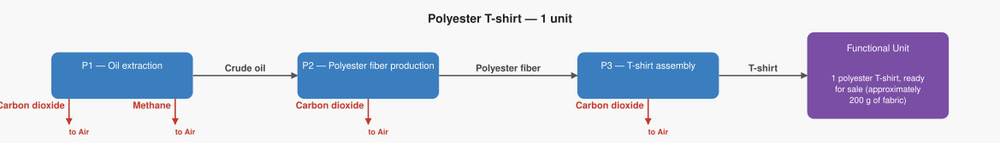

# /system-boundary polyester_tshirt
**Skill version:** 0.1
**Student:** calvin
**Model:** sonnet-4-6
**Date:** 2026-06-14

---

**AI:** Here is a question to start us off — no LCA knowledge needed yet.

Imagine you are reviewing a restaurant receipt at the end of a work dinner. The receipt shows the food and drinks your table ordered — but it does not include the taxi you took to get there, the parking fee your colleague paid, or the round of drinks someone bought at the bar next door.

If someone added up only the restaurant receipt to figure out the total cost of the evening, would that number be accurate — and what would be missing from it?

**Student:** it would be missing the taxi and parking costs

**AI:** Exactly right — the receipt only covers what happened inside that restaurant. The taxi, the parking, the drinks next door — all of those were real costs that actually happened that evening, but because they were outside the restaurant's bill, they simply do not appear. The total on the receipt is not wrong, but it is incomplete.

Life Cycle Assessment works the same way. Every study has its own version of that receipt — a defined set of steps it covers and a defined set it does not. That defined edge is called the **system boundary** (meaning: the line that separates what is counted from what is not). Everything inside the boundary is measured and added up. Everything outside is ignored, even if it causes real environmental harm.

Now let's look at a real example. This study is called the **Polyester T-shirt**. Its goal is to calculate the climate impact of producing one T-shirt, tracing the journey from crude oil in the ground all the way to a finished garment ready for sale.

Here is the supply chain diagram — each box is a step that this study decided to **include**:

`../skills_references/polyester_tshirt/product_graph_structure.svg`

The fence — the system boundary — runs around all three of those boxes together. Any step not shown in the diagram is outside the fence and was not counted.

Looking at the diagram, can you think of anything that happens to the T-shirt after it leaves the last box that might also cause environmental impact — but is not shown here?

**Student:** washing and drying it

**AI:** Exactly right — and that is a really important observation.

Every time a customer washes and tumble-dries a polyester T-shirt, that machine is using electricity and heating water, which releases CO₂. Over the lifetime of a T-shirt — which might be washed 50 or 100 times — that adds up to a significant amount of environmental impact. But none of that is captured in this study, because the boundary stops the moment the shirt leaves the factory.

This study is what's called **cradle to gate** — meaning it starts at the very beginning of the supply chain (the oil well, which is the "cradle") and stops at the factory exit (the "gate"). Everything that happens after the gate — the shop, the customer's wardrobe, the washing machine, the bin — is outside the fence.

Here is the what-if question: if this study had included all those washes and tumble-dry cycles over the T-shirt's lifetime, do you think the total carbon footprint would go up a little, or a lot — and why?
